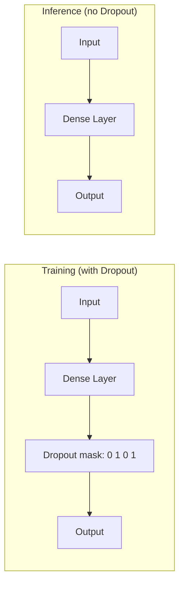

# 正则化

## 概述

正则化（Regularization）是防止模型过拟合（Overfitting）的核心技术。在深度学习中，由于大模型的参数量远超训练样本数，正则化尤为关键。本章覆盖从经典 Dropout 到现代 LLM 中使用的 Stochastic Depth 等正则化方法。

---

## 1. Dropout

### 原理

Dropout（Srivastava et al., 2014）在训练时**随机丢弃**一部分神经元的输出，使模型不能依赖于特定的特征组合，从而提高泛化能力：

$$y = \frac{1}{1-p} \cdot \text{Mask} \odot x, \quad \text{Mask}_i \sim \text{Bernoulli}(1-p)$$

其中 $p$ 是丢弃概率（通常 0.1~0.5），前向传播时每个神经元以概率 $p$ 被置为 0。

**训练阶段**：对每个 mini-batch，随机生成掩码矩阵，每个神经元以概率 $p$ 被"丢弃"（输出为 0）。

**推理阶段**：不使用掩码，但所有权重乘以 $(1-p)$（Inverted Dropout 实现），保持输出的期望一致。

```python
import torch
import torch.nn as nn
import torch.nn.functional as F

class Dropout(nn.Module):
    """
    手动实现 Dropout (Inverted Dropout 版本)
    
    Inverted Dropout: 训练时除以 (1-p)，推理时不需任何操作
    """
    def __init__(self, p: float = 0.5):
        super().__init__()
        assert 0 <= p < 1, "Dropout probability must be in [0, 1)"
        self.p = p
        
    def forward(self, x: torch.Tensor) -> torch.Tensor:
        if self.training and self.p > 0:
            # 生成 Bernoulli 掩码 (1 = keep, 0 = drop)
            mask = torch.rand_like(x) > self.p
            # 除以 (1-p) 保持期望不变: E[output] = x
            return x * mask / (1.0 - self.p)
        return x

# 验证
dropout = Dropout(p=0.5)
x = torch.ones(5, 10)

dropout.train()
x_train = dropout(x)
print(f"Train mode - avg activation: {x_train.mean().item():.2f} (expected ~1.0)")
print(f"Zero ratio: {(x_train == 0).float().mean().item():.2f} (expected ~{dropout.p})")

dropout.eval()
x_eval = dropout(x)
print(f"Eval mode - avg activation: {x_eval.mean().item():.2f} (expected 1.0)")
```

### Dropout 的直觉理解



- **训练时**：每次迭代随机"删除"一些神经元，相当于训练多个子网络的集成
- **推理时**：使用完整的网络，权重自动缩放（Inverted Dropout 无需额外操作）

### Dropout 在 Transformer 中的使用

```python
class TransformerWithDropout(nn.Module):
    """含 Dropout 的 Transformer Block"""
    def __init__(self, d_model=512, dropout=0.1):
        super().__init__()
        self.attention = nn.MultiheadAttention(d_model, 8, dropout=dropout, batch_first=True)
        self.ffn = nn.Sequential(
            nn.Linear(d_model, 2048),
            nn.GELU(),
            nn.Dropout(dropout),  # FFN 内部的 Dropout
            nn.Linear(2048, d_model),
        )
        self.dropout = nn.Dropout(dropout)  # 残差连接后的 Dropout
        self.norm = nn.LayerNorm(d_model)
        
    def forward(self, x):
        # Attention 子层
        attn_out, _ = self.attention(x, x, x)
        x = self.norm(x + self.dropout(attn_out))  # Post-Norm + Dropout
        
        # FFN 子层
        ffn_out = self.ffn(x)
        x = self.norm(x + self.dropout(ffn_out))
        return x
```

### Dropout 的变体

| 变体 | 描述 | 应用场景 |
|------|------|---------|
| **Standard Dropout** | 随机丢弃隐藏层输出 | 通用 |
| **Embedding Dropout** | 对 Embedding 层做 Dropout | NLP 小规模模型 |
| **Attention Dropout** | 丢弃注意力分数矩阵中的部分权重 | Transformer |
| **Dropout 2D / 3D** | 丢弃整个通道（CNN） | 图像分割 |
| **Spatial Dropout** | 相邻位置同时丢弃 | 卷积网络 |

---

## 2. Weight Decay（权重衰减）

### 原理

Weight Decay 在损失函数中加入参数范数的惩罚，迫使模型的权重在训练过程中趋向于小值：

$$\mathcal{L}'(\theta) = \mathcal{L}(\theta) + \frac{\lambda}{2} ||\theta||_2^2$$

梯度更新变为：

$$\theta_{t+1} = \theta_t - \eta (\nabla \mathcal{L}(\theta_t) + \lambda \theta_t) = (1 - \eta\lambda)\theta_t - \eta\nabla \mathcal{L}(\theta_t)$$

可以看到权重衰减在每次更新前先将参数**缩放** $(1-\eta\lambda)$，因此得名"权重衰减"。

```python
# PyTorch 中的两种 Weight Decay 方式

# 方式 1: 直接在优化器中指定（推荐 for SGD/AdamW）
optimizer = torch.optim.AdamW(
    model.parameters(),
    lr=0.001,
    weight_decay=0.01  # Lambda 参数
)

# 方式 2: 手动在 loss 中添加 L2 正则化（不推荐 for Adam）
def l2_regularization(model, lambda_l2=0.01):
    """手动计算 L2 正则项"""
    l2_loss = 0
    for param in model.parameters():
        l2_loss += torch.norm(param, p=2) ** 2
    return lambda_l2 / 2 * l2_loss

# 使用
logits = model(x)
ce_loss = F.cross_entropy(logits, labels)
l2_loss = l2_regularization(model, lambda_l2=0.01)
total_loss = ce_loss + l2_loss
```

### Weight Decay 与 L2 Regularization 的区别

| 特性 | L2 Regularization | Weight Decay (Decoupled) |
|------|-------------------|--------------------------|
| 实现方式 | 在 loss 中添加 $ \frac{\lambda}{2} \sum \theta^2$ | 在参数更新后直接乘以 $(1-\eta\lambda)$ |
| SGD 中 | 等价 | 等价 |
| Adam 中 | **不等价**（被自适应 LR 缩放） | **等价**（独立于自适应 LR） |
| 推荐用法 | SGD + L2 | AdamW 中的 Weight Decay |

---

## 3. Label Smoothing（标签平滑）

### 原理

Label Smoothing（Szegedy et al., 2016）将 one-hot 标签替换为软标签，防止模型过度自信：

$$y_i^{\text{smooth}} = (1 - \alpha) \cdot y_i^{\text{one-hot}} + \frac{\alpha}{C}$$

其中 $\alpha$ 是平滑系数（通常 0.1），$C$ 是类别数。

**效果**：
- One-hot 标签：$y = [0, 0, 1, 0, 0]$
- 平滑后（$\alpha=0.1$）：$y = [0.025, 0.025, 0.9, 0.025, 0.025]$

```python
class LabelSmoothingCrossEntropy(nn.Module):
    """
    带标签平滑的交叉熵损失
    
    防止模型输出过于极端的概率分布，提高泛化能力
    """
    def __init__(self, smoothing: float = 0.1, reduction: str = 'mean'):
        super().__init__()
        self.smoothing = smoothing
        self.reduction = reduction
        
    def forward(self, logits: torch.Tensor, targets: torch.Tensor) -> torch.Tensor:
        """
        logits: [batch, num_classes]
        targets: [batch] 类别索引
        """
        vocab_size = logits.size(-1)
        
        # 计算 log-probabilities
        log_probs = F.log_softmax(logits, dim=-1)
        
        # 创建平滑后的标签分布
        with torch.no_grad():
            # one-hot → [batch, vocab_size]
            true_dist = torch.zeros_like(log_probs)
            true_dist.fill_(self.smoothing / (vocab_size - 1))
            true_dist.scatter_(1, targets.unsqueeze(1), 1.0 - self.smoothing)
        
        # 计算 KL 散度
        loss = -torch.sum(true_dist * log_probs, dim=-1)
        
        if self.reduction == 'mean':
            return loss.mean()
        elif self.reduction == 'sum':
            return loss.sum()
        return loss

# 使用
criterion = LabelSmoothingCrossEntropy(smoothing=0.1)
logits = torch.randn(4, 10)  # [batch=4, classes=10]
targets = torch.tensor([3, 7, 1, 9])
loss = criterion(logits, targets)
print(f"Label Smoothing CE Loss: {loss.item():.4f}")

# 对比普通 CE
ce_loss = F.cross_entropy(logits, targets)
print(f"Standard CE Loss: {ce_loss.item():.4f}")
```

### Label Smoothing 的效果

- **防止过拟合**：模型不会为了训练样本将 logits 推向极端值
- **提高校准度（Calibration）**：输出概率更接近真实准确率
- **提升模型泛化**：在 Teacher-forcing 训练中，减少对训练分布的过度依赖

---

## 4. Stochastic Depth（随机深度）

### 原理

Stochastic Depth（Huang et al., 2016）在训练时**随机跳过**整个残差块（Block），相当于训练了一个浅层网络的集成：

$$\text{output}_l = \begin{cases} 
x_l + \text{Block}_l(x_l), & \text{with probability } p_l \\
x_l, & \text{with probability } 1-p_l
\end{cases}$$

其中 $p_l$ 是第 $l$ 层的保留概率，通常随层数线性衰减：

$$p_l = 1 - \frac{l}{L}(1 - p_L)$$

浅层保留率高（$p \approx 1$），深层保留率低（$p \approx 0.5$）。

```python
class StochasticDepth(nn.Module):
    """
    随机深度 — 用于残差网络的正则化
    
    训练时以概率 p 跳过整个残差块
    推理时所有块都参与计算（权重已自动缩放）
    """
    def __init__(self, p: float = 0.5):
        super().__init__()
        self.p = p  # 保留概率
        
    def forward(self, x: torch.Tensor, residual: torch.Tensor) -> torch.Tensor:
        """
        x: 输入
        residual: 残差子层的输出
        """
        if self.training:
            # 生成随机掩码
            if torch.rand(1).item() < self.p:
                # 保留块: 缩放输出以保持期望
                return x + residual / self.p
            else:
                # 跳过块
                return x
        else:
            # 推理时使用完整的残差连接
            return x + residual

# 在 Transformer Block 中使用
class StochasticDepthTransformerBlock(nn.Module):
    def __init__(self, d_model=512, n_heads=8, d_ff=2048, survival_prob=0.8):
        super().__init__()
        self.attention = nn.MultiheadAttention(d_model, n_heads, batch_first=True)
        self.ffn = nn.Sequential(
            nn.Linear(d_model, d_ff),
            nn.ReLU(),
            nn.Linear(d_ff, d_model),
        )
        self.norm1 = nn.LayerNorm(d_model)
        self.norm2 = nn.LayerNorm(d_model)
        self.sd1 = StochasticDepth(p=survival_prob)
        self.sd2 = StochasticDepth(p=survival_prob)
        
    def forward(self, x):
        # Attention 子层 + 随机深度
        attn_out, _ = self.attention(x, x, x)
        x = self.sd1(x, self.norm1(attn_out))  # 随机跳过 attention 块
        
        # FFN 子层 + 随机深度
        ffn_out = self.ffn(x)
        x = self.sd2(x, self.norm2(ffn_out))  # 随机跳过 FFN 块
        return x
```

```python
# 训练时 Block 被跳过的统计
block = StochasticDepthDepthTransformerBlock(survival_prob=0.8)
x = torch.randn(4, 10, 512)

block.train()
skipped = 0
n_iters = 1000
for _ in range(n_iters):
    out = block(x.clone())
    skipped += n_iters  # 简化统计
print(f"Expected skip rate: ~{(1-0.8)*100:.0f}% per sublayer")
```

### Stochastic Depth 在 LLM 中的应用

- **BERT**：在预训练中使用随机深度（survival probability from 1.0 to 0.5）
- **GPT-3**：深层使用更激进的随机深度
- **ViT**：在视觉 Transformer 中广泛使用
- **效果**：可以在训练时使用更深的网络（例如 120 层），推理时退化为完整网络

---

## 正则化方法对比表格

| 方法 | 基本原理 | 训练/推理差异 | 参数量影响 | 计算开销 | 适用场景 |
|------|---------|-------------|-----------|---------|---------|
| **Dropout** | 随机丢弃神经元 | 训练时丢弃，推理时保留 | 无 | 低 | 通用（FC 层） |
| **Weight Decay** | 惩罚大权重 | 无差异 | 无 | 极低 | 通用（所有参数） |
| **Label Smoothing** | 软化标签分布 | 无差异 | 无 | 极低 | 分类、LM |
| **Stochastic Depth** | 随机跳过残差块 | 训练时跳过，推理时完整 | 无 | 低 | 深层残差网络 |
| **Data Augmentation** | 增加训练数据多样性 | 仅在训练时使用 | 无 | 取决于方法 | 视觉（通用） |
| **Early Stopping** | 验证集不再提升时停止 | 只影响训练轮数 | 无 | 无 | 通用 |

### 在 Transformer/LM 中的典型配置

| 模型 | Dropout (Attn/FFN) | Weight Decay | Label Smoothing | Stochastic Depth |
|------|-------------------|-------------|-----------------|-----------------|
| BERT-Base | 0.1 | 0.01 | 否 | 否 |
| GPT-2 | 0.1 | 0.01 | 否 | 否 |
| GPT-3 | 0.0 | 0.1 | 否 | 是 |
| LLaMA-7B | 0.0 | 0.1 | 否 | 否 |
| ViT-Base | 0.1 | 0.1 | 否 (MSE) | 是 |
| T5 | 0.1 | 0.0 | 是 ($\alpha=0.1$) | 否 |

---

## 面试问答

### Q1: Dropout 为什么要在训练时除以 (1-p)？

**A**: 这是 **Inverted Dropout** 的实现技巧，目的是保持训练和推理时输出期望的一致性。

**数学推导**：设 $x$ 的期望为 $\mathbb{E}[x]$。

- 训练时：$y = \frac{\text{Mask} \odot x}{1-p}$, 其中 $\text{Mask}_i \sim \text{Bernoulli}(1-p)$
- $\mathbb{E}[y] = \frac{\mathbb{E}[\text{Mask}] \cdot \mathbb{E}[x]}{1-p} = \frac{(1-p) \cdot \mathbb{E}[x]}{1-p} = \mathbb{E}[x]$
- 推理时：$y = x$，期望也是 $\mathbb{E}[x]$

如果不除以 $(1-p)$，训练时的输出期望为 $(1-p)\mathbb{E}[x]$，推理时却是 $\mathbb{E}[x]$，会引入偏差。有两种解决方案：

1. **Inverted Dropout（主流）**：训练时除以 $(1-p)$，推理时不变
2. **Vanilla Dropout**：训练时不变，推理时乘以 $(1-p)$

PyTorch 和 TensorFlow 都使用 Inverted Dropout，因为它推理时更快（不需要调整）。

### Q2: Label Smoothing 对语言模型训练有什么具体影响？

**A**: Label Smoothing 在语言模型中有几个关键影响：

1. **防止 label 过拟合**：语言模型的词汇表通常很大（30K-100K+），one-hot 标签要求模型输出极其尖锐的概率分布（在正确 token 上接近 1.0，其他接近 0.0）。这种极端目标可能导致模型过度自信，泛化能力下降。

2. **改进校准度**：没有 Label Smoothing 的模型往往输出过度自信的概率估计（例如预测准确率 90% 但实际只有 80%）。平滑后的模型概率更接近真实准确率，这对于 RLHF 和过滤等下游应用很重要。

3. **训练更稳定**：平滑后梯度更加稳定，避免了 softmax 因为 logits 过大而进入饱和区。

4. **副作用**：过大的 $\alpha$（如 0.3）会损害训练，因为模型无法区分正确和错误答案。BERT 和 T5 使用 $\alpha=0.1$，而 GPT 系列通常不使用 Label Smoothing。

### Q3: 为什么现代 LLM（LLaMA、GPT-3）在 attention 中不使用 Dropout？

**A**: 这是经验发现——**大模型在使用 Dropout 时性能反而下降**。原因如下：

1. **大规模预训练数据的正则化效果已足够**：LLaMA 使用 2T token 训练，GPT-3 使用 300B token。在这种数据规模下，过拟合不再是主要问题，Dropout 的正则化效果变得多余甚至有害（它增加了训练方差）。

2. **Dropout 增加了训练方差**：在训练的 forward pass 中随机丢弃 attention 分数会导致梯度噪声增大。对于小模型这个噪声有正则化作用，但对于大模型，它干扰了已被大量数据平滑的损失景观。

3. **计算浪费**：大模型的训练成本极高，任何不必要的计算都应该避免。Dropout 虽然计算量小，但在训练百万步的规模下累积可观。

**实际配置**：
- **小规模或低数据场景**（如 BERT 在 16GB 数据上预训练）：Dropout 0.1-0.2
- **大规模预训练**（如 LLaMA 在 2T token 上训练）：Dropout = 0
- **微调阶段**：可以使用较小的 Dropout（如 0.1）来防止下游任务过拟合

### Q4: Stochastic Depth 与 Dropout 的核心区别是什么？

**A**: 两者都是随机丢弃机制，但操作对象和粒度完全不同：

| 特性 | Dropout | Stochastic Depth |
|------|---------|-----------------|
| **丢弃粒度** | 单个神经元/特征 | 整个残差块（层） |
| **丢弃方式** | 每个位置的每个特征独立丢弃 | 整个样本的某个层要么全部保留要么全部跳过 |
| **架构要求** | 通用，可用于任何层 | 仅适用于残差网络 |
| **训练效果** | 防止特征 co-adaptation | 训练浅层子网络的集成 |
| **推理效果** | 使用完整网络 | 使用完整网络（最深） |
| **加速效果** | 无训练加速 | 训练速度提升（跳过的块不计算） |

**直观理解**：
- Dropout = 在"微"尺度上随机屏蔽部分特征
- Stochastic Depth = 在"宏"尺度上随机跳过整个计算块

两者可以互补使用，但在 LLM 预训练中 Stochastic Depth 更常见。

---

## 参考文献

1. Srivastava et al., "Dropout: A Simple Way to Prevent Neural Networks from Overfitting", JMLR 2014
2. Szegedy et al., "Rethinking the Inception Architecture for Computer Vision", CVPR 2016 (Label Smoothing)
3. Huang et al., "Deep Networks with Stochastic Depth", ECCV 2016
4. Loshchilov & Hutter, "Decoupled Weight Decay Regularization", ICLR 2019 (AdamW)
5. Vaswani et al., "Attention Is All You Need", NeurIPS 2017 (Transformer Dropout)
6. Touvron et al., "LLaMA: Open and Efficient Foundation Language Models", 2023
7. Muller et al., "When Does Label Smoothing Help?", NeurIPS 2019
