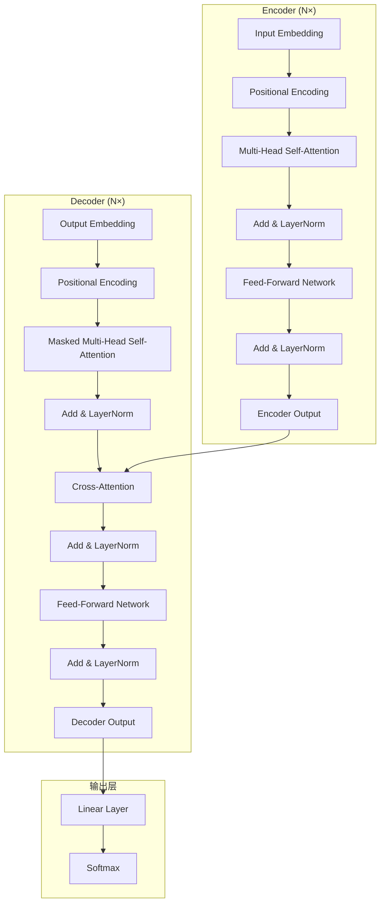

## 概述

Transformer 架构由 Vaswani 等人于 2017 年在论文 **"Attention Is All You Need"** 中提出，彻底革新了序列建模的方式。与传统的 RNN/LSTM 不同，Transformer **完全基于注意力机制（Attention Mechanism）**，摒弃了循环结构，实现了并行计算和长距离依赖捕获。

### 核心创新

- **纯注意力架构**：无 RNN/CNN，完全由 Self-Attention 和 Feed-Forward Network 堆叠而成
- **并行训练**：所有时间步同时计算，训练速度远超 RNN
- **长距离依赖**：任意两个位置的直接连接路径长度为 1，解决了 RNN 的长距离梯度消失问题
- **可扩展性**：通过堆叠层数和增加维度轻松扩展模型容量

---

## 整体架构（Encoder-Decoder）



### 数据流动过程

**Encoder 部分**（左侧，N=6 层堆叠）：

1. **输入嵌入（Input Embedding）**：将输入 token 序列 $x = (x_1, ..., x_n)$ 映射为 $d_{\text{model}}$ 维的稠密向量
2. **位置编码（Positional Encoding）**：注入序列位置信息，与输入嵌入相加
3. **多头自注意力（Multi-Head Self-Attention）**：每个位置关注所有位置，捕获上下文依赖
4. **残差连接 + 层归一化（Add & Norm）**：$x = \text{LayerNorm}(x + \text{Sublayer}(x))$
5. **前馈网络（Feed-Forward Network）**：两层线性变换 + ReLU 激活，独立作用于每个位置
6. 重复步骤 3-5 共 N 次，输出编码表示

**Decoder 部分**（右侧，同样 N=6 层）：

1. **输出嵌入 + 位置编码**：与 Encoder 类似，但输入是目标序列
2. **掩码多头自注意力（Masked MHA）**：每个位置只能关注左侧的位置（未来信息被 Mask 遮蔽），保证自回归生成
3. **交叉注意力（Cross-Attention）**：K, V 来自 Encoder 输出，Q 来自 Decoder 前一层的输出——这是 Encoder 与 Decoder 的信息交互通道
4. **前馈网络 + Add & Norm**：与 Encoder 相同
5. 线性层 + Softmax：将 Decoder 输出映射为词汇表上的概率分布

---

## 各组件详解

### 1. Scaled Dot-Product Attention（缩放点积注意力）

这是 Transformer 的原子操作。给定查询（Query）、键（Key）、值（Value），注意力输出是值的加权和，权重由查询与键的相似度决定：

```python
import torch
import torch.nn as nn
import torch.nn.functional as F
import math

def scaled_dot_product_attention(
    Q: torch.Tensor,  # [batch, heads, seq_len, d_k]
    K: torch.Tensor,  # [batch, heads, seq_len, d_k]
    V: torch.Tensor,  # [batch, heads, seq_len, d_v]
    mask: torch.Tensor = None  # optional mask
) -> torch.Tensor:
    """
    Scaled Dot-Product Attention 的标准实现
    Attention(Q, K, V) = softmax(QK^T / sqrt(d_k)) V
    """
    d_k = Q.size(-1)
    
    # 计算注意力分数: Q @ K^T
    scores = torch.matmul(Q, K.transpose(-2, -1))  # [batch, heads, seq_q, seq_k]
    
    # 缩放: 除以 sqrt(d_k) 防止梯度消失
    scores = scores / math.sqrt(d_k)
    
    # 可选的 mask（用于 Decoder 的 Masked Attention 或 Padding Mask）
    if mask is not None:
        scores = scores.masked_fill(mask == 0, float('-inf'))
    
    # Softmax 归一化得到注意力权重
    attn_weights = F.softmax(scores, dim=-1)  # [batch, heads, seq_q, seq_k]
    
    # 加权求和得到输出
    output = torch.matmul(attn_weights, V)  # [batch, heads, seq_q, d_v]
    
    return output, attn_weights
```

**公式**：

$$\text{Attention}(Q, K, V) = \text{softmax}\left(\frac{QK^\top}{\sqrt{d_k}}\right)V$$

其中 $Q \in \mathbb{R}^{n \times d_k}$, $K \in \mathbb{R}^{m \times d_k}$, $V \in \mathbb{R}^{m \times d_v}$。

**缩放因子 $\sqrt{d_k}$ 的作用**：当 $d_k$ 较大时，点积的方差也会变大（$\text{Var}(QK^\top) = d_k$），导致 softmax 落入梯度极小的区域。除以 $\sqrt{d_k}$ 将方差归一化为 1，使梯度更稳定。

### 2. Multi-Head Attention（多头注意力）

多头注意力将模型拆分为 $h$ 个"头"，每个头在不同的子空间中学习注意力模式：

$$\text{MHA}(Q, K, V) = \text{Concat}(\text{head}_1, ..., \text{head}_h) W^O$$

其中 $\text{head}_i = \text{Attention}(QW_i^Q, KW_i^K, VW_i^V)$

```python
class MultiHeadAttention(nn.Module):
    def __init__(self, d_model: int, n_heads: int, dropout: float = 0.1):
        super().__init__()
        assert d_model % n_heads == 0, "d_model must be divisible by n_heads"
        
        self.d_model = d_model
        self.n_heads = n_heads
        self.d_k = d_model // n_heads
        
        # 线性投影矩阵
        self.W_q = nn.Linear(d_model, d_model)  # Q 投影
        self.W_k = nn.Linear(d_model, d_model)  # K 投影
        self.W_v = nn.Linear(d_model, d_model)  # V 投影
        self.W_o = nn.Linear(d_model, d_model)  # 输出投影
        
        self.dropout = nn.Dropout(dropout)
        
    def forward(self, Q, K, V, mask=None):
        batch_size = Q.size(0)
        
        # 1. 线性投影 + 拆分为多头
        Q = self.W_q(Q).view(batch_size, -1, self.n_heads, self.d_k).transpose(1, 2)
        K = self.W_k(K).view(batch_size, -1, self.n_heads, self.d_k).transpose(1, 2)
        V = self.W_v(V).view(batch_size, -1, self.n_heads, self.d_k).transpose(1, 2)
        
        # 2. 计算注意力
        attn_output, attn_weights = scaled_dot_product_attention(Q, K, V, mask)
        attn_output = self.dropout(attn_output)
        
        # 3. 拼接所有头的输出
        attn_output = attn_output.transpose(1, 2).contiguous()
        attn_output = attn_output.view(batch_size, -1, self.d_model)
        
        # 4. 输出投影
        output = self.W_o(attn_output)
        return output, attn_weights
```

### 3. Position-wise Feed-Forward Network（FFN）

每个位置共用一个两层 MLP，先升维再降维：

$$\text{FFN}(x) = \max(0, xW_1 + b_1)W_2 + b_2$$

```python
class PositionwiseFFN(nn.Module):
    def __init__(self, d_model: int, d_ff: int, dropout: float = 0.1):
        super().__init__()
        self.linear1 = nn.Linear(d_model, d_ff)
        self.linear2 = nn.Linear(d_ff, d_model)
        self.dropout = nn.Dropout(dropout)
        
    def forward(self, x):
        # 先升维到 d_ff（通常是 2048 或 4×d_model），再降维回 d_model
        return self.linear2(self.dropout(F.relu(self.linear1(x))))
```

在现代 LLM 中，FFN 常使用 **GELU** 或 **SwiGLU** 激活函数替代 ReLU（详见 `05-activation-functions.md`）。

### 4. Add & LayerNorm（残差连接 + 层归一化）

每个子层（Attention 和 FFN）后都接残差连接和层归一化：

$$\text{output} = \text{LayerNorm}(x + \text{Sublayer}(x))$$

- **残差连接**：梯度直通路径，缓解深层网络梯度消失
- **层归一化**：对每个样本的特征维度做归一化，稳定训练

```python
class SublayerConnection(nn.Module):
    def __init__(self, d_model: int, dropout: float = 0.1):
        super().__init__()
        self.norm = nn.LayerNorm(d_model)
        self.dropout = nn.Dropout(dropout)
        
    def forward(self, x, sublayer):
        # Pre-Norm 形式（现代 Transformer 的主流选择）
        return x + self.dropout(sublayer(self.norm(x)))
```

关于 Pre-Norm vs Post-Norm 的详细讨论，见 `04-normalization.md`。

---

## 完整 Transformer Block 实现

```python
class TransformerBlock(nn.Module):
    def __init__(self, d_model: int, n_heads: int, d_ff: int, dropout: float = 0.1):
        super().__init__()
        # 多头注意力
        self.attention = MultiHeadAttention(d_model, n_heads, dropout)
        # 前馈网络
        self.ffn = PositionwiseFFN(d_model, d_ff, dropout)
        # 残差连接
        self.sublayer1 = SublayerConnection(d_model, dropout)
        self.sublayer2 = SublayerConnection(d_model, dropout)
        
    def forward(self, x, mask=None):
        # Self-Attention + Add & Norm
        x = self.sublayer1(x, lambda x: self.attention(x, x, x, mask)[0])
        # FFN + Add & Norm
        x = self.sublayer2(x, self.ffn)
        return x
```

---

## 参数量计算

以 Transformer Base 模型（Vaswani et al., 2017）为例：

| 组件 | 参数量公式 | Base 配置 | Base 参数量 |
|------|-----------|-----------|-------------|
| Token Embedding | $V \times d_{\text{model}}$ | $V=37000, d=512$ | 18.9M |
| Multi-Head Attention (单层) | $4 \times d_{\text{model}}^2$ | $d=512, h=8$ | 1.05M |
| FFN (单层) | $2 \times d_{\text{model}} \times d_{\text{ff}}$ | $d=512, d_{\text{ff}}=2048$ | 2.10M |
| Encoder (6层) | $6 \times (1.05M + 2.10M)$ | — | 18.9M |
| Decoder (6层) | $6 \times (1.05M \times 2 + 2.10M)$ | — | 25.2M |
| **总计（无 Embedding）** | — | — | 44.1M |

**详细推导**：
- MHA 参数量：$W^Q, W^K, W^V, W^O$ 各为 $d_{\text{model}} \times d_{\text{model}}$，合计 $4d_{\text{model}}^2$
- FFN 参数量：$W_1 \in \mathbb{R}^{d_{\text{model}} \times d_{\text{ff}}}$, $W_2 \in \mathbb{R}^{d_{\text{ff}} \times d_{\text{model}}}$，合计 $2 d_{\text{model}} d_{\text{ff}}$

```python
def count_transformer_params(d_model=512, d_ff=2048, n_layers=6, vocab_size=37000):
    """计算 Transformer Base 的参数量"""
    embedding = vocab_size * d_model
    attn_per_layer = 4 * d_model * d_model  # Q, K, V, O
    ffn_per_layer = 2 * d_model * d_ff
    layer_total = n_layers * (attn_per_layer + ffn_per_layer)
    
    # 注意：Encoder 有 attn_per_layer + ffn_per_layer
    # Decoder 有 2 * attn_per_layer + ffn_per_layer（多了 Cross-Attention）
    encoder_params = n_layers * (attn_per_layer + ffn_per_layer)
    decoder_params = n_layers * (2 * attn_per_layer + ffn_per_layer)
    
    return {
        "embedding": embedding,
        "per_encoder_layer": attn_per_layer + ffn_per_layer,
        "per_decoder_layer": 2 * attn_per_layer + ffn_per_layer,
        "encoder_total": encoder_params,
        "decoder_total": decoder_params,
        "total": embedding + encoder_params + decoder_params
    }

params = count_transformer_params()
for k, v in params.items():
    print(f"{k}: {v/1e6:.2f}M")
```

输出结果：
```
embedding: 18.94M
per_encoder_layer: 3.15M
per_decoder_layer: 4.20M
encoder_total: 18.93M
decoder_total: 25.17M
total: 63.03M
```

---

## 不同模型规模的参数量对比

| 模型 | $d_{\text{model}}$ | $d_{\text{ff}}$ | $n_{\text{heads}}$ | $n_{\text{layers}}$ | 总参数量 |
|------|-----|-------|--------|---------|---------|
| Transformer Base | 512 | 2048 | 8 | 6+6 | ~65M |
| Transformer Big | 1024 | 4096 | 16 | 6+6 | ~213M |
| BERT-Base | 768 | 3072 | 12 | 12 | ~110M |
| BERT-Large | 1024 | 4096 | 16 | 24 | ~340M |
| GPT-2 Small | 768 | 3072 | 12 | 12 | ~124M |
| GPT-3 175B | 12288 | 49152 | 96 | 96 | ~175B |
| LLaMA-7B | 4096 | 11008 | 32 | 32 | ~6.7B |

---

## 面试问答

### Q1: 为什么 Transformer 要使用缩放点积注意力而非普通点积？

**A**: 缩放因子 $\sqrt{d_k}$ 有两个关键作用：

1. **梯度稳定性**：当 $d_k$ 较大时，$QK^\top$ 的各个分量是独立同分布的随机变量（均值为 0、方差为 $d_k$），导致点积结果的方差为 $d_k$。较大的方差会使 softmax 的输出极度接近 one-hot 向量，梯度趋近于 0。除以 $\sqrt{d_k}$ 将方差归一化为 1，使 softmax 处于梯度适中的区域。
2. **数值稳定性**：缩放避免了过大数值导致的 float16 溢出问题，这对现代混合精度训练至关重要。

数学上，若 $q_i, k_i \sim \mathcal{N}(0, 1)$，则 $S = \sum_{i=1}^{d_k} q_i k_i$ 的方差为 $\text{Var}(S) = d_k$。缩放后 $\text{Var}(S/\sqrt{d_k}) = 1$。

### Q2: 为什么 Decoder 需要 Masked Self-Attention？

**A**: Decoder 的 Self-Attention 需要掩码来保证**自回归属性（Autoregressive Property）**——预测第 $t$ 个 token 时只能看到 $1$ 到 $t-1$ 位置的 token，不能看到未来的 token。如果不加掩码，模型相当于"作弊"，在预测时就能看到正确答案。

掩码实现方式：将上三角矩阵设为 $-\infty$，使得 softmax 后这些位置的注意力权重为 0：

```python
def create_causal_mask(seq_len):
    """创建因果掩码，mask[i][j] = 0 表示位置 i 可以看到位置 j"""
    mask = torch.triu(torch.ones(seq_len, seq_len), diagonal=1) == 0
    return mask  # [seq_len, seq_len]
```

在推理阶段，Masked Decoder 以自回归方式逐个生成 token，每步仅关注已生成的 token。

### Q3: 残差连接在 Transformer 中为什么重要？

**A**: 残差连接在 Transformer 中有三个关键作用：

1. **梯度流动**：残差连接 $\text{output} = x + f(x)$ 为梯度提供了**直接通路**。在反向传播时，$\frac{\partial \text{output}}{\partial x} = 1 + \frac{\partial f}{\partial x}$。其中的常数项 1 保证了即使深层网络中 $f(x)$ 的梯度消失，梯度仍能通过残差连接传播回浅层。
2. **模型简化**：理论上，残差连接使网络更容易学习恒等映射。如果一个子层没有学到有用信息，网络可以直接跳过它（$f(x) \approx 0$）。这使得训练深层网络（如 1000+ 层的 ResNet 或 96 层的 GPT-3）成为可能。
3. **表示保持**：注意力层和 FFN 的输出被加到原始输入上，相当于在原始表示的基础上"增量调整"而非"替换"，保留了位置编码等低层信息。

### Q4: Transformer 中 Self-Attention 的计算复杂度是多少？如何处理长序列？

**A**: Self-Attention 的计算复杂度为 $O(n^2 \cdot d_k)$，其中 $n$ 是序列长度，$d_k$ 是每个头的维度。平方复杂度来自 $QK^\top$ 矩阵乘法，它产生一个 $n \times n$ 的注意力矩阵。

这是 Transformer 处理长序列的主要瓶颈。常用的优化策略包括：

- **稀疏注意力（Sparse Attention）**：只计算局部窗口或特定模式的注意力（如 Longformer、BigBird）
- **线性注意力（Linear Attention）**：将 Softmax 注意力重写为核函数形式，将复杂度降到 $O(n)$
- **Flash Attention**：通过分块计算和重排序减少 HBM 读写，实际加速 2-4 倍
- **滑动窗口注意力（Sliding Window）**：每个位置只关注邻近的 w 个 token（如 Mistral、Gemma）
- **全局 + 局部注意力**：部分 token 使用全局注意力，其余使用局部窗口（如 Longformer、BigBird）

### Q5: Encoder-Only、Decoder-Only 和 Encoder-Decoder 架构的区别是什么？

**A**:

| 架构 | 代表模型 | 特点 | 适用场景 |
|------|---------|------|---------|
| **Encoder-Only** | BERT、RoBERTa | 双向上下文，每个位置可以看到全部位置 | 文本分类、NER、句子对分类、阅读理解 |
| **Decoder-Only** | GPT 系列、LLaMA | 自回归（单向），逐步生成 | 文本生成、对话、代码生成、few-shot 学习 |
| **Encoder-Decoder** | T5、BART | Encoder 双向理解 + Decoder 自回归生成 | 翻译、摘要、文本转换 |

选择建议：
- 只需理解无需生成 $\rightarrow$ Encoder-Only（如情感分析）
- 只需生成无需理解 $\rightarrow$ Decoder-Only（如聊天机器人）
- 两者都需要 $\rightarrow$ Encoder-Decoder（如翻译、摘要）

---

## 参考文献

1. Vaswani et al., "Attention Is All You Need", NeurIPS 2017. [arXiv:1706.03762](https://arxiv.org/abs/1706.03762)
2. Devlin et al., "BERT: Pre-training of Deep Bidirectional Transformers", NAACL 2019
3. Brown et al., "Language Models are Few-Shot Learners", NeurIPS 2020
4. Touvron et al., "LLaMA: Open and Efficient Foundation Language Models", 2023
5. Dao et al., "FlashAttention: Fast and Memory-Efficient Exact Attention", 2022
6. Beltagy et al., "Longformer: The Long-Document Transformer", 2020
