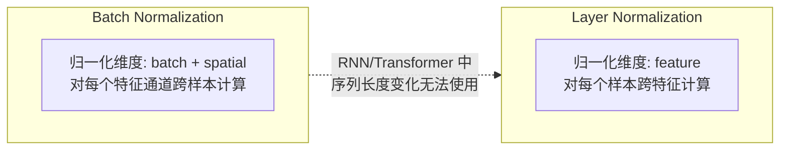
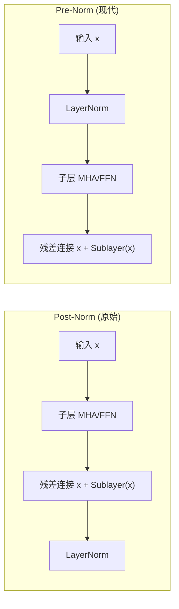

## 概述

归一化（Normalization）是深度学习中稳定训练、加速收敛的关键技术。其核心思想是将中间层的激活值调整到合适的尺度范围内，防止因网络深度增加导致的激活值/梯度的剧烈波动（Internal Covariate Shift / 内部协变量偏移）。

本章详细讨论 Layer Normalization、RMS Norm、Batch Normalization 以及 Pre-Norm 与 Post-Norm 的差异。

---

## 1. Layer Normalization（层归一化）

### 原理

Layer Normalization（LayerNorm, Ba et al., 2016）对**每个样本的所有特征维度**计算均值和方差进行归一化，与 batch 大小无关：

$$\text{LayerNorm}(x) = \frac{x - \mu}{\sqrt{\sigma^2 + \epsilon}} \odot \gamma + \beta$$

其中对单个样本 $x = (x_1, ..., x_H)$：

$$\mu = \frac{1}{H} \sum_{i=1}^{H} x_i, \quad \sigma^2 = \frac{1}{H} \sum_{i=1}^{H} (x_i - \mu)^2$$

- $\gamma, \beta$：可学习的缩放和偏移参数（仿射变换）
- $\epsilon$：防止除零的小常数（通常 $10^{-5}$）
- $H$：特征维数（对于 Transformer 是 $d_{\text{model}}$）

### 与 Batch Normalization 的关键区别



### 梯度推导

设 $y = \frac{x - \mu}{\sigma}$（忽略 $\gamma, \beta$ 和 $\epsilon$），反向传播梯度为：

$$\frac{\partial \mathcal{L}}{\partial x_i} = \frac{1}{\sigma} \left( \frac{\partial L}{\partial y_i} - \frac{1}{H} \sum_{j=1}^{H} \frac{\partial L}{\partial y_j} - \frac{y_i}{H} \sum_{j=1}^{H} y_j \frac{\partial L}{\partial y_j} \right)$$

这个梯度公式确保三点：
1. **中心化**：减去梯度均值 $\frac{1}{H} \sum \frac{\partial L}{\partial y_j}$
2. **方差缩放**：减去 $y_i$ 方向的投影分量
3. **方差归一化**：整体乘以 $1/\sigma$

### PyTorch 实现

```python
import torch
import torch.nn as nn
import torch.nn.functional as F

class LayerNorm(nn.Module):
    """
    手动实现 Layer Normalization（与 nn.LayerNorm 等价）
    """
    def __init__(self, normalized_shape, eps=1e-5, elementwise_affine=True):
        super().__init__()
        self.normalized_shape = normalized_shape
        self.eps = eps
        self.elementwise_affine = elementwise_affine
        
        if elementwise_affine:
            if isinstance(normalized_shape, int):
                self.gamma = nn.Parameter(torch.ones(normalized_shape))
                self.beta = nn.Parameter(torch.zeros(normalized_shape))
            else:
                self.gamma = nn.Parameter(torch.ones(*normalized_shape))
                self.beta = nn.Parameter(torch.zeros(*normalized_shape))
    
    def forward(self, x):
        # 计算均值和方差（在最后一维上）
        mean = x.mean(dim=-1, keepdim=True)
        var = x.var(dim=-1, keepdim=True, unbiased=False)  # unbiased=False 使用 N 而非 N-1
        
        # 归一化
        x_norm = (x - mean) / torch.sqrt(var + self.eps)
        
        # 仿射变换
        if self.elementwise_affine:
            x_norm = x_norm * self.gamma + self.beta
        
        return x_norm

# 验证与 PyTorch 官方实现的一致性
x = torch.randn(4, 16, 512)  # [batch, seq_len, d_model]
custom_ln = LayerNorm(512, eps=1e-5)
torch_ln = nn.LayerNorm(512, eps=1e-5)

# 同步参数（设为相同值）
with torch.no_grad():
    custom_ln.gamma.copy_(torch_ln.weight)
    custom_ln.beta.copy_(torch_ln.bias)

custom_out = custom_ln(x)
torch_out = torch_ln(x)
print(f"Max difference: {(custom_out - torch_out).abs().max().item():.2e}")
# 输出: Max difference: ~1e-6（数值误差在可接受范围内）
```

### 在 Transformer 中的使用

```python
class TransformerBlockWithLN(nn.Module):
    """带有 LayerNorm 的 Transformer Block"""
    def __init__(self, d_model, n_heads, d_ff, dropout=0.1):
        super().__init__()
        self.attention = nn.MultiheadAttention(d_model, n_heads, dropout=dropout, batch_first=True)
        self.ffn = nn.Sequential(
            nn.Linear(d_model, d_ff),
            nn.ReLU(),
            nn.Linear(d_ff, d_model),
            nn.Dropout(dropout)
        )
        # Pre-Norm 形式的 LayerNorm
        self.norm1 = nn.LayerNorm(d_model)
        self.norm2 = nn.LayerNorm(d_model)
        self.dropout = nn.Dropout(dropout)
        
    def forward(self, x):
        # Pre-Norm: 先归一化，再传入子层
        attn_out, _ = self.attention(x, x, x)
        x = x + self.dropout(attn_out)
        x = x + self.dropout(self.ffn(self.norm2(x)))
        return x
```

---

## 2. RMS Norm（均方根归一化）

### 原理

RMS Norm（Root Mean Square Layer Normalization, Zhang & Sennrich, 2019）去掉了 LayerNorm 中的**均值中心化**步骤，仅使用均方根对激活值进行缩放：

$$\text{RMSNorm}(x) = \frac{x}{\sqrt{\text{RMS}(x) + \epsilon}} \odot \gamma$$

其中 $\text{RMS}(x) = \sqrt{\frac{1}{H} \sum_{i=1}^{H} x_i^2}$

### 动机

论文指出 LayerNorm 的成功主要来自**缩放变换（除以标准差）**而非中心化（减去均值）。去掉中心化可以节省计算量，同时实验证明在 Transformer 中性能几乎不受影响。

```python
class RMSNorm(nn.Module):
    """
    RMS Norm — 去掉中心化的 LayerNorm 变体
    被 LLaMA、Mistral 等现代 LLM 广泛采用
    """
    def __init__(self, hidden_size: int, eps: float = 1e-6):
        super().__init__()
        self.weight = nn.Parameter(torch.ones(hidden_size))  # gamma
        self.eps = eps
        
    def forward(self, x):
        # 计算 RMS: sqrt(mean(x^2))
        rms = torch.sqrt(x.pow(2).mean(dim=-1, keepdim=True) + self.eps)
        x_norm = x / rms
        return x_norm * self.weight

# 对比性能
x = torch.randn(4, 16, 4096)  # LLaMA-7B 的维度
rms_norm = RMSNorm(4096)
ln = nn.LayerNorm(4096)

# 基准测试（粗略）
import time

def benchmark(norm_fn, x, n_iters=1000):
    start = time.time()
    for _ in range(n_iters):
        _ = norm_fn(x)
    torch.cuda.synchronize() if x.is_cuda else None
    return (time.time() - start) / n_iters

print(f"RMS Norm forward time: {benchmark(rms_norm, x):.4f}s (but tiny, just for demonstration)")
print(f"LayerNorm forward time: {benchmark(ln, x):.4f}s")
```

### 与 LayerNorm 的对比

| 特性 | LayerNorm | RMS Norm |
|------|-----------|----------|
| 计算量 | $\mathcal{O}(H)$（均值+方差） | $\mathcal{O}(H)$（仅平方和） |
| 计算节省 | — | 约 5-10% 的 forward 加速 |
| 是否有均值中心化 | 是 | 否 |
| 等价性 | $\text{LN}(x) \approx \text{RMS}(x - \mu)$ | — |
| Transformer 性能 | 基准 | 几乎相同 |
| 使用模型 | BERT, T5 | LLaMA, Mistral, Gemma |

---

## 3. Batch Normalization（批归一化）

### 原理

Batch Normalization（BN, Ioffe & Szegedy, 2015）对**每个特征通道跨 batch 计算均值和方差**：

$$\text{BN}(x) = \gamma \cdot \frac{x - \mu_{\text{batch}}}{\sqrt{\sigma^2_{\text{batch}} + \epsilon}} + \beta$$

其中 $\mu_{\text{batch}} = \frac{1}{m} \sum_{i=1}^{m} x_i$, $\sigma^2_{\text{batch}} = \frac{1}{m} \sum_{i=1}^{m} (x_i - \mu_{\text{batch}})^2$，$m$ 是 batch size。

### 训练与推理的差异

**训练时**：
- 使用当前 mini-batch 的统计量 $\mu_{\text{batch}}, \sigma^2_{\text{batch}}$
- 维护**运行均值（running mean）**和**运行方差（running variance）**：$\mu_{\text{run}} \leftarrow \text{momentum} \cdot \mu_{\text{run}} + (1 - \text{momentum}) \cdot \mu_{\text{batch}}$

**推理时**：
- 使用训练期间积累的运行均值和运行方差（固定值，不依赖当前 batch）
- 这点与 LayerNorm 完全不同——LN 在推理时仍然使用当前样本的统计量

```python
class BatchNorm1d(nn.Module):
    """
    手动实现 BatchNorm1d（仅示训练流程）
    """
    def __init__(self, num_features, eps=1e-5, momentum=0.1):
        super().__init__()
        self.num_features = num_features
        self.eps = eps
        self.momentum = momentum
        
        self.gamma = nn.Parameter(torch.ones(num_features))
        self.beta = nn.Parameter(torch.zeros(num_features))
        
        # 运行统计量（不可学习）
        self.register_buffer('running_mean', torch.zeros(num_features))
        self.register_buffer('running_var', torch.ones(num_features))
        
        self.training = True
        
    def forward(self, x):
        if self.training:
            # 计算当前 batch 的统计量
            batch_mean = x.mean(dim=0)  # [num_features]
            batch_var = x.var(dim=0, unbiased=False)  # [num_features]
            
            # 更新运行统计量
            self.running_mean = (1 - self.momentum) * self.running_mean + self.momentum * batch_mean
            self.running_var = (1 - self.momentum) * self.running_var + self.momentum * batch_var
            
            # 归一化
            x_norm = (x - batch_mean) / torch.sqrt(batch_var + self.eps)
        else:
            # 推理时使用运行统计量
            x_norm = (x - self.running_mean) / torch.sqrt(self.running_var + self.eps)
        
        return self.gamma * x_norm + self.beta

# 使用示例
bn = BatchNorm1d(512)
x_train = torch.randn(32, 512)  # [batch, features]
out_train = bn(x_train)  # 训练模式

bn.training = False
x_test = torch.randn(8, 512)
out_test = bn(x_test)  # 推理模式
```

### BN 在 Transformer 中不流行的原因

1. **序列长度可变性**：Transformer 处理的序列长度不同，BN 在不同长度序列上的统计量不一致
2. **batch size 限制**：大模型训练时 batch size 有限，BN 在小 batch 下统计量不稳定
3. **LayerNorm 更适合 Transformer**：LN 的统计量不依赖 batch size，与序列长度无关

---

## 4. Pre-Norm vs Post-Norm

### 定义

**Post-Norm**（原始 Transformer 使用）：

$$\text{Output} = \text{LayerNorm}(x + \text{Sublayer}(x))$$

先通过子层，再归一化。

**Pre-Norm**（现代主流）：

$$\text{Output} = x + \text{Sublayer}(\text{LayerNorm}(x))$$

先归一化，再通过子层。

### 结构对比



### 为什么 Pre-Norm 更好？

```python
# Post-Norm Block
class PostNormBlock(nn.Module):
    def forward(self, x):
        attn_out = self.attention(x, x, x)
        x = self.norm1(x + self.dropout(attn_out))  # 先加后归一化
        ffn_out = self.ffn(x)
        x = self.norm2(x + self.dropout(ffn_out))
        return x

# Pre-Norm Block
class PreNormBlock(nn.Module):
    def forward(self, x):
        attn_out = self.attention(self.norm1(x), x, x)
        x = x + self.dropout(attn_out)  # 先归一化再加
        ffn_out = self.ffn(self.norm2(x))
        x = x + self.dropout(ffn_out)
        return x
```

### 关键差异分析

| 特性 | Post-Norm | Pre-Norm |
|------|-----------|----------|
| 归一化位置 | 残差连接**之后** | 残差连接**之前** |
| 梯度流动 | 需通过 LN（可能抑制梯度） | 残差路径无 LN 遮挡 |
| 训练稳定性 | 较差（深层需要 warmup） | 较好（可直接用较大 LR） |
| 最终性能 | 理论上界更高 | 实际更鲁棒 |
| 深层网络（>12层） | 训练不稳定 | 训练稳定 |
| 使用模型 | 原始 Transformer | 所有现代 LLM |

**核心原因**：Pre-Norm 的残差路径上没有任何归一化层，梯度可以直接从输出层无损地流回输入层。而 Post-Norm 的梯度需要通过 LayerNorm 的反向传播，LayerNorm 的梯度在数值上可能非常小，导致浅层训练不足。

**数学解释**：Pre-Norm 第 $L$ 层的输出可以展开为：

$$x_L = x_0 + \sum_{i=1}^{L} \text{Sublayer}_i(\text{Norm}(x_{i-1}))$$

这意味着 $x_L$ 对 $x_0$ 的梯度中有一个**恒等项** $I$，保证梯度永不消失。而 Post-Norm 中：

$$x_L = \text{Norm}\left(x_{L-1} + \text{Sublayer}_{L-1}(x_{L-1})\right)$$

没有这样的恒等梯度路径。

### 混合方案

有些模型使用混合方案——前几层用 Post-Norm，后几层用 Pre-Norm，试图同时获得两者的优点。但实践中最主流的仍然是 Pre-Norm。

---

## 对比表格

| 特性 | BatchNorm | LayerNorm | RMS Norm | Pre-Norm | Post-Norm |
|------|-----------|-----------|----------|----------|-----------|
| 归一化维度 | batch + spatial | feature | feature | — | — |
| 依赖 batch size | 是 | 否 | 否 | — | — |
| 可学习的 $\gamma, \beta$ | 是 | 是 | 是 | — | — |
| 训练/推理差异 | 有 | 无 | 无 | — | — |
| Transformer 兼容性 | 差 | 好 | 好 | — | — |
| 计算开销 | 中等 | 中等 | 较低 | 与 LN 相同 | 与 LN 相同 |
| 梯度流动 | — | — | — | 好 | 差 |
| 是否需要 warmup | — | — | — | 否 | 是 |
| 主流模型 | CNN (ResNet, VGG) | BERT, T5 | LLaMA, Mistral | GPT, LLaMA | 原始 Transformer |

---

## 面试问答

### Q1: LayerNorm 为什么比 BatchNorm 更适合 Transformer？

**A**: 三个核心原因：

1. **序列长度可变的兼容性**：BatchNorm 对每个特征跨 batch 计算统计量。当序列长度可变时（如 NMT 中不同句子长度），较短的序列末尾填充了大量的 padding token，这些 token 的统计量会污染 BN 的均值和方差估计。LayerNorm 对每个 token 独立计算统计量，不受序列长度影响。

2. **Batch size 敏感性问题**：大模型通常使用较小的 batch size（受显存限制），BN 在小 batch 下统计量噪声大、不稳定。LayerNorm 无此问题。

3. **分布式训练友好**：BN 在分布式训练中需要跨设备同步统计量（SyncBN），增加了通信开销。LayerNorm 不需要跨设备同步。

总结：LN 与 Transformer 的"每个位置独立处理"的设计哲学天然一致，BN 与 CNN 的"平移不变性"设计哲学天然一致。

### Q2: RMS Norm 去掉均值中心化为什么仍然有效？

**A**: 论文（Zhang & Sennrich, 2019）通过理论和实验给出了回答：

1. **缩放比中心化更重要**：LayerNorm 的核心作用是防止激活值的尺度爆炸。RMS Norm 保留了最关键的缩放操作（除以 RMS），这是维持梯度稳定的主要因素。
2. **均值中心化在 Transformer 中收益有限**：由于残差连接的存在，Transformer 各层的激活值均值通常已经接近于 0，减去均值的额外收益很小。
3. **经验验证**：在 WMT 机器翻译任务上，RMS Norm 与 LayerNorm 取得了几乎相同的 BLEU 分数，但训练速度提升了 5-10%。
4. **计算简化**：去掉均值计算意味着每个 forward 节省了两次求和操作（计算均值 + 计算方差）。

G. 这也解释了为什么 LLaMA、Mistral、Gemma 等最新 LLM 全面采用了 RMS Norm。

### Q3: Pre-Norm 为什么可以省去学习率 warmup？

**A**: 学习率 warmup（从 0 逐渐增加到目标 LR）在 Post-Norm 中是必需的，原因在于 Post-Norm 的梯度路径在初始化阶段梯度很小：

1. **Post-Norm 的梯度瓶颈**：在初始化阶段，Post-Norm 中 LayerNorm 的输出方差高度依赖于输入的方差。当参数随机初始化时，经过子层后激活值方差放大，LayerNorm 需要大幅缩放输出。这个缩放过程的反向梯度非常小，导致浅层参数更新极慢。如果直接使用大学习率，参数更新步长与梯度尺度的不匹配会导致训练发散。

2. **Pre-Norm 的梯度路径**：Pre-Norm 的输出 $x_L = x_0 + \sum \text{Sublayer}(Norm(x))$ 保证了梯度中始终存在恒等项 $I$，$\partial x_L / \partial x_0 = I + \text{(子层梯度)}$。即使在初始化阶段子层输出接近 0，梯度仍然可以通过恒等项反向传播。

3. **实际影响**：使用 Pre-Norm 时，甚至在训练的初始 step 就可以使用 $10^{-4}$ 级别的学习率而不发散。Post-Norm 通常需要 4k-10k 步的 warmup 才能逐步升到同样水平。

**注意**：虽然 Pre-Norm 省掉了 warmup 的**必要性**，但在大模型训练中，为避免极小概率的发散风险，大多数训练脚本仍然保留了短 warmup（如 2k 步）作为安全措施。

---

## 参考文献

1. Ba et al., "Layer Normalization", arXiv 2016
2. Zhang & Sennrich, "Root Mean Square Layer Normalization", NeurIPS 2019
3. Ioffe & Szegedy, "Batch Normalization: Accelerating Deep Network Training by Reducing Internal Covariate Shift", ICML 2015
4. Xiong et al., "On Layer Normalization in the Transformer Architecture", ICML 2020
5. Vaswani et al., "Attention Is All You Need", NeurIPS 2017
6. Nguyen & Salazar, "Transformers without Tears: Improving the Normalization of Self-Attention", 2019
7. Wang et al., "Understanding the Difficulty of Training Transformers", EMNLP 2020
