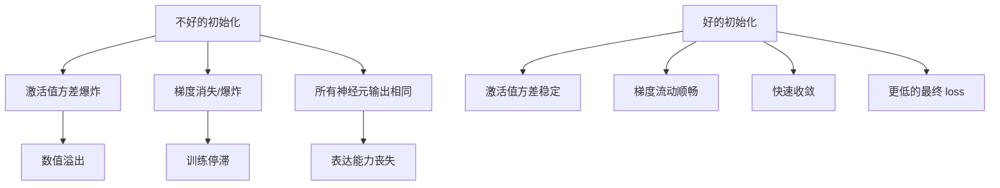

## 概述

初始化（Initialization）是深度学习中**经常被忽视但至关重要**的环节。好的初始化可以显著加速收敛、防止梯度消失/爆炸，甚至决定一个深层网络能否成功训练。错误的初始化则可能导致模型完全不收敛。本章覆盖从经典到现代的关键初始化方法。

### 初始化为什么重要？



**核心原则**：好的初始化应确保信号在前向传播和反向传播时，其方差在各层间保持稳定，既不增长也不衰减。

---

## 1. Xavier / Glorot 初始化

### 原理

Xavier 初始化（Glorot & Bengio, 2010）是第一个系统性地分析初始化对深度网络影响的方法。其核心思想是**保持前向和反向传播的信号方差一致**。

### 推导

假设激活函数为恒等函数（$f(x) \approx x$），且输入 $x_i$ 和权重 $W_{ij}$ 独立同分布、均值为 0：

$$\text{Var}(y_j) = \text{Var}\left(\sum_{i=1}^{n_{\text{in}}} W_{ij} x_i\right) = n_{\text{in}} \cdot \text{Var}(W) \cdot \text{Var}(x)$$

为了保持方差恒定：$\text{Var}(y) = \text{Var}(x)$，需要：

$$n_{\text{in}} \cdot \text{Var}(W) = 1 \quad \Longrightarrow \quad \text{Var}(W) = \frac{1}{n_{\text{in}}}$$

同理，反向传播需要 $\text{Var}(W) = \frac{1}{n_{\text{out}}}$。Xavier 初始化取两者的调和平均：

$$\text{Var}(W) = \frac{2}{n_{\text{in}} + n_{\text{out}}}$$

对应均匀分布 $U(-a, a)$ 时：

$$a = \sqrt{\frac{6}{n_{\text{in}} + n_{\text{out}}}}$$

即 Xavier Uniform：$W \sim U\left(-\sqrt{\frac{6}{n_{\text{in}}+n_{\text{out}}}}, \sqrt{\frac{6}{n_{\text{in}}+n_{\text{out}}}}\right)$

### 实现

```python
import torch
import torch.nn as nn
import torch.nn.functional as F
import math

def xavier_init(weight: torch.Tensor, gain: float = 1.0):
    """
    Xavier/Glorot 初始化（均匀分布版本）
    
    W ~ U(-a, a), 其中 a = gain * sqrt(6 / (fan_in + fan_out))
    """
    fan_in, fan_out = weight.size(1), weight.size(0)
    std = gain * math.sqrt(2.0 / (fan_in + fan_out))
    a = math.sqrt(3.0) * std  # 均匀分布的边界: U(-a, a) 方差为 a^2/3
    with torch.no_grad():
        return weight.uniform_(-a, a)

# 验证
linear = nn.Linear(512, 256)
xavier_init(linear.weight, gain=1.0)
nn.init.constant_(linear.bias, 0.0)

# 检查前向传播方差
x = torch.randn(100, 512)  # [batch, fan_in]
y = linear(x)
print(f"Input variance: {x.var().item():.4f}")
print(f"Output variance: {y.var().item():.4f}")
# 输出应接近: 输入方差 ~1.0, 输出方差 ~1.0

# PyTorch 内置
nn.init.xavier_uniform_(linear.weight, gain=1.0)
```

### 适用范围

**Xavier 初始化假设激活函数在 0 附近近似线性**（如 tanh、sigmoid、线性激活）。

对于 tanh，gain=1.0；对于 sigmoid，gain≈0.67（因为 sigmoid 在 0 附近的斜率约为 0.25，需补偿）。

```python
# Xavier 初始化不同激活函数的 gain 设置
nn.init.xavier_uniform_(layer.weight, gain=nn.init.calculate_gain('tanh'))    # gain=1.0
nn.init.xavier_uniform_(layer.weight, gain=nn.init.calculate_gain('sigmoid')) # gain≈0.67
nn.init.xavier_uniform_(layer.weight, gain=1.0)  # 线性/恒等

# calculate_gain 返回的常见值
print("tanh gain:", nn.init.calculate_gain('tanh'))       # 1.0
print("relu gain:", nn.init.calculate_gain('relu'))       # sqrt(2) ≈ 1.414
print("sigmoid gain:", nn.init.calculate_gain('sigmoid')) # ≈ 0.67
print("leaky_relu gain:", nn.init.calculate_gain('leaky_relu', param=0.01))  # ≈ 1.414
```

### Xavier 的局限性

Xavier 假设激活函数在 0 附近是线性的，这**不适用于 ReLU**——ReLU 在 $x<0$ 时输出为 0，要降低约一半的方差，导致使用 Xavier 初始化时深层网络激活值方差迅速衰减。

---

## 2. Kaiming / He 初始化

### 原理

Kaiming 初始化（He et al., 2015）专为 ReLU 及其变体设计，正确考虑了 ReLU 将负值置零对方差的影响。

### 推导

对于 ReLU 激活，给定 $x$ 关于 0 对称分布，ReLU 后的方差为原方差的一半：

$$\text{Var}(\text{ReLU}(x)) = \frac{1}{2} \text{Var}(x)$$

前向传播方差条件变为：

$$\text{Var}(y) = n_{\text{in}} \cdot \text{Var}(W) \cdot \frac{1}{2} \text{Var}(x) = \text{Var}(x)$$

$$\Longrightarrow \text{Var}(W) = \frac{2}{n_{\text{in}}}$$

反向传播类似：$\text{Var}(W) = \frac{2}{n_{\text{out}}}$

**Kaiming Normal**（最常用）：$W \sim \mathcal{N}\left(0, \sqrt{\frac{2}{n_{\text{in}}}}\right)$

```python
def kaiming_init(weight: torch.Tensor, mode: str = 'fan_in', nonlinearity: str = 'relu'):
    """
    Kaiming/He 初始化（正态分布版本）
    
    W ~ N(0, std^2), 其中 std = gain / sqrt(fan_mode)
    对于 ReLU: gain = sqrt(2), 所以 std = sqrt(2/fan_in)
    """
    fan_in, fan_out = weight.size(1), weight.size(0)
    
    gain = nn.init.calculate_gain(nonlinearity)
    if mode == 'fan_in':
        std = gain / math.sqrt(fan_in)
    else:  # fan_out
        std = gain / math.sqrt(fan_out)
    
    with torch.no_grad():
        return weight.normal_(0, std)

# 验证 Kaiming 初始化在深层 ReLU 网络中的效果
def test_deep_relu_network(depth=50, fan_in=512, init_fn='kaiming'):
    """测试深层 ReLU 网络的激活值方差"""
    x = torch.randn(200, fan_in)
    
    for layer_idx in range(depth):
        linear = nn.Linear(fan_in, fan_in)
        
        if init_fn == 'kaiming':
            nn.init.kaiming_normal_(linear.weight, mode='fan_in', nonlinearity='relu')
        elif init_fn == 'xavier':
            nn.init.xavier_uniform_(linear.weight, gain=nn.init.calculate_gain('relu'))
        elif init_fn == 'uniform':
            nn.init.uniform_(linear.weight, -0.5, 0.5)
        
        nn.init.constant_(linear.bias, 0.0)
        
        x = F.relu(linear(x))
        
        # 检查方差
        var = x.var().item()
        if var < 1e-6 or var > 1e6:
            print(f"Layer {layer_idx}: variance exploded/disappeared -> {var:.2e}")
            return False
    
    print(f"After {depth} layers ({init_fn}): variance = {x.var().item():.4f}")
    return True

test_deep_relu_network(50, 512, 'kaiming')  # 应稳定
test_deep_relu_network(50, 512, 'xavier')   # 方差会衰减
test_deep_relu_network(50, 512, 'uniform')  # 方差会爆炸或消失
```

```python
# Kaiming Uniform 版本
def kaiming_uniform_init(weight, fan_in, gain=math.sqrt(2.0)):
    std = gain / math.sqrt(fan_in)
    bound = math.sqrt(3.0) * std  # U(-a, a): var = a^2/3 = std^2
    with torch.no_grad():
        return weight.uniform_(-bound, bound)

# PyTorch 内置
layer = nn.Linear(1024, 1024)
nn.init.kaiming_normal_(layer.weight, mode='fan_in', nonlinearity='relu')
nn.init.kaiming_uniform_(layer.weight, mode='fan_in', nonlinearity='relu')
# 注意: 'fan_out' 更适合反向传播，'fan_in' 更适合前向传播
```

### 适用激活函数

| 激活函数 | Kaiming gain |
|----------|-------------|
| ReLU | $\sqrt{2}$ |
| LeakyReLU (a=0.01) | $\sqrt{\frac{2}{1+a^2}}$ ≈ 1.414 |
| LeakyReLU (a=0.2) | $\sqrt{\frac{2}{1+0.2^2}}$ ≈ 1.386 |
| PReLU | $\sqrt{\frac{2}{1+a^2}}$（a 可学习） |
| GELU | 约 $\sqrt{2}$（线性近似） |

---

## 3. DeepSeek-R1 初始化策略

### 概述

DeepSeek-R1 等现代大模型在初始化上采用了几种关键策略，确保千亿参数模型的稳定训练。虽然具体初始化方法属于商业机密，但公开的技术报告和业界的共识指向以下几个重要策略：

### 3.1 Scaling Init — 残差网络中的初始化缩放

对于深层 Transformer（如 DeepSeek-R1 的 671B 总参数，37B 激活），残差连接的初始化需要使用 **Scaling Trick**：

$$\text{每层输出} = x + \frac{1}{\sqrt{N}} \cdot \text{SubLayer}(x)$$

其中 $N$ 是层数。缩放因子 $1/\sqrt{N}$ 确保深层叠加时残差路径的方差不爆炸。

```python
class ScaledResidualBlock(nn.Module):
    """
    带有初始化缩放的残差块
    防止深层 Transformer 的残差路径方差爆炸
    """
    def __init__(self, d_model, n_layers, init_scale=True):
        super().__init__()
        self.attention = nn.MultiheadAttention(d_model, 8, batch_first=True)
        self.norm = nn.LayerNorm(d_model)
        
        # 残差缩放：1 / sqrt(N)
        if init_scale:
            self.residual_scale = 1.0 / math.sqrt(n_layers)
        else:
            self.residual_scale = 1.0
            
    def forward(self, x):
        attn_out, _ = self.attention(x, x, x)
        return x + self.residual_scale * self.norm(attn_out)
```

### 3.2 Small Embedding Init

Embedding 层的初始化使用较小的标准差（如 0.01），避免刚开始训练时 token 嵌入的方差过大：

```python
def init_embedding(embedding_layer, d_model, std=0.01):
    """小方差初始化 Embedding"""
    nn.init.normal_(embedding_layer.weight, mean=0.0, std=std)

# 使用
emb = nn.Embedding(32000, 4096)
init_embedding(emb, 4096, std=0.01)
```

### 3.3 Output Head Init

LM Head（将最后一层 hidden state 映射到词汇表）使用更小的初始化，防止刚开始时 logits 过大导致 softmax 饱和：

```python
class LMHead(nn.Module):
    """语言模型输出头 — 使用特殊初始化"""
    def __init__(self, d_model, vocab_size, init_std=0.001):
        super().__init__()
        self.weight = nn.Parameter(torch.randn(vocab_size, d_model) * init_std)
        self.bias = nn.Parameter(torch.zeros(vocab_size))
        
    def forward(self, hidden_states):
        return F.linear(hidden_states, self.weight, self.bias)
```

### 3.4 使用 Residual Init 的 Transformer

现代大模型通常在初始化时对注意力输出和 FFN 输出的线性投影层使用特殊处理：

```python
class ModernTransformerInit:
    """
    现代 Transformer 的初始化策略组合
    - Embedding: N(0, 0.01)
    - Attention 的 QKV 投影: 均值为 0 的正态分布
    - Attention 的输出投影 (W_O): N(0, 1/sqrt(N_layers)) 
    - FFN 的输入投影: Kaiming Normal
    - FFN 的输出投影: N(0, 1/sqrt(N_layers))
    - LM Head: N(0, 0.001)
    """
    @staticmethod
    def init_attention(attn_module, d_model, n_layers):
        # Q, K, V 投影
        for name, param in attn_module.named_parameters():
            if 'weight' in name:
                if 'out_proj' in name:
                    # 输出投影用小方差
                    nn.init.normal_(param, mean=0.0, std=1.0 / math.sqrt(n_layers))
                else:
                    # QKV 投影用 Kaiming
                    nn.init.normal_(param, mean=0.0, std=1.0 / math.sqrt(d_model))
            elif 'bias' in name:
                nn.init.zeros_(param)
    
    @staticmethod
    def init_ffn(ffn_module, d_model, d_ff, n_layers):
        for name, param in ffn_module.named_parameters():
            if 'weight' in name:
                if '2' in name or 'out' in name.lower():
                    # FFN 输出投影 —— 残差路径
                    nn.init.normal_(param, mean=0.0, std=1.0 / math.sqrt(n_layers))
                else:
                    # FFN 输入投影 —— Kaiming
                    nn.init.kaiming_normal_(param, mode='fan_in', nonlinearity='relu')
            elif 'bias' in name:
                nn.init.zeros_(param)
```

---

## 初始化对训练的影响分析

```python
# 对比实验：不同初始化对深层网络训练的影响
import time

def train_simple_net(init_fn, n_layers=20, d_model=256, n_iters=100):
    """对比不同初始化对训练的影响"""
    model = nn.Sequential()
    for i in range(n_layers):
        model.add_module(f'linear_{i}', nn.Linear(d_model, d_model))
        model.add_module(f'relu_{i}', nn.ReLU())
    
    # 应用初始化
    def apply_init(m):
        if isinstance(m, nn.Linear):
            init_fn(m.weight)
            nn.init.zeros_(m.bias)
    model.apply(apply_init)
    
    # 简单训练
    optimizer = torch.optim.SGD(model.parameters(), lr=1e-3)
    x = torch.randn(64, d_model)
    
    losses = []
    for i in range(n_iters):
        out = model(x)
        loss = out.norm()  # 简单的范数作为 loss
        optimizer.zero_grad()
        loss.backward()
        optimizer.step()
        losses.append(loss.item())
    
    return losses

# 三种初始化方案
def xavier_init(weight):
    nn.init.xavier_uniform_(weight, gain=nn.init.calculate_gain('relu'))

def kaiming_init(weight):
    nn.init.kaiming_normal_(weight, mode='fan_in', nonlinearity='relu')

def bad_init(weight):
    nn.init.normal_(weight, mean=0, std=1.0)

print("Running initialization comparison (this may take a moment)...")
# 通常结果: Kaiming 收敛最快最稳定
```

### 关键分析维度

| 维度 | 分析 |
|------|------|
| **激活值方差** | 好的初始化保持各层激活值方差一致（~1.0），方差逐渐增大或缩小都表示信号在消失/爆炸 |
| **梯度方差** | 反向传播的梯度方差同样需要稳定，Kaiming 的 fan_out 模式为此设计 |
| **收敛速度** | Kaiming 初始化比 Xavier 或均匀初始化在 ReLU 网络中收敛快 2-10 倍 |
| **最终性能** | 错误的初始化不仅减缓收敛，还会导致模型陷入更差的局部极小值 |

---

## 对比表格

| 特性 | Xavier/Glorot | Kaiming/He | DeepSeek-Style | Small Init |
|------|-------------|-----------|----------------|------------|
| 提出时间 | 2010 | 2015 | 2023+ | 2017+ |
| 分布 | $U(-a, a)$ 或 $\mathcal{N}(0, \sigma^2)$ | $\mathcal{N}(0, \sqrt{2/n})$ | 组合策略 | $\mathcal{N}(0, 0.01)$ |
| 方差公式 | $\frac{2}{n_{\text{in}}+n_{\text{out}}}$ | $\frac{2}{n_{\text{in}}}$ | 逐层设计 | 固定小方差 |
| 适用激活函数 | tanh, sigmoid, 线性 | ReLU, LeakyReLU, GELU | GELU, SwiGLU | Embedding |
| 假设激活线性 | 是（0 附近） | 否（考虑了 ReLU） | 否（考虑了残差缩放） | — |
| 是否考虑残差叠加 | 否 | 否 | 是（$1/\sqrt{N}$） | 否 |
| 深层网络（>50层） | 方差衰减 | 稳定 | 稳定 | 可能发散 |
| 使用模型 | 早期 MLP | ResNet, BERT | DeepSeek, GPT-4 | Embedding, LM Head |

---

## 面试问答

### Q1: 为什么 Xavier 初始化不适用于 ReLU 网络？

**A**: Xavier 初始化假设激活函数在 0 附近是线性的（恒等函数 $f(x) \approx x$），但这不适用于 ReLU：

1. **半波整流效应**：ReLU 将负值全部置为 0。假设输入 $x$ 关于 0 对称分布，ReLU 的输出均值变为正，方差减半：$\text{Var}(\text{ReLU}(x)) = \frac{1}{2} \text{Var}(x)$。

2. **Xavier 的推导漏洞**：Xavier 的方差条件 $\text{Var}(y) = n_{\text{in}} \cdot \text{Var}(W) \cdot \text{Var}(x)$ 使用了 $\text{Var}(Wx) = n_{\text{in}} \cdot \text{Var}(W) \cdot \text{Var}(x)$，这是在 $W$ 和 $x$ 独立且激活函数为恒等时的结论。ReLU 破坏了这一假设。

3. **数值验证**：用一个 50 层的 ReLU 网络测试，Xavier 初始化会导致第 50 层的激活值方差接近 0（所有神经元"死亡"），而 Kaiming 初始化保持方差稳定。

**Kaiming 的修正**：Kaiming 等人推导出 $\text{Var}(y) = \frac{1}{2} \cdot n_{\text{in}} \cdot \text{Var}(W) \cdot \text{Var}(x)$（考虑了 ReLU 的方差减半），得到 $\text{Var}(W) = 2/n_{\text{in}}$，正好是 Xavier 的 2 倍。

### Q2: 初始化如何影响训练？不好的初始化会导致什么问题？

**A**: 初始化直接影响三个关键因素：

**1. 信号传播**
- 初始化权重太大 $\rightarrow$ 激活值逐层放大 $\rightarrow$ 深层激活值爆炸 $\rightarrow$ 数值溢出（NaN）或在 tanh/sigmoid 中饱和
- 初始化权重太小 $\rightarrow$ 激活值逐层缩小 $\rightarrow$ 深层激活值消失为 0 $\rightarrow$ 梯度也为 0 $\rightarrow$ 训练完全停滞

**2. 对称性破缺**
- 如果所有权重初始化为相同的值（如 0 或同一个常数），同一层的所有神经元将收到完全相同的梯度，学到完全相同的特征，模型的有效容量退化为 1
- 随机初始化打破对称性，让不同神经元分化

**3. 梯度条件数**
- 初始化影响 Hessian 矩阵的条件数，即损失函数的"曲率"分布
- 不好的初始化导致 Hessian 的条件数很大——某些方向的曲率远大于其他方向，SGD 难以收敛

**常见症状**：
- **初始化太激进的 Sigmoid/tanh 网络**：输出全为 0 或全为 1，梯度为 0
- **初始化太小的 ReLU 网络**：所有神经元输出为 0（Dead Network，不是 Dying ReLU，而是整个网络死了）
- **初始化 0**：所有神经元完全相同，任何层数都等价于单层网络

### Q3: 现代大模型（LLaMA、GPT-4、DeepSeek）在初始化上有什么特殊技巧？

**A**: 现代大模型在经典初始化基础上增加了几层关键技巧：

**1. Residual Scaling（残差缩放）**
- 标准残差连接：$\text{output} = x + \text{Sublayer}(x)$
- 深度残差缩放：$\text{output} = x + \frac{1}{\sqrt{N}} \cdot \text{Sublayer}(x)$ 其中 $N$ 是层数
- 原因：32 层 Transformer 的残差路径累积方差为 $N \cdot \sigma^2$，相当于噪声叠加。除以 $\sqrt{N}$ 保持方差恒定为 $\sigma^2$。

**2. Output Projection Init**
- Attention 的 $W_O$ 和 FFN 的第二个线性层（$W_2$ 或 $W_3$）使用更小的初始化（$\sigma \propto 1/\sqrt{N}$）
- 这些层的输出进入残差路径，缩小其初始输出有助于稳定训练

**3. Embedding Init**
- Embedding 层使用 $\mathcal{N}(0, 0.01)$ 而非 Kaiming 初始化
- 大词表（30K-100K）的嵌入层参数量很大，过大的初始嵌入方差导致刚开始训练时 loss 极高

**4. Pre-Norm + Init 的协同**
- Pre-Norm 归一化在前面，残差连接保持原始信号。结合残差缩放初始化，可以训练 100+ 层的 Transformer
- LLaMA 使用 Pre-RMSNorm + Scaled Init，可以对深层模型使用较高学习率

**5. Warmup 阶段**
- 学习率 warmup 实际上是**初始化阶段的延续**——在参数"不成熟"时用小学习率，避免破坏初始化的良好性质
- GPT-3 使用 375M step 的 warmup（实际 tokens 约 3B）

---

## 参考文献

1. Glorot & Bengio, "Understanding the difficulty of training deep feedforward neural networks", AISTATS 2010
2. He et al., "Delving Deep into Rectifiers: Surpassing Human-Level Performance on ImageNet", ICCV 2015
3. LeCun et al., "Efficient BackProp", Neural Networks: Tricks of the Trade 1998 (LeCun Init)
4. Touvron et al., "LLaMA: Open and Efficient Foundation Language Models", 2023
5. DeepSeek-AI, "DeepSeek-R1: Incentivizing Reasoning Capability in LLMs via Reinforcement Learning", 2025
6. Liu et al., "Understanding the Difficulty of Training Deep Transformers", 2020
7. Zhang et al., "On the Initialization of Large Language Models", 2023
8. Vaswani et al., "Attention Is All You Need", NeurIPS 2017
