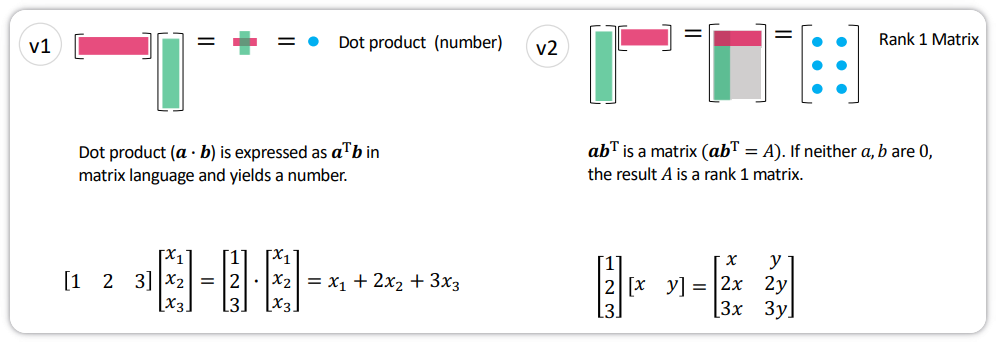
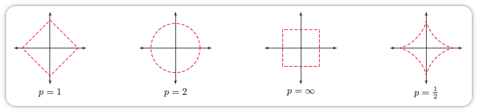
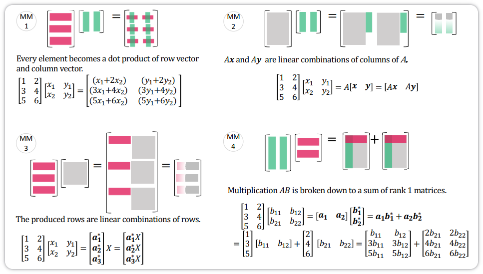
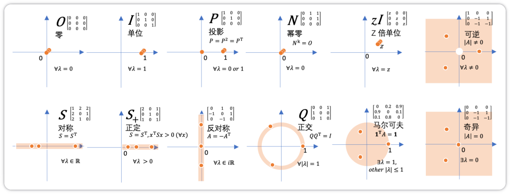
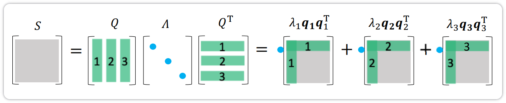
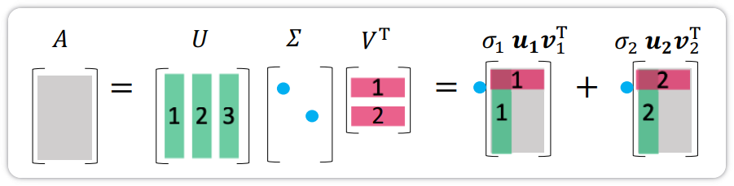

## 向量和向量空间

### 向量

标量（Scalar）是一个实数，只有大小，没有方向. 标量一般用斜体小写英文字母表示. 向量（Vector）是由一组实数组成的有序数组，同时具有大小和方向. 一个 $N$ 维向量 $\mathbf{a}$ 可以写为
$$
\mathbf{a} = [a_1; a_2; \dots; a_N] \in \mathbb{R}^N \tag{1}
$$
其中 $a_n$ 称为向量 $\mathbf{a}$ 的第 $n$ 个分量，或第 $n$ 维. 

one-hot 向量为只有一个元素为 $1$、其余元素都为 $0$ 的向量. 

### 向量空间

向量空间（Vector Space），也称线性空间（Linear Space），是指由向量组成并且对加法与数乘封闭的集合. 对向量空间 $\mathcal{V}$ 中的任意向量 $\mathbf{a},\mathbf{b}$ 和任意标量 $c$ ，至少需要满足：

- 向量加法 $+$：若 $\mathbf{a}, \mathbf{b} \in \mathcal{V}$，则 $\mathbf{a} + \mathbf{b} \in \mathcal{V}$；

- 标量乘法 $\cdot$：若 $\mathbf{a} \in \mathcal{V}$，则 $c \cdot \mathbf{a} \in \mathcal{V}$.

一个常用的线性空间是欧式空间（Euclidean Space）. 一个定义在实数域上的欧式空间通常表示为 $\mathbb{R}^N$，其中 $N$ 为空间维度（Dimension）. 欧式空间的向量加法和标量乘法定义为：
$$
[a_1, a_2, \cdots, a_N] + [b_1, b_2, \cdots, b_N] = [a_1 + b_1, a_2 + b_2, \cdots, a_N + b_N] \tag{2}
$$

$$
c \cdot [a_1, a_2, \cdots, a_N] = [ca_1, ca_2, \cdots, ca_N] \tag{3}
$$

其中 $a,b,c \in \mathbb{R}$ 属于标量.

线性空间 $\mathcal{V}$ 中的 $M$ 个向量 $\{\mathbf{v}_1, \mathbf{v}_2, \cdots, \mathbf{v}_M\}$，如果一组标量 $\lambda_1, \lambda_2, \cdots, \lambda_M$ 满足
$$
\lambda_1 \mathbf{v}_1 + \lambda_2 \mathbf{v}_2 + \cdots + \lambda_M \mathbf{v}_M = 0, \tag{4}
$$
则必然 $\lambda_1 = \lambda_2 = \cdots = \lambda_M = 0$，那么 $\{\mathbf{v}_1, \mathbf{v}_2, \cdots, \mathbf{v}_M\}$ 是线性无关的，也称为线性独立的. 换句话说，只有所有系数都为 $0$ 的平凡线性组合才会得到零向量.

一个 $N$ 维线性空间中的两个向量 $\mathbf{a}$ 和 $\mathbf{b}$，其内积（Inner Product）为
$$
\langle \mathbf{a}, \mathbf{b} \rangle = \sum_{n=1}^N a_n b_n. \tag{5}
$$
内积也称为点积（Dot Product）或标量积（Scalar Product）.

两个向量 $\mathbf{a} \in \mathbb{R}^M$ 和 $\mathbf{b} \in \mathbb{R}^N$ 的外积（Outer Product）是一个 $M \times N$ 的矩阵，定义为
$$
\mathbf{a} \otimes \mathbf{b} =
\begin{bmatrix}
a_1 b_1 & a_1 b_2 & \cdots & a_1 b_N \\
a_2 b_1 & a_2 b_2 & \cdots & a_2 b_N \\
\vdots & \vdots & \ddots & \vdots \\
a_M b_1 & a_M b_2 & \cdots & a_M b_N
\end{bmatrix}
= \mathbf{a} \mathbf{b}^\top
\tag{6}
$$
其中 $[\mathbf{a} \otimes \mathbf{b}]_{mn} = a_m b_n$.

（v1）是两个向量之间的点积，而（v2）将列乘以行并产生一个秩 $1$ 矩阵（若 $\mathbf{a}, \mathbf{b}$ 均非零），是两个向量的外积.

如果向量空间中两个向量的内积为 $0$，则它们正交（Orthogonal）. 如果向量空间中一个向量 $\mathbf{v}$ 与子空间 $\mathcal{U}$ 中的每个向量都正交，那么向量 $\mathbf{v}$ 和子空间 $\mathcal{U}$ 正交.

### 范数

范数（Norm）是一个表示向量“长度”的函数. 对于一个 $N$ 维向量 $\mathbf{v}$，一个常见的范数函数为 $\ell_p$ 范数：
$$
\ell_p(\mathbf{v}) \equiv \|\mathbf{v}\|_p = \left( \sum_{n=1}^N |v_n|^p \right)^{1/p} \tag{7}
$$
其中 $p \geq 1$ 为一个标量参数. 常用的 $p$ 取值有 $1, 2, \infty$ 等.

$\ell_1$ 范数为各元素绝对值之和：
$$
\|\mathbf{v}\|_1 = \sum_{n=1}^N |v_n|. \tag{8}
$$
$\ell_2$ 范数为各元素平方和再开平方：
$$
\|\mathbf{v}\|_2 = \sqrt{\sum_{n=1}^N v_n^2} = \sqrt{\mathbf{v}^\top \mathbf{v}}. \tag{9}
$$
$\ell_2$ 范数又称 Euclidean 范数. 几何上，向量可视为从原点出发的有向线段，其 $\ell_2$ 范数即线段长度，也称向量的模.

当 $0 < p < 1$ 时，上式仍常使用，但不再严格满足三角不等式，通常称为拟范数（Quasi-norm）.

$\ell_\infty$ 范数为各元素绝对值的最大值：
$$
\|\mathbf{v}\|_\infty = \max_{1 \leq n \leq N} |v_n|. \tag{10}
$$

图中给出了常见范数的示例，其中红线表示不同范数的 $\ell_p=1$ 的点.

## 矩阵

### 线性映射

线性映射（Linear Mapping）是指从线性空间 $\mathcal{X}$ 到线性空间 $\mathcal{Y}$ 的一个映射函数 $f : \mathcal{X} \to \mathcal{Y}$，并满足：对于 $\mathcal{X}$ 中任何两个向量 $\mathbf{u}$ 和 $\mathbf{v}$ 以及任何标量 $c$，有
$$
f(\mathbf{u} + \mathbf{v}) = f(\mathbf{u}) + f(\mathbf{v}) \tag{11}
$$

$$
f(c\mathbf{v}) = c f(\mathbf{v}) \tag{12}
$$

两个有限维欧氏空间的映射函数 $f : \mathbb{R}^N \to \mathbb{R}^M$ 可以表示为
$$
\mathbf{y} = \mathbf{A} \mathbf{x} \triangleq
\begin{bmatrix}
a_{11} x_1 + a_{12} x_2 + \cdots + a_{1N} x_N \\
a_{21} x_1 + a_{22} x_2 + \cdots + a_{2N} x_N \\
\vdots \\
a_{M1} x_1 + a_{M2} x_2 + \cdots + a_{MN} x_N
\end{bmatrix} \tag{13}
$$
其中 $\mathbf{A}$ 是一个由 $M$ 行 $N$ 列个元素排列成的矩形阵列，称为 $M \times N$ 的矩阵（Matrix）：
$$
\mathbf{A} =
\begin{bmatrix}
a_{11} & a_{12} & \cdots & a_{1N} \\
a_{21} & a_{22} & \cdots & a_{2N} \\
\vdots & \vdots & \ddots & \vdots \\
a_{M1} & a_{M2} & \cdots & a_{MN}
\end{bmatrix} \tag{14}
$$
向量 $\mathbf{x} \in \mathbb{R}^N$ 和 $\mathbf{y} \in \mathbb{R}^M$ 为两个空间中的向量. $\mathbf{x}$ 和 $\mathbf{y}$ 可以分别表示为 $N \times 1$ 的矩阵和 $M \times 1$ 的矩阵：
$$
\mathbf{x} = 
\begin{bmatrix}
x_1 \\
x_2 \\
\vdots \\
x_N
\end{bmatrix}, \quad \mathbf{y} = 
\begin{bmatrix}
y_1 \\
y_2 \\
\vdots \\
y_M
\end{bmatrix} \tag{15}
$$
这种表示形式称为列向量，即只有一列的矩阵.

行向量（即 $1 \times N$ 的矩阵）一般用逗号隔离的向量 $[\mathbf{x}_1, \mathbf{x}_2, \cdots, \mathbf{x}_N]$ 表示；列向量用分号隔开的向量 $\mathbf{x} = [\mathbf{x}_1; \mathbf{x}_2; \cdots; \mathbf{x}_N]$ 表示，或用行向量的转置 $[\mathbf{x}_1, \mathbf{x}_2, \cdots, \mathbf{x}_N]^T$ 表示（常见）.

矩阵 $\mathbf{A} \in \mathbb{R}^{M \times N}$ 定义了一个从空间 $\mathbb{R}^N$ 到空间 $\mathbb{R}^M$ 的线性映射. 一个矩阵 $\mathbf{A}$ 从左上角数起的第 $m$ 行第 $n$ 列上的元素称为第 $m, n$ 项，通常记为 $[\mathbf{A}]_{mn}$ 或 $a_{mn}$.

### 仿射变换

仿射变换（Affine Transformation）是指通过一个线性变换和一个平移，将一个向量空间变换成另一个向量空间的过程. 

更一般地，令 $\mathbf{A} \in \mathbb{R}^{M \times N}$，$\mathbf{x} \in \mathbb{R}^N$，$\mathbf{b} \in \mathbb{R}^M$，则仿射变换可以表示为
$$
\mathbf{y} = \mathbf{A} \mathbf{x} + \mathbf{b} \tag{16}
$$
其中$\mathbf{b}$ 为平移项. 当 $\mathbf{b} = \mathbf{0}$ 时，仿射变换就退化为线性变换. 神经网络中的线性层（更准确地说是仿射层）通常就写成这一形式.

仿射变换可实现线性空间中的旋转、平移和缩放，且不改变原始空间的相对位置关系，具有以下性质：

- 共线性（Collinearity）不变：原本在同一直线上的三个及以上的点，变换后仍然共线；
- 比例不变：不同点之间的距离比例在变换后保持不变；
- 平行性不变：两条平行线变换后仍然平行；
- 凸性不变：凸集（Convex Set）变换后仍为凸集.

### 矩阵操作

若 $\mathbf{A}$ 和 $\mathbf{B}$ 都为 $M \times N$ 的矩阵，则它们的和也是 $M \times N$ 的矩阵，其每个元素是 $\mathbf{A}$ 和 $\mathbf{B}$ 对应元素之和，即
$$
[\mathbf{A} + \mathbf{B}]_{mn} = a_{mn} + b_{mn} \tag{17}
$$
假设有两个矩阵 $\mathbf{A}$ 和 $\mathbf{B}$ 分别表示两个线性映射 $g : \mathbb{R}^K \to \mathbb{R}^M$ 和 $f : \mathbb{R}^N \to \mathbb{R}^K$，则其复合线性映射
$$
(g \circ f)(\mathbf{x}) = g(f(\mathbf{x})) = g(\mathbf{B} \mathbf{x}) = \mathbf{A} (\mathbf{B} \mathbf{x}) = (\mathbf{A} \mathbf{B}) \mathbf{x} \tag{18}
$$
其中 $\mathbf{A} \mathbf{B}$ 表示矩阵 $\mathbf{A}$ 和 $\mathbf{B}$ 的乘积，定义为
$$
[\mathbf{A} \mathbf{B}]_{mn} = \sum_{k=1}^K a_{mk} b_{kn} \tag{19}
$$
两个矩阵的乘积仅当前者列数等于后者行数时才有定义. 若 $\mathbf{A} \in \mathbb{R}^{M \times K}$、$\mathbf{B} \in \mathbb{R}^{K \times N}$，则 $\mathbf{A} \mathbf{B} \in \mathbb{R}^{M \times N}$.

矩阵的乘法满足结合律和分配律：

- 结合律：$ (\mathbf{A} \mathbf{B}) \mathbf{C} = \mathbf{A} (\mathbf{B} \mathbf{C})$；
- 分配律：$(\mathbf{A} + \mathbf{B}) \mathbf{C} = \mathbf{A} \mathbf{C} + \mathbf{B} \mathbf{C}, \quad \mathbf{C} (\mathbf{A} + \mathbf{B}) = \mathbf{C} \mathbf{A} + \mathbf{C} \mathbf{B}$.

图中展示了矩阵乘法的四种等价视角：

- 元素定义：$[\mathbf{A}\mathbf{B}]_{mn}$ 为 $\mathbf{A}$ 的第 $m$ 行与 $\mathbf{B}$ 的第 $n$ 列的点积；
- 列视角：$\mathbf{A}\mathbf{B} = [\mathbf{A}\mathbf{x}, \mathbf{A}\mathbf{y}]$，即 $\mathbf{A}$ 分别作用于 $\mathbf{B}$ 的各列；
- 行视角：$\mathbf{A}\mathbf{B}$ 的每一行是 $\mathbf{A}$ 对应行向量的线性组合；
- 秩 $1$ 分解：$\mathbf{A}\mathbf{B} = \sum_k \mathbf{a}_k \mathbf{b}_k^*$，即各列与对应行的外积之和.

$M \times N$ 矩阵 $\mathbf{A}$ 的转置（Transposition）是一个 $N \times M$ 的矩阵，记为 $\mathbf{A}^\top$，其第 $m$ 行第 $n$ 列的元素为原矩阵 $\mathbf{A}$ 的第 $n$ 行第 $m$ 列元素：
$$
[\mathbf{A}^\top]_{mn} = [\mathbf{A}]_{nm} \tag{20}
$$
矩阵 $\mathbf{A}$ 和矩阵 $\mathbf{B}$ 的 Hadamard 积（Hadamard Product）也称为逐点乘积，为 $\mathbf{A}$ 和 $\mathbf{B}$ 中对应的元素相乘：
$$
[\mathbf{A} \odot \mathbf{B}]_{mn} = a_{mn} b_{mn} \tag{21}
$$
Kronecker 积（Kronecker Product）是一种把两个矩阵按块展开的乘积。若 $\mathbf{A}$ 是 $M \times N$ 的矩阵，$\mathbf{B}$ 是 $S \times T$ 的矩阵，则 $\mathbf{A} \otimes \mathbf{B}$ 是一个 $MS \times NT$ 的矩阵：
$$
\mathbf{A} \otimes \mathbf{B} =
\begin{bmatrix}
a_{11}\mathbf{B} & a_{12}\mathbf{B} & \cdots & a_{1N}\mathbf{B} \\
a_{21}\mathbf{B} & a_{22}\mathbf{B} & \cdots & a_{2N}\mathbf{B} \\
\vdots & \vdots & \ddots & \vdots \\
a_{M1}\mathbf{B} & a_{M2}\mathbf{B} & \cdots & a_{MN}\mathbf{B}
\end{bmatrix} \tag{22}
$$
矩阵的向量化（Vectorization）是将矩阵表示为一个列向量。令 $\mathbf{A} = [a_{ij}]_{M \times N}$，向量化算子 $\text{vec}(\cdot)$ 定义为
$$
\text{vec}(\mathbf{A}) = [a_{11}, a_{21}, \cdots, a_{M1}, a_{12}, a_{22}, \cdots, a_{M2}, \cdots, a_{1N}, a_{2N}, \cdots, a_{MN}]^\top
$$
方块矩阵 $\mathbf{A}$ 的对角线元素之和称为它的迹（Trace），记为 $\text{tr}(\mathbf{A})$. 迹具有以下性质：

- 对于 $\mathbf{A} \in \mathbb{R}^{n \times n}$，$\text{tr}(\mathbf{A}) = \text{tr}(\mathbf{A}^\top)$；
- 对于 $\mathbf{A}, \mathbf{B} \in \mathbb{R}^{n \times n}$，$\text{tr}(\mathbf{A} + \mathbf{B}) = \text{tr}(\mathbf{A}) + \text{tr}(\mathbf{B})$；
- 对于 $\mathbf{A} \in \mathbb{R}^{n \times n}$，$t \in \mathbb{R}$，$\text{tr}(t\mathbf{A}) = t \cdot \text{tr}(\mathbf{A})$；
- 对于 $\mathbf{A}, \mathbf{B}$ 使得 $\mathbf{A}\mathbf{B}$ 为方阵，$\text{tr}(\mathbf{A}\mathbf{B}) = \text{tr}(\mathbf{B}\mathbf{A})$；
- 对于 $\mathbf{A}, \mathbf{B}, \mathbf{C}$ 使得 $\mathbf{A}\mathbf{B}\mathbf{C}$ 为方阵，$\text{tr}(\mathbf{A}\mathbf{B}\mathbf{C}) = \text{tr}(\mathbf{B}\mathbf{C}\mathbf{A}) = \text{tr}(\mathbf{C}\mathbf{A}\mathbf{B})$，对于更多矩阵的乘积以此类推.

矩阵 $\mathbf{A}$ 的列秩为其线性无关列向量的数目，行秩为其线性无关行向量的数目. 矩阵的列秩和行秩总相等，统称为秩（Rank）.

$M \times N$ 矩阵 $\mathbf{A}$ 的秩至多为 $\min(M, N)$；若 $\text{rank}(\mathbf{A}) = \min(M, N)$，则称 $\mathbf{A}$ 为满秩。不满秩的矩阵含线性相关的行（列）向量，其行列式为 $0$.

两个矩阵乘积的秩满足 $\text{rank}(\mathbf{A}\mathbf{B}) \leq \min(\text{rank}(\mathbf{A}), \text{rank}(\mathbf{B}))$.

矩阵范数有多种形式. 若将矩阵视作元素数组，可定义按元素的 $\ell_p$ 范数：
$$
\|\mathbf{A}\|_p = \left( \sum_{m=1}^M \sum_{n=1}^N |a_{mn}|^p \right)^{1/p} \tag{23}
$$
其中最常用的是 $p = 2$ 情形：
$$
\|\mathbf{A}\|_F = \left( \sum_{m=1}^M \sum_{n=1}^N a_{mn}^2 \right)^{1/2} \tag{24}
$$
称为 Frobenius 范数，在机器学习中常用于参数正则化. 此外，矩阵的谱范数在稳定性与泛化分析中也很常见.

### 矩阵类型

对称矩阵（Symmetric Matrix）指其转置等于自己的矩阵，即满足 $\mathbf{A} = \mathbf{A}^\top$.

对角矩阵（Diagonal Matrix）是一个主对角线之外的元素皆为 0 的矩阵. 一个对角矩阵 $\mathbf{A}$ 满足
$$
[\mathbf{A}]_{mn} = 0, \quad \forall m, n \in \{1, \cdots, N\}, \quad m \neq n \tag{25}
$$
对角矩阵通常指方块矩阵，但有时也指矩形对角矩阵（Rectangular Diagonal Matrix），即一个 $M \times N$ 的矩阵，其除 $a_{ii}$ 之外的元素都为 0。一个 $N \times N$ 的对角矩阵 $\mathbf{A}$ 也可以记为 $\text{diag}(\mathbf{a})$，$\mathbf{a}$ 为一个 $N$ 维向量，并满足
$$
[\mathbf{A}]_{nn} = a_n \tag{26}
$$
$N \times N$ 的对角矩阵 $\mathbf{A} = \text{diag}(\mathbf{a})$ 和 $N$ 维向量 $\mathbf{b}$ 的乘积为一个 $N$ 维向量
$$
\mathbf{A} \mathbf{b} = \text{diag}(\mathbf{a}) \mathbf{b} = \mathbf{a} \odot \mathbf{b} \tag{27}
$$
其中 $\odot$ 表示按元素乘积，即 $[\mathbf{a} \odot \mathbf{b}]_n = a_n b_n, \quad 1 \leq n \leq N$.

单位矩阵（Identity Matrix）是一种特殊的对角矩阵，其主对角线元素为 1，其余元素为 0. $N$ 阶单位矩阵 $\mathbf{I}_N$ 是一个 $N \times N$ 的方块矩阵，可以记为 $\mathbf{I}_N = \text{diag}(\mathbf{1}_N)$.

一个 $M \times N$ 的矩阵 $\mathbf{A}$ 与单位矩阵的乘积等于其本身，即
$$
\mathbf{A} \mathbf{I}_N = \mathbf{I}_M \mathbf{A} = \mathbf{A} \tag{28}
$$
对于一个 $N \times N$ 的方块矩阵 $\mathbf{A}$，如果存在另一个方块矩阵 $\mathbf{B}$ 使得
$$
\mathbf{A} \mathbf{B} = \mathbf{B} \mathbf{A} = \mathbf{I}_N \tag{29}
$$
其中 $\mathbf{I}_N$ 为单位矩阵，则称 $\mathbf{A}$ 是可逆的. 矩阵 $\mathbf{B}$ 称为矩阵 $\mathbf{A}$ 的逆矩阵（Inverse Matrix），记为 $\mathbf{A}^{-1}$. 一个方阵俄行列式等于 $0$ 当且仅当该方阵不可逆.

对于一个 $N \times N$ 的对称矩阵 $\mathbf{A}$，如果对于所有的非零向量 $\mathbf{x} \in \mathbb{R}^N$ 都满足
$$
\mathbf{x}^\top \mathbf{A} \mathbf{x} > 0 \tag{30}
$$
则 $\mathbf{A}$ 为正定矩阵（Positive-Definite Matrix）. 如果 $\mathbf{x}^\top \mathbf{A} \mathbf{x} \geq 0$，则 $\mathbf{A}$ 是半正定矩阵（Positive-Semidefinite Matrix）.

如果一个 $N \times N$ 的方块矩阵 $\mathbf{A}$ 的逆矩阵等于其转置矩阵，即
$$
\mathbf{A}^\top = \mathbf{A}^{-1} \tag{31}
$$
则 $\mathbf{A}$ 为正交矩阵（Orthogonal Matrix）. 正交矩阵满足 $\mathbf{A}^\top \mathbf{A} = \mathbf{A} \mathbf{A}^\top = \mathbf{I}_N$，即正交矩阵的每一行（列）向量和自身的内积为 $1$，和其他行（列）向量的内积为 $0$.

### 特征值与特征向量

对一个 $N \times N$ 的矩阵 $\mathbf{A}$，如果存在一个标量 $\lambda$ 和一个非零向量 $\mathbf{v}$ 满足
$$
\mathbf{A} \mathbf{v} = \lambda \mathbf{v} \tag{32}
$$
则 $\lambda$ 和 $\mathbf{v}$ 分别称为矩阵 $\mathbf{A}$ 的特征值（Eigenvalue）和特征向量（Eigenvector）.

当用矩阵 $\mathbf{A}$ 对它的特征向量 $\mathbf{v}$ 进行线性映射时，得到的新向量只是在 $\mathbf{v}$ 的长度上缩放 $\lambda$ 倍. 给定一个矩阵的特征值，其对应的特征向量的数量通常是无限的. 令 $\mathbf{u}$ 和 $\mathbf{v}$ 是矩阵 $\mathbf{A}$ 的特征值 $\lambda$ 对应的特征向量，则当 $\alpha \neq 0$ 时，$\alpha \mathbf{u}$ 也是特征值 $\lambda$ 对应的特征向量；若 $\mathbf{u} + \mathbf{v}$ 不是零向量，则 $\mathbf{u} + \mathbf{v}$ 也是特征值 $\lambda$ 对应的特征向量.

如果矩阵 $\mathbf{A}$ 是一个 $N \times N$ 的实对称矩阵，则存在实数 $\lambda_1, \cdots, \lambda_N$，以及 $N$ 个互相正交的单位向量 $\mathbf{v}_1, \cdots, \mathbf{v}_N$，使得 $\mathbf{v}_n$ 为矩阵 $\mathbf{A}$ 的特征值为 $\lambda_n$ 的特征向量（$1 \leq n \leq N$）.

### 矩阵分解

**特征分解**：一个 $N \times N$ 的方块矩阵 $\mathbf{S}$ 的特征分解（Eigendecomposition）定义为
$$
\mathbf{S} = \mathbf{Q} \boldsymbol{\Lambda} \mathbf{Q}^{-1} \tag{33}
$$
其中 $\mathbf{Q}$ 为 $N \times N$ 的方块矩阵，其每一列都为 $\mathbf{S}$ 的特征向量，$\boldsymbol{\Lambda}$ 为对角矩阵，其每一个对角元素分别为 $\mathbf{A}$ 的一个特征值.

如果 $\mathbf{S}$ 为实对称矩阵，那么其不同特征值对应的特征向量相互正交. $\mathbf{S}$ 可以被分解为
$$
\mathbf{S} = \mathbf{Q} \boldsymbol{\Lambda} \mathbf{Q}^\top \tag{34}
$$
其中 $\mathbf{Q}$ 为正交矩阵.
$$
\mathbf{S} = \mathbf{Q} \boldsymbol{\Lambda} \mathbf{Q}^\top = 
\begin{bmatrix}
& & \\
\mathbf{q}_1 & \mathbf{q}_2 & \mathbf{q}_3 \\
& &
\end{bmatrix}
\begin{bmatrix}
\lambda_1 & & \\
& \lambda_2 & \\
& & \lambda_3
\end{bmatrix}
\begin{bmatrix}
& \mathbf{q}_1^\top & \\
& \mathbf{q}_2^\top & \\
& \mathbf{q}_3^\top &
\end{bmatrix}
$$

$$
= \lambda_1 \mathbf{q}_1 \mathbf{q}_1^\top + \lambda_2 \mathbf{q}_2 \mathbf{q}_2^\top + \lambda_3 \mathbf{q}_3 \mathbf{q}_3^\top
$$

$$
= \lambda_1 \mathbf{P}_1 + \lambda_2 \mathbf{P}_2 + \lambda_3 \mathbf{P}_3 \tag{35}
$$

其中 $\mathbf{P}_1 = \mathbf{q}_1 \mathbf{q}_1^\top, \quad \mathbf{P}_2 = \mathbf{q}_2 \mathbf{q}_2^\top, \quad \mathbf{P}_3 = \mathbf{q}_3 \mathbf{q}_3^\top$.

**奇异值分解**：一个 $M \times N$ 的矩阵 $\mathbf{A}$ 的奇异值分解（Singular Value Decomposition, SVD）定义为
$$
\mathbf{A} = \mathbf{U} \boldsymbol{\Sigma} \mathbf{V}^\top \tag{36}
$$
其中 $\mathbf{U}$ 和 $\mathbf{V}$ 分别为 $M \times M$ 和 $N \times N$ 的正交矩阵，$\boldsymbol{\Sigma}$ 为 $M \times N$ 的矩形对角矩阵. $\boldsymbol{\Sigma}$ 对角线上的元素称为奇异值（Singular Value），一般按从大到小排列.

根据公式 $(36)$ 
$$
\mathbf{A} \mathbf{A}^\top = \mathbf{U} \boldsymbol{\Sigma} \mathbf{V}^\top \mathbf{V} \boldsymbol{\Sigma}^\top \mathbf{U}^\top = \mathbf{U} (\boldsymbol{\Sigma} \boldsymbol{\Sigma}^\top) \mathbf{U}^\top \tag{37}
$$

$$
\mathbf{A}^\top \mathbf{A} = \mathbf{V} \boldsymbol{\Sigma}^\top \mathbf{U}^\top \mathbf{U} \boldsymbol{\Sigma} \mathbf{V}^\top = \mathbf{V} (\boldsymbol{\Sigma}^\top \boldsymbol{\Sigma}) \mathbf{V}^\top \tag{38}
$$

因此，$\mathbf{U}$ 和 $\mathbf{V}$ 分别为 $\mathbf{A} \mathbf{A}^\top$ 和 $\mathbf{A}^\top \mathbf{A}$ 的特征向量矩阵，$\mathbf{A}$ 的非零奇异值为 $\mathbf{A} \mathbf{A}^\top$ 或 $\mathbf{A}^\top \mathbf{A}$ 的非零特征值的平方根.
$$
\mathbf{A} = \mathbf{U} \boldsymbol{\Sigma} \mathbf{V}^\top = 
\begin{bmatrix}
\mathbf{u}_1 & \mathbf{u}_2 & \mathbf{u}_3
\end{bmatrix}
\begin{bmatrix}
\sigma_1 & \\
& \sigma_2
\end{bmatrix}
\begin{bmatrix}
\mathbf{v}_1^\top \\
\mathbf{v}_2^\top
\end{bmatrix}
= \sigma_1 \mathbf{u}_1 \mathbf{v}_1^\top + \sigma_2 \mathbf{u}_2 \mathbf{v}_2^\top
$$

在实际应用中，通常使用奇异值分解来提高计算效率或构造低秩近似，但它只能近似重构原始矩阵. SVD 因而也常被用于降维、主成分分析（Principal Components Analysis，PCA）以及表示压缩. SVD 还可以拓展矩阵求逆到非方矩阵上.