> **Many among us expressed a preference for supervised annotation, attracted by its denser signal… However, reinforcement learning proved highly effective, particularly given its cost and time effectiveness.**

## What is Reinforcement Learning?

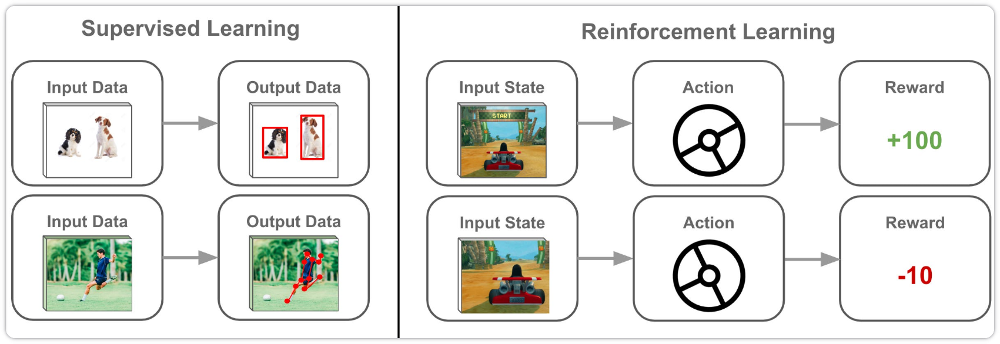

强化学习（reinforcement learning，RL），更具体地说，基于人类反馈的强化学习（reinforcement learning from human feedback，RLHF），是训练 LLM 的关键组成部分. 总的来看，强化学习是训练机器学习模型的一种方式. 

强化学习的核心优势在于它可以从非数字化的反馈信号中学习. 这在语言模型对齐中至关重要——RL可以把主观判断转化为奖励信号（reward signal），让模型自己学着产出更好的输出.

## A Formal Framework for RL

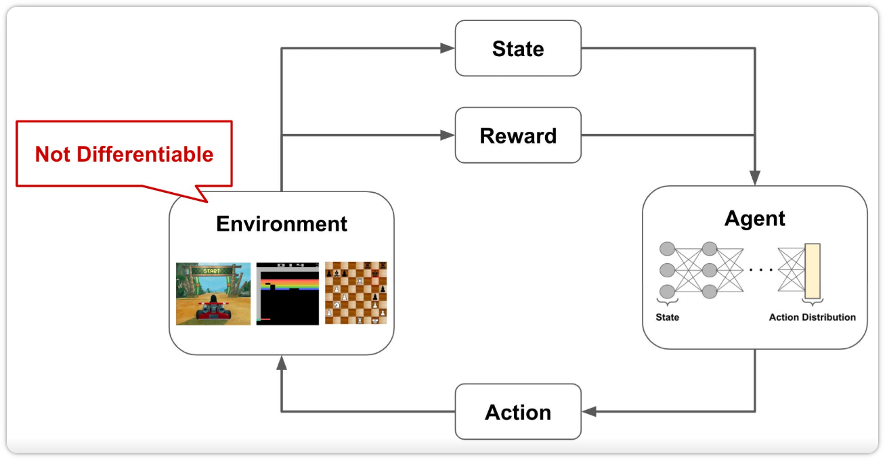

通过强化学习解决的问题往往是通过上图类似的框架结构化的. 有一个与 Environment 交互的 Agent；Agent 在环境中有状态 State，并且产生修改当前 State 的 Action 作为输出. 当 Agent 与 Environment 交互时，它可以因其 Action 而得到 positive 和 negative Reward. Agent 的目标就是最大化它所获得的 Reward，但并不是每个 Action 都会获得 Reward，Reward 可能有一个很长的时间范围，这就需要几个正确的、连续的 Action 来得到 Reward.

### Markov Decision Process (MDP)

为了让叙述更正式，可以将上述的系统表述为马尔可夫决策过程（MDP）. 在 MDP 中，有 State，Action，Reward，Transition 和 Policy. 

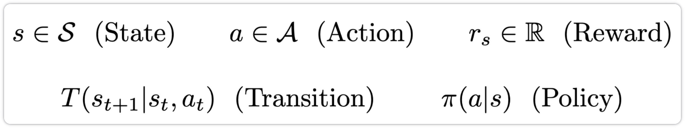

State 和 Action 就有离散值，而 Reward 是真实的数字. 在 MDP 中，定义两种类型的函数——Transition Function 和 Policy Function. Policy 将 State 作为输入，然后输出一个可能的 Action 的概率分布，根据这个概率分布，可以决定从当前 State 采取的 Action. Transition 是一个基于先前的 State 和所选的 Action 输出下一个 State 的函数，Agent 可以通过迭代的方式和 Environment 进行交互.

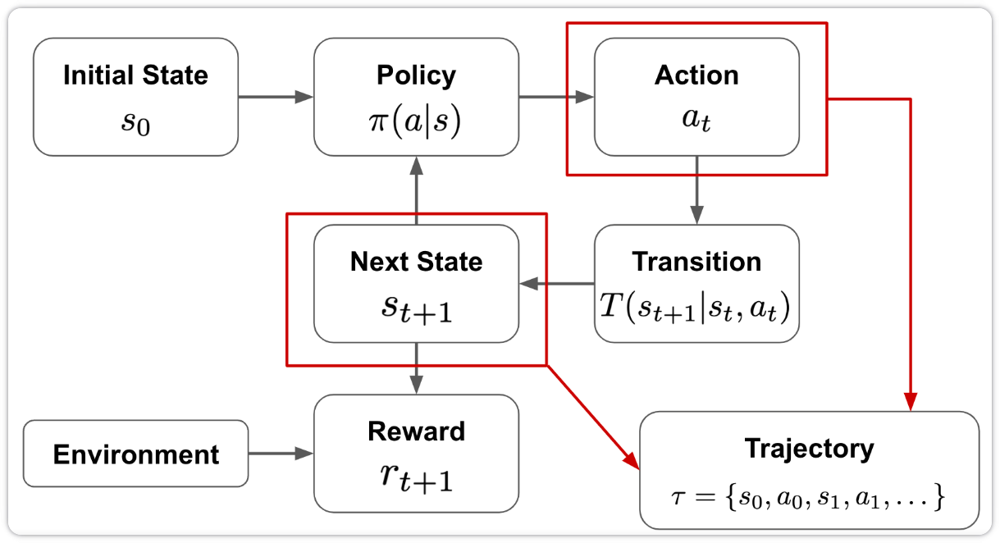

我们可以认为 Agent 在其 Environment 中实施 Policy. Policy 描述了 Agent 如何基于当前 State 来选择下一步的 State. Agent 在与 Environment 交互时会遵循这个 Policy，我们的目标是学习一种 Policy 使 Agent 能够从 Environment 中获得最大化的 Reward. 

当 Agent 和 Environment 交互时，会形成一个 "Trajectory"，其中包含了 Agent 在整个过程中选择的 State 和 Action. 然后，根据每个 State 对应的 Reward，可以得到一个 total return，由下式给出，其中 $\gamma$ 是折扣因子. 这个 return 是 Agent 的整个 Trajectory 上的 Reward 的总和，但后续时间步获得的 Reward 会按照折扣因子 $\gamma$ 进行指数折扣.
$$
\tau = \{s_0, a_0, s_1, a_1, \dots, s_t, a_t\} \quad \text{(Trajectory)}
$$

$$
R(\tau) = \sum_t \gamma^t r_{s_t} \quad \text{(Return)}
$$

强化学习的目标是训练一个 Agent，使其 return 最大化. 如下面的公式所示，可以将其描述为找到一个 Policy，该 Policy 能够最大化从最终 Policy 中采样得到的 Trajectory 的 return.

### Important Terms and Definitions

**Trajectory**：是指描述 Agent 在 Environment 中所采取的路径的 State 和 Action 序列.

**Episode**：有时，我们探索的 Environment 具有明确的最终 State. 从 Start State 到 End State的 Trajectory 称为一个 episode.

**Return**：Return 是指整个 Trajectory 上的 Reward 总和. 该总和通常包含一个折扣因子.

**Discount factor**：它指的是确定未来 Reward 当前价值的基本思想. 这是一个复杂的内容，这里不深究.

**On Vs. Off-Policy**：在强化学习中，有一个 target policy，它描述了 Agent 想要学习的目标. 另外，还有一个 behavior policy，Agent 在和 Environment 交互时会用该 Policy 来选择 Action. On and off-policy 的区别在于，Agent 在强化学习过程中用于选择 Action 的 behavior policy 是否与我们要评估和改进的 target policy 相同（on-policy），或者不同（off-policy）.

**$\epsilon$ -Greedy Policy**：强化学习通过与 Environment 交互来训练神经网络. 如何选择实际执行哪个 Action 的常用方法之一就是 $\epsilon$ -Greedy Policy，它在大多数情况下（即概率为 $1-\epsilon$）会选择预期最高的 Action，否则选择随机 Action.

## The Canonical LLM Training Pipline

现代基于 Transformer 的 LLM，比如说 ChatGPT 和 Llama2，需要经过三个阶段的训练过程：

- Pretraining
- Supervised Fine Tuning
- Alignmeng

在预训练阶段，模型首先在庞大的未标注的文本数据集中进行训练，然后监督微调会优化模型，使其可以更好地遵循特定指令，最后的对齐阶段会进一步完善 LLM，使其能够更有效地响应用户的 prompt，并确保安全性.

首先来看第一个阶段——Pretraining.

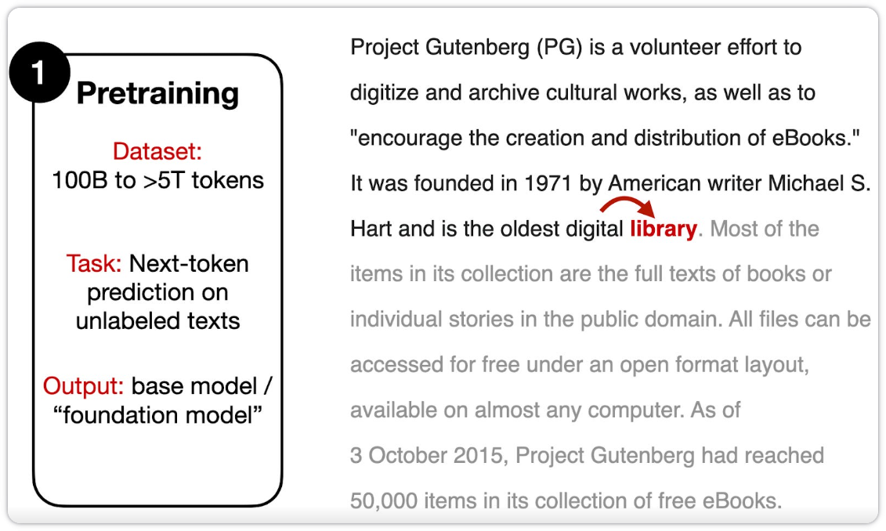

预训练通常在包含数十亿到数万亿个 tokens 的庞大文本语料库上进行. 这里采用简单的下词预测任务，即模型根据给定的文本预测下一个词（或 token）.

实际上，在预训练步骤中，"label" 是文本中的下一个 token，它本身就是数据集的一部分，因此，这种预训练方法通常被称为 self-supervised learning（自监督学习）.

下一个阶段——Supervised Fine Tuning.

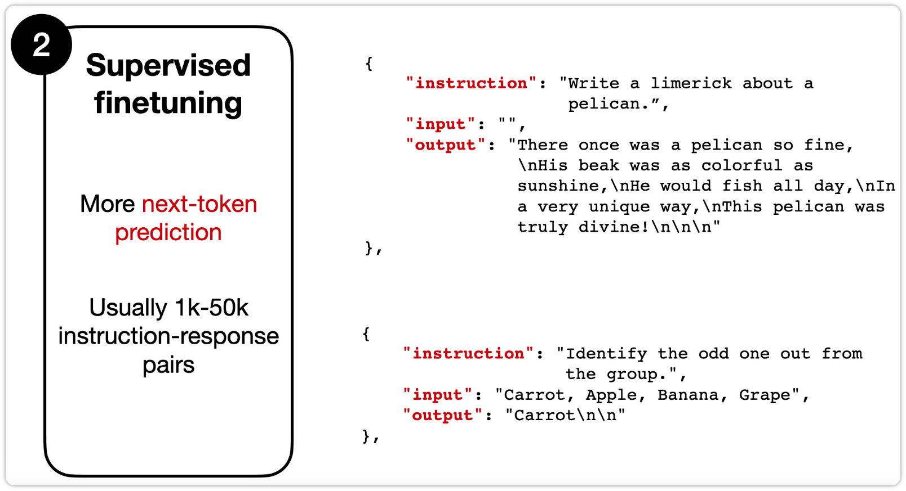

与之前的预训练阶段不同，监督微调阶段处理的是 instruction-output 对. instruction 是给模型的输入（有时候会附带可选的输入文本，取决于具体任务），output 是我们期望的响应. 虽然二者都采用类似的 next-token 训练目标，但监督微调使用的数据集通常比预训练的要小得多. 这是因为它需要 instruction-output 对，为了构造这样的数据集，需要由人根本特定指令编写所需的输出，这需要消耗大量精力. 

在经过监督微调后，还有另一个微调阶段，通常被称为 "alignment"，因其主要目的是为了让 LLM 与人类偏好保持一致，RLHF 正是在此发挥作用.

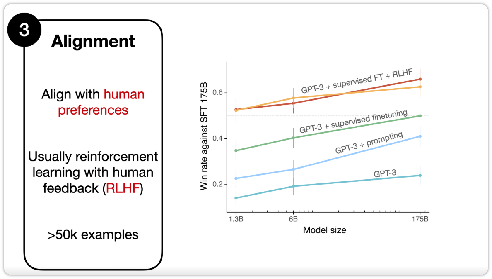

在下一节中将详细地描述基于 RLHF 的对齐阶段.

## Reinforcement Learning from Human Feedback

RLHF pipeline 采用预训练模型，并且对其进行监督微调（上节的第二个阶段），并进一步用近端策略优化（proximal policy optimization，PPO）对齐（上节的第三个阶段）.

RLHF 可以分为三个步骤：

- Supervised finetuning of the pretrained model
- Creating a reward model
- Finetuning via proximal policy optimization

RLHF 第一步是一个监督微调，用于创建一个基础模型，以便进一步的 RLHF 微调.

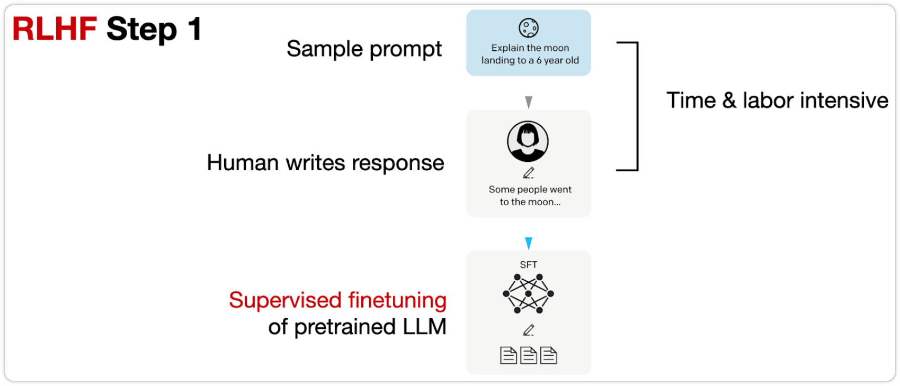

从图中可见这一步与上节中的阶段二类似.

RLHF 第二步是使用上一步监督微调（SFT）的模型来创建一个奖励模型（RM）.

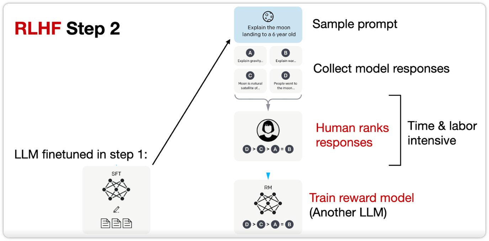

如图所示，对于每个 prompt，利用上一步微调后的 LLM 生成 4-9 个响应. 然后由人根据偏好来对这些响应进行排名. 虽然对其进行排名的过程比较耗时，但与创建用于监督微调的数据集相比，还是更省力一些的. 

构建包含这些排名的数据集后，我们可以设计一个奖励模型，该模型会输出一个奖励分数，用于 RLHF 第三步的后续优化. 这个奖励模型通常源自于先前监督微调中得到的 LLM. 为了将这个 LLM 转化为 RM，需要将其输出层替换为具有单个输出结点的回归层. 

RLHF 第三步是使用奖励模型（RM）对经过 SFT 训练的 LLM 进行微调.

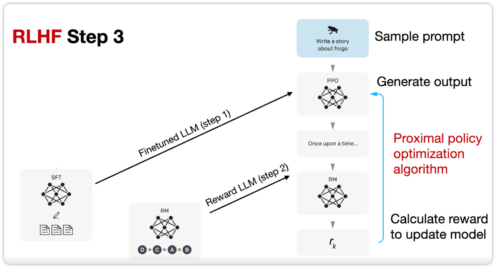

在这一步中，我们使用基于在 RLHF 步骤 2 中创建的奖励模型的奖励分数进行近端策略优化 (PPO) 来更新 SFT 模型.

## RLHF in Llama 2

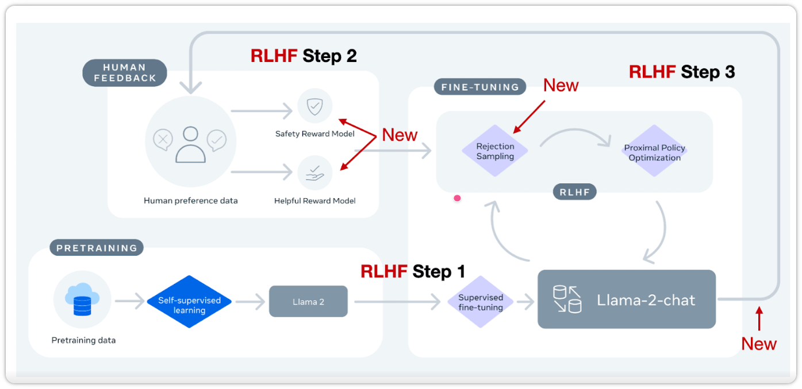

Meta AI 在创建 Llama-2-chat 模型时也使用了 RLHF. 但这两种方法之间存在一些区别.

总的来说，Llama-2-chat 在 RLHF 步骤 1 中遵循与 InstructGPT 相同的监督微调. 然而，在 RLHF 步骤 2 中，它创建了两个奖励模型，而不是一个. 此外，Llama-2-chat 模型经历了多个阶段的演化，奖励模型会根据 Llama-2-chat 模型产生的误差进行更新. 它还增加了一个 rejection sampling 步骤.

### Margin Loss（边缘损失）

在之前讨论的用于 RLHF PPO 的标准 InstructGPT 方法中，研究人员收集对 4 到 9 个输出进行排序的响应，并从中创建 "k 选 2" 的比较.

例如，如果人工标注者对四个响应（A-D）进行排序，例如 A < C < D < B，则会产生 "4 选 2" = 6 次比较. 类似地，Llama 2 的数据集采用基于响应的二元比较.

此外，新增功能是在每个二元排名旁边收集一个 "margin" 标签（范围从“明显更好”到“略好”），该标签可以通过额外的边缘参数选择性地用于二元排名损失，以计算两个响应之间的差距.

InstructGPT 使用以下基于交叉熵的排序损失来训练奖励模型：
$$
\mathcal{L}_{\text{ranking}} = -\log\left(\sigma\left(r_\theta(x, y_c) - r_\theta(x, y_r) \right)\right)
$$
Llama 2 将边缘 "$m(r)$" 作为偏好等级的离散函数添加：
$$
\mathcal{L}_{\text{ranking}} = -\log\left(\sigma\left(r_\theta(x, y_c) - r_\theta(x, y_r) - m(r)\right)\right)
$$
其中

- $r_\theta(x, y)$ 是 prompt $x$ 和生成的响应 $y$ 的标量得分输出；
- $\theta$ 是模型权重；
- $\sigma$ 是 sigmoid 函数；
- $y_c$ 是人工标注者选择的首选响应；
- $y_r$ 是人工标注者选择的拒绝响应.

通过 "$m(r)$" 返回更高的 margin，将使首选响应和拒绝响应之间的奖励差异更小，从而导致更大的损失，进而导致更大的梯度，并在策略梯度更新期间导致模型变化.

### Two reward models

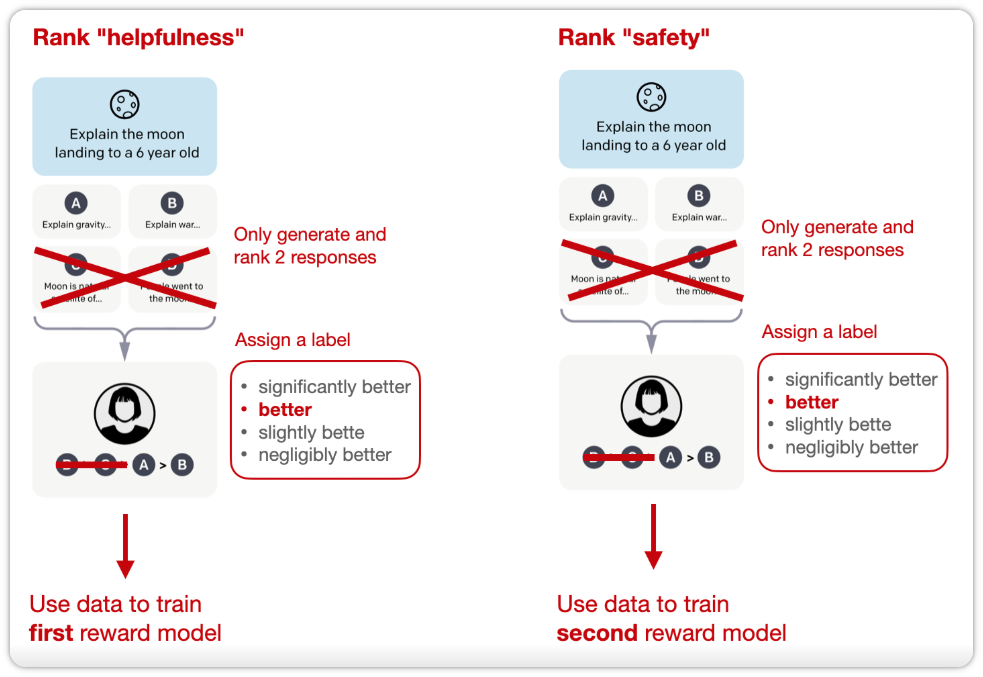

如前面所述，Llama 2 中采用了两种奖励模型. 一种奖励模型是基于 helpfulness，另一种是基于 safety. 最终用于模型优化的奖励函数是这两种评分的线性组合.

### Rejection sampling（拒绝采样）

此外，Llama 2 作者采用了一种训练流程，该流程迭代生成多个 RLHF 模型. 他们并没有仅仅依赖之前讨论的基于 PPO 的 RLHF 方法，而是采用了两种算法进行 RLHF 微调：PPO 和 rejection sampling.

在 rejection sampling 中，抽取 K 个输出，并在优化步骤中选择奖励最高的输出进行梯度更新，如下图所示.

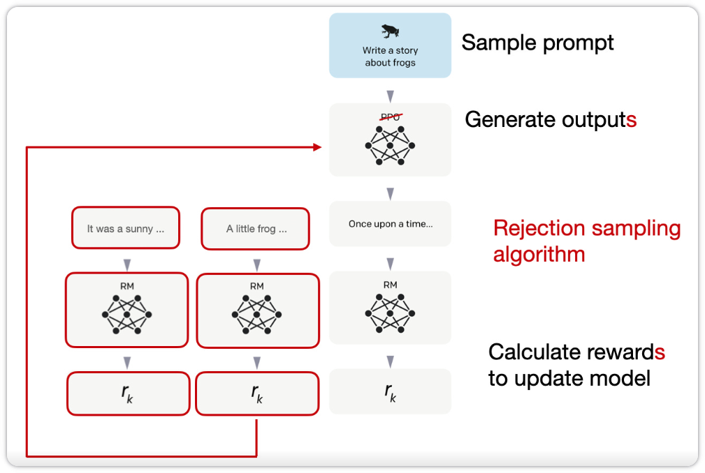

Rejection sampling 用于在每次迭代中选择奖励分数较高的样本. 因此，与每次仅基于单个样本进行更新的 PPO 算法相比，rejection sampling 能够利用奖励分数更高的样本进行模型微调.

在监督微调的初始阶段之后，模型完全使用 rejection sampling 进行训练，然后再将 rejection sampling 和 PPO 结合起来.

