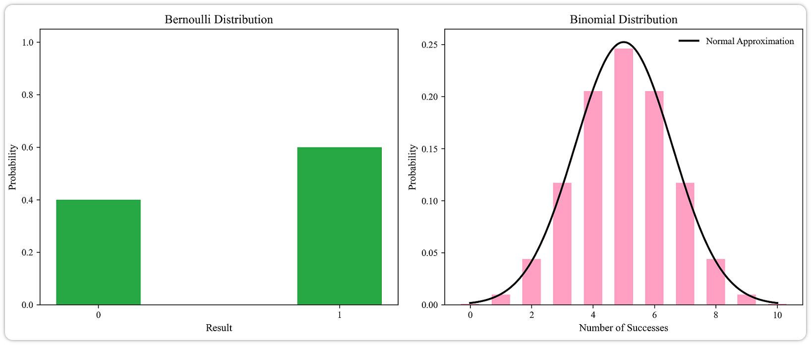
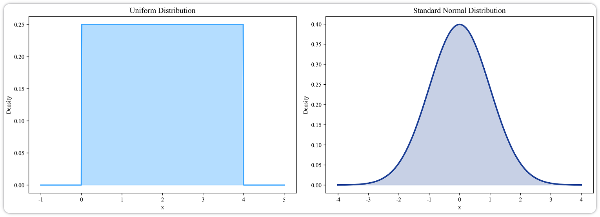
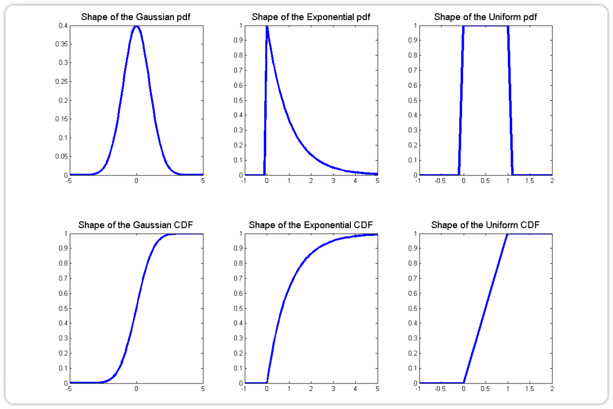
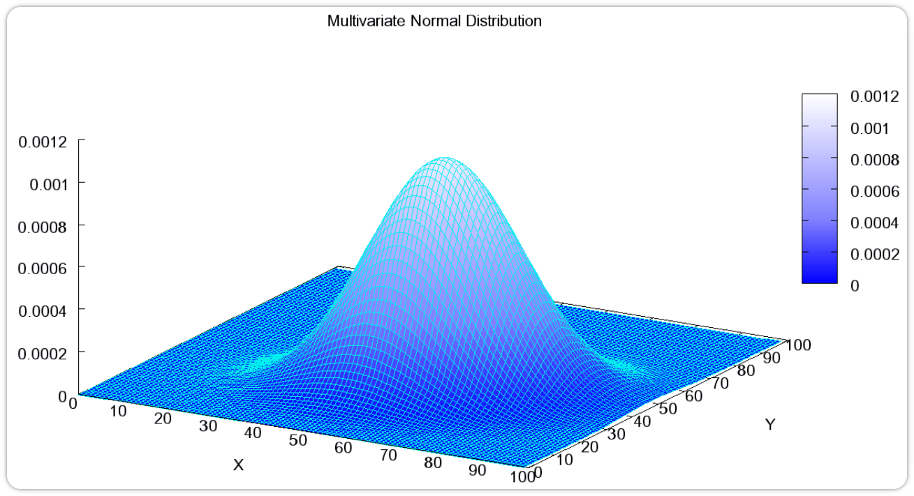
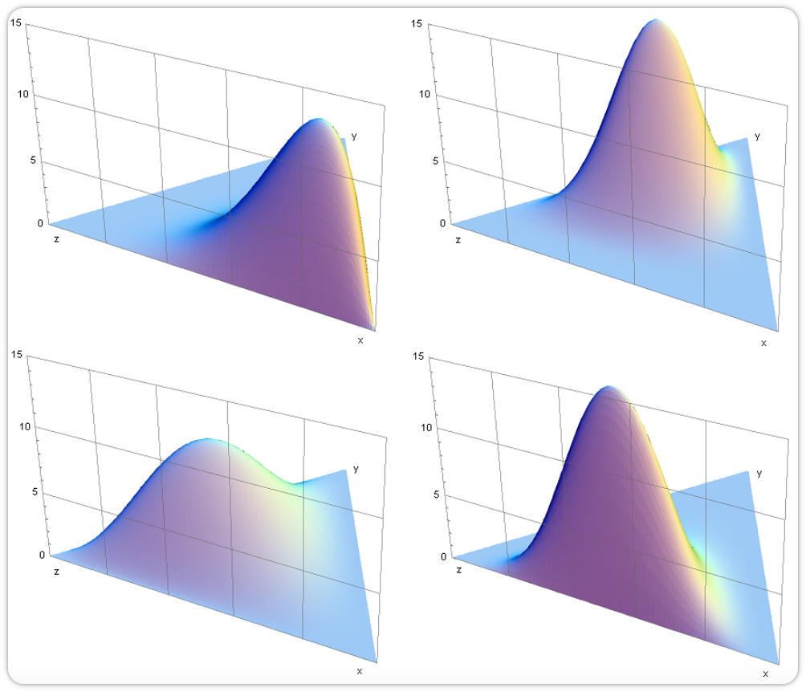
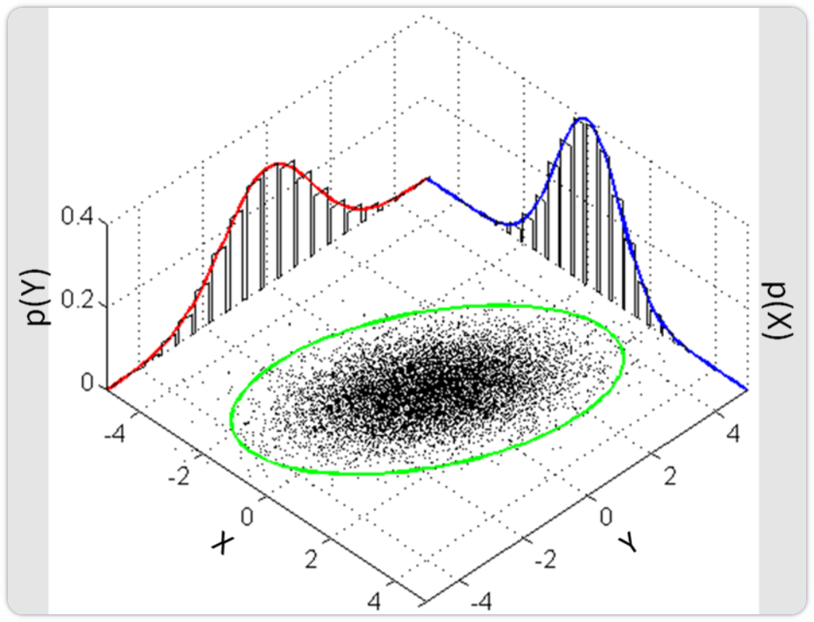
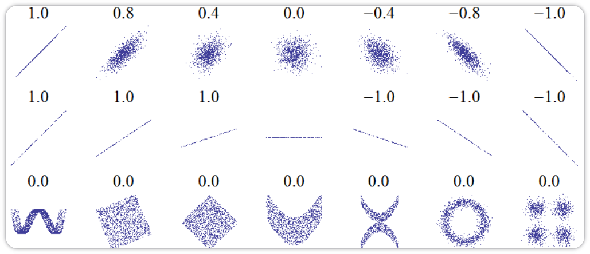
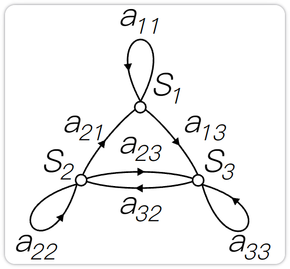
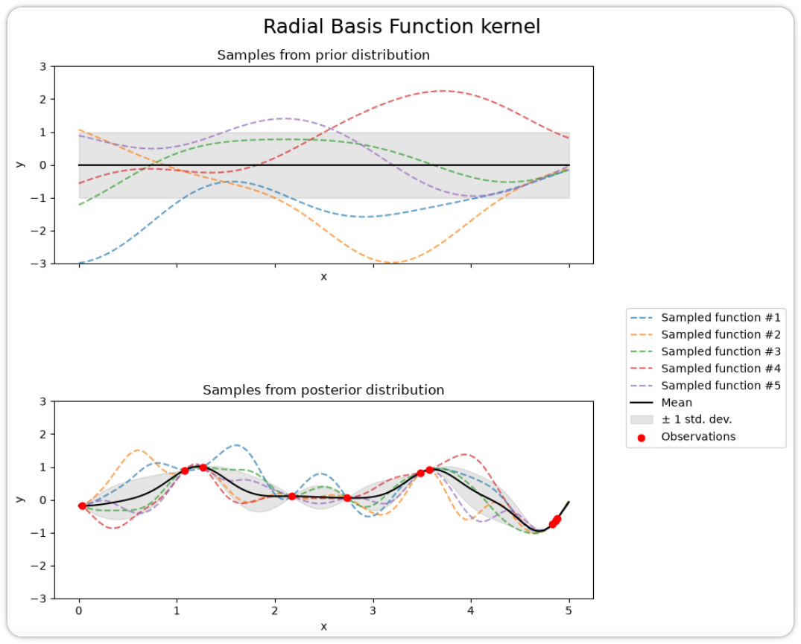

> 概率论研究的不是“随机现象本身，而是对不确定性的量化.

## 事件和概率

### 随机变量

在随机试验中，试验的结果可以用给一个数 $X$ 来表示，这个数 $X$ 是随着试验结果的不而变化的，是样本点的一个函数. 把这种数称为随机变量（Random Variable）.

#### 离散随机变量

如果随机变量 $X$ 所可能的取值是有限个或可数无穷个，例如在有限情形下可写为 $\{x_1, \cdots, x_N\}$，则称 $X$ 为离散随机变量. $X$ 每种可能取值 $x_n$ 的概率可以表示为：
$$
P(X = x_n) = p(x_n), \quad \forall n \in \{1, \cdots, N\} \tag{1}
$$
其中 $p(x_1), \cdots, p(x_N)$ 称为离散随机变量 $X$ 的概率分布（Probability Distribution）或分布，并且满足
$$
\sum_{n=1}^N p(x_n) = 1 \tag{2}
$$

$$
p(x_n) \geq 0, \quad \forall n \in \{1, \cdots, N\} \tag{3}
$$

常见的离散随机变量的概率分布有伯努利分布和二项分布.

在一次试验中，事件 $A$ 出现的概率为 $\mu$，不出现的概率为 $1 - \mu$。若用变量 $X$ 表示事件 $A$ 出现的次数，则 $X$ 的取值为 0 和 1，其相应的分布为
$$
p(x) = \mu^x (1 - \mu)^{1-x} \tag{4}
$$
这个分布称为伯努利分布（Bernoulli Distribution），又名两点分布或 0-1 分布.

在 $N$ 次伯努利试验中，若以变量 $X$ 表示事件 $A$ 出现的次数，则 $X$ 的取值为 $\{0, \cdots, N\}$，其相应的分布为二项分布（Binomial Distribution）.
$$
P(X = k) = \binom{N}{k} \mu^k (1 - \mu)^{N-k}, \quad k = 0, \cdots, N \tag{5}
$$
其中 $\binom{N}{k}$ 为二项式系数，表示从 $N$ 个元素中取出 $k$ 个元素而不考虑其顺序的组合的总数.

#### 连续随机变量

与离散随机变量不同，一些随机变量 $X$ 的取值是不可列举的，由全部实数或者由一部分区间组成，比如
$$
X = \{x \mid a \leq x \leq b\}, \quad -\infty < a < b < \infty
$$
则称 $X$ 为连续随机变量. 连续随机变量的值是不可数及无穷尽的.

连续随机变量 $X$ 取任一具体值 $x_i$ 的概率为 0，这与离散情形截然不同. 因此无法像离散情形那样通过逐点概率来刻画分布.

连续随机变量 $X$ 的概率分布用概率密度函数（Probability Density Function, PDF）$p(x)$ 来描述. $p(x)$ 为可积函数，并满足
$$
\int_{-\infty}^{+\infty} p(x) \, dx = 1 \tag{6}
$$

$$
p(x) \geq 0 \tag{7}
$$

给定概率密度函数 $p(x)$，可计算随机变量落入某区域的概率. 令 $\mathcal{R}$ 为 $x$ 附近的一个小邻域，$|\mathcal{R}|$ 为其大小，则 $p(x)|\mathcal{R}|$ 近似给出了随机变量落入 $\mathcal{R}$ 的概率.

常见的连续随机变量的概率分布有均匀分布和正态分布.

若 $a, b$ 为有限数，$[a, b]$ 上的均匀分布（Uniform Distribution）的概率密度函数定义为
$$
p(x) =
\begin{cases} 
\dfrac{1}{b-a}, & a \leq x \leq b \\[6pt]
0, & x < a \text{ 或 } x > b
\end{cases}
\tag{8}
$$
正态分布（Normal Distribution），又名高斯分布（Gaussian Distribution），是一类在统计建模中非常常用的连续分布，并且具有很多良好的数学性质，其概率密度函数为
$$
p(x) = \frac{1}{\sqrt{2\pi}\sigma} \exp\left(-\frac{(x-\mu)^2}{2\sigma^2}\right) \tag{9}
$$
其中 $\sigma > 0$，$\mu$ 和 $\sigma$ 均为常数。若随机变量 $X$ 服从一个参数为 $\mu$ 和 $\sigma$ 的概率分布，简记为
$$
X \sim \mathcal{N}(\mu, \sigma^2) \tag{10}
$$
当 $\mu = 0, \sigma = 1$ 时，称为标准正态分布（Standard Normal Distribution）.

#### 累积分布函数

对于一个随机变量 $X$，其累积分布函数（Cumulative Distribution Function, CDF）是随机变量 $X$ 的取值小于等于 $x$ 的概率.
$$
\text{cdf}(x) = P(X \leq x) \tag{11}
$$
以连续随机变量 $X$ 为例，累积分布函数定义为
$$
\text{cdf}(x) = \int_{-\infty}^x p(t) \, dt \tag{12}
$$
其中 $p(x)$ 为概率密度函数.

### 随机向量

随机向量是指一组随机变量构成的向量. 如果 $X_1, X_2, \cdots, X_K$ 为 $K$ 个随机变量，那么称 $\mathbf{X} = [X_1; X_2; \cdots; X_K]$ 为一个 $K$ 维随机向量. 随机向量也分为离散随机向量和连续随机向量.

#### 离散随机向量

离散随机向量的联合概率分布（Joint Probability Distribution）为
$$
P(X_1 = x_1, X_2 = x_2, \cdots, X_K = x_K) = p(x_1, x_2, \cdots, x_K)
$$
其中 $x_k \in \Omega_k$ 为变量 $X_k$ 的取值，$\Omega_k$ 为变量 $X_k$ 的样本空间.

和离散随机变量类似，离散随机向量的概率分布满足
$$
p(x_1, x_2, \cdots, x_K) \geq 0, \quad \forall x_1 \in \Omega_1, x_2 \in \Omega_2, \cdots, x_K \in \Omega_K \tag{13}
$$

$$
\sum_{x_1 \in \Omega_1} \sum_{x_2 \in \Omega_2} \cdots \sum_{x_K \in \Omega_K} p(x_1, x_2, \cdots, x_K) = 1 \tag{14}
$$

一种常见的离散向量概率分布为多项分布（Multinomial Distribution）. 多项分布是二项分布在随机向量上的推广. 假设一个袋子中装了很多球，总共有 $K$ 个不同的颜色. 我们从袋子中取出 $N$ 个球. 每次取出一个球时，就在袋子中放入一个同样颜色的球. 这样保证同一颜色的球在不同试验中被取出的概率是相等的. 令 $\mathbf{X}$ 为一个 $K$ 维随机向量，每个元素 $X_k$（$k = 1, \cdots, K$）为取出的 $N$ 个球中颜色为 $k$ 的球的数量，则 $\mathbf{X}$ 服从多项分布，其概率分布为
$$
p(x_1, \cdots, x_K \mid \boldsymbol{\mu}) = \frac{N!}{x_1! \cdots x_K!} \mu_1^{x_1} \cdots \mu_K^{x_K} \tag{15}
$$
其中 $\boldsymbol{\mu} = [\mu_1, \cdots, \mu_K]^\top$ 分别为每次抽取的球的颜色为 $1, \cdots, K$ 的概率；$x_1, \cdots, x_K$ 为非负整数，并且满足 $\sum_{k=1}^K x_k = N$.

多项分布的概率分布也可以用 gamma 函数表示：
$$
p(x_1, \cdots, x_K \mid \boldsymbol{\mu}) = \frac{\Gamma\left(\sum_k x_k + 1\right)}{\prod_k \Gamma(x_k + 1)} \prod_{k=1}^K \mu_k^{x_k} \tag{16}
$$
其中
$$
\Gamma(z) = \int_0^\infty \frac{t^{z-1}}{\exp(t)} \, dt \tag{17}
$$
为 gamma 函数. 这种表示形式和狄利克雷分布（下面会提到）类似，而狄利克雷分布可以作为多项分布的共轭先验.

#### 连续随机向量

一个 $K$ 维连续随机向量 $\mathbf{X}$ 的联合概率密度函数（Joint Probability Density Function）满足
$$
p(\mathbf{x}) = p(x_1, \cdots, x_K) \geq 0 \tag{18}
$$

$$
\int_{-\infty}^{+\infty} \cdots \int_{-\infty}^{+\infty} p(x_1, \cdots, x_K) \, dx_1 \cdots dx_K = 1 \tag{19}
$$

常用的连续随机向量分布之一是多元正态分布（Multivariate Normal Distribution），也称为多元高斯分布（Multivariate Gaussian Distribution）. 若 $K$ 维随机向量 $\mathbf{X} = [X_1, \cdots, X_K]^\top$ 服从 $K$ 元正态分布，其密度函数为
$$
p(\mathbf{x}) = \frac{1}{(2\pi)^{K/2} |\boldsymbol{\Sigma}|^{1/2}} \exp \left( -\frac{1}{2} (\mathbf{x} - \boldsymbol{\mu})^\top \boldsymbol{\Sigma}^{-1} (\mathbf{x} - \boldsymbol{\mu}) \right) \tag{20}
$$
其中 $\boldsymbol{\mu} \in \mathbb{R}^K$ 为多元正态分布的均值向量，$\boldsymbol{\Sigma} \in \mathbb{R}^{K \times K}$ 为多元正态分布的协方差矩阵，$|\boldsymbol{\Sigma}|$ 表示 $\boldsymbol{\Sigma}$ 的行列式.

如果一个多元高斯分布的协方差矩阵简化为 $\boldsymbol{\Sigma} = \sigma^2 \mathbf{I}$，则称该分布为各向同性高斯分布（Isotropic Gaussian Distribution）. 这时各维随机变量不仅两两不相关，而且由于联合分布是高斯分布，它们彼此独立且方差相同.

如果一个 $K$ 维随机向量 $\mathbf{X}$ 服从狄利克雷分布（Dirichlet Distribution），其支持集为
$$
x_k \geq 0, \quad \sum_{k=1}^K x_k = 1 \tag{21}
$$
密度函数为
$$
p(\mathbf{x} \mid \boldsymbol{\alpha}) = \frac{\Gamma(\alpha_0)}{\Gamma(\alpha_1) \cdots \Gamma(\alpha_K)} \prod_{k=1}^K x_k^{\alpha_k-1} \tag{22}
$$
其中 $\boldsymbol{\alpha} = [\alpha_1, \dots, \alpha_K]^\top$ 为狄利克雷分布的参数，且 $\alpha_0 = \sum_{k=1}^K \alpha_k$.

三分量狄利克雷分布在二维单纯形上的概率密度。不同参数向量改变密度峰的位置和分布形状。

### 边际分布

对于二维离散随机向量 $(X, Y)$，假设 $X$ 取值空间为 $\Omega_x$，$Y$ 取值空间为 $\Omega_y$，其联合概率分布满足
$$
p(x, y) \geq 0, \quad \sum_{x \in \Omega_x} \sum_{y \in \Omega_y} p(x, y) = 1 \tag{23}
$$
对于联合概率分布 $p(x, y)$，我们可以分别对 $x$ 和 $y$ 进行求和.

- 对于固定的 $x$

$$
\sum_{y \in \Omega_y} p(x, y) = p(x) \tag{24}
$$

- 对于固定的 $y$

$$
\sum_{x \in \Omega_x} p(x, y) = p(y) \tag{25}
$$

由离散随机向量 $(X, Y)$ 的联合概率分布，对 $Y$ 的所有取值进行求和得到 $X$ 的概率分布；而对 $X$ 的所有取值进行求和得到 $Y$ 的概率分布. 这里 $p(x)$ 和 $p(y)$ 就称为 $p(x, y)$ 的边际分布（Marginal Distribution）.

对于二维连续随机向量 $(X, Y)$，其边际分布为
$$
p(x) = \int_{-\infty}^{+\infty} p(x, y) \, dy \tag{26}
$$

$$
p(y) = \int_{-\infty}^{+\infty} p(x, y) \, dx \tag{27}
$$

一个二元正态分布的边际分布仍为正态分布.

### 条件概率分布

对于离散随机向量 $(X, Y)$，已知 $X = x$ 的条件下，随机变量 $Y = y$ 的条件概率（Conditional Probability）为
$$
p(y \mid x) \triangleq P(Y = y \mid X = x) = \frac{p(x, y)}{p(x)} \tag{28}
$$
这个公式定义了随机变量 $Y$ 关于随机变量 $X$ 的条件分布（Conditional Distribution）；在离散情形下，它也常称为条件概率分布.

对于二维连续随机向量 $(X, Y)$，已知 $X = x$ 的条件下，随机变量 $Y = y$ 的条件概率密度函数（Conditional Probability Density Function）为
$$
p(y \mid x) = \frac{p(x, y)}{p(x)} \tag{29}
$$
同理，已知 $Y = y$ 的条件下，随机变量 $X = x$ 的条件概率密度函数为
$$
p(x \mid y) = \frac{p(x, y)}{p(y)} \tag{30}
$$

### 贝叶斯公式

通过公式 $(29)$ 和 $(30)$，两个条件概率 $p(y \mid x)$ 和 $p(x \mid y)$ 之间的关系为
$$
p(y \mid x) = \frac{p(x \mid y) \, p(y)}{p(x)} \tag{31}
$$
这个公式称为贝叶斯定理（Bayes' Theorem），或贝叶斯公式.

贝叶斯定理提供了一种逆转条件概率的方式：当我们知道 $p(x \mid y)$ 时，可以通过它来计算 $p(y \mid x)$. 这在机器学习中极为重要，因为很多时候我们更容易从原因推结果，但实际需要做的是从结果推原因.

贝叶斯定理中的每一项都有其名称：

- 先验：$p(y)$，在观察到任何数据之前，对 $y$ 的已有信念；
- 似然：$p(x \mid y)$，在给定 $y$ 的条件下，观察到 $x$ 的可能性；
- 证据：$p(x)$，观测数据 $x$ 的边际概率，通常作为归一化常数；
- 后验：$p(y \mid x)$，在观察到 $x$ 之后，对 $y$ 的更新信念.

因此贝叶斯定理可以写成如下形式
$$
\text{后验} = \frac{\text{似然} \times \text{先验}}{\text{证据}}
$$

> **Note:** 你相信什么并不重要，重要的是你别完全相信它.

### 独立与条件独立

对于两个离散（或连续）随机变量 $X$ 和 $Y$，如果其联合概率（或联合概率密度函数）$p(x, y)$ 满足
$$
p(x, y) = p(x)p(y) \tag{32}
$$
则称 $X$ 和 $Y$ 互相独立（Independence），记为 $X \perp\!\!\!\perp Y$.

对于三个离散（或连续）随机变量 $X, Y$ 和 $Z$，如果条件概率（或联合概率密度函数）$p(x, y \mid z)$ 满足
$$
p(x, y \mid z) = p(x \mid z)p(y \mid z) \tag{33}
$$
则称在给定变量 $Z$ 时，$X$ 和 $Y$ 条件独立（Conditional Independence），记为 $X \perp\!\!\!\perp Y \mid Z$.

### 期望和方差

对于 $N$ 个取值的离散变量 $X$，其概率分布为 $p(x_1), \cdots, p(x_N)$，$X$ 的期望（Expectation）定义为
$$
\mathbb{E}[X] = \sum_{n=1}^N x_n p(x_n) \tag{34}
$$
对于连续随机变量 $X$，概率密度函数为 $p(x)$，其期望定义为
$$
\mathbb{E}[X] = \int_{\mathbb{R}} x p(x) \, dx \tag{35}
$$
随机变量 $X$ 的方差（Variance）用来定义它的概率分布的离散程度：
$$
\text{var}(X) = \mathbb{E} \left[ \left( X - \mathbb{E}[X] \right)^2 \right] \tag{36}
$$
随机变量 $X$ 的方差也称为它的二阶中心矩. $\sqrt{\text{var}(X)}$ 则称为 $X$ 的标准差.

两个连续随机变量 $X$ 和 $Y$ 的协方差（Covariance）用来衡量两个随机变量的分布之间的总体变化性，定义为
$$
\text{cov}(X, Y) = \mathbb{E} \left[ \left( X - \mathbb{E}[X] \right) \left( Y - \mathbb{E}[Y] \right) \right] \tag{37}
$$
协方差经常也用来衡量两个随机变量之间的线性相关性. 如果两个随机变量的协方差为 $0$，那么称这两个随机变量是线性不相关. 两个随机变量之间没有线性相关性，并非表示它们之间是独立的，可能存在某种非线性的函数关系. 反之，如果 $X$ 与 $Y$ 是统计独立的，那么它们之间的协方差一定为 $0$。

两个 $M$ 维和 $N$ 维的连续随机向量 $\mathbf{X}$ 和 $\mathbf{Y}$，它们的协方差（Covariance）为 $M \times N$ 的矩阵，定义为：

$$
\text{cov}(\mathbf{X}, \mathbf{Y}) = \mathbb{E} \left[ \left( \mathbf{X} - \mathbb{E}[\mathbf{X}] \right) \left( \mathbf{Y} - \mathbb{E}[\mathbf{Y}] \right)^\top \right] \tag{38}
$$

协方差矩阵 $\text{cov}(\mathbf{X}, \mathbf{Y})$ 的第 $(m, n)$ 个元素等于随机变量 $X_m$ 和 $Y_n$ 的协方差。两个随机向量的协方差 $\text{cov}(\mathbf{X}, \mathbf{Y})$ 与 $\text{cov}(\mathbf{Y}, \mathbf{X})$ 互为转置关系。

如果单个随机向量的协方差矩阵为对角矩阵，则说明其各维随机变量两两不相关；这并不必然意味着它们彼此独立。若进一步假设该随机向量服从多元高斯分布，则两两不相关可推出独立。

## 随机过程

随机过程（Stochastic Process）是一组随机变量 $\{X_t\}$ 的集合，索引 $t$ 来自集合 $\mathcal{T}$。$\mathcal{T}$ 可定义在时间域或空间域，通常取时间域，以实数或正整数表示；$t$ 为实数时称为连续随机过程，为整数时称为离散随机过程。股价波动、语音信号、身高变化等都可看作随机过程。与时间相关的常见随机过程包括伯努利过程、随机游走（Random Walk）、马尔可夫过程等；与空间相关的随机过程通常称为随机场（Random Field），例如二维图像，每个像素由空间位置索引，整张图就构成一个随机场。

### 马尔可夫过程

在随机过程中，马尔可夫性质（Markov Property）是指一个随机过程在给定现在状态及所有过去状态情况下，其未来状态的条件概率分布仅依赖于当前状态。以离散随机过程为例，假设随机变量 $X_0, X_1, \cdots, X_T$ 构成一个随机过程。这些随机变量的所有可能取值的集合被称为状态空间（State Space）。如果 $X_{t+1}$ 对于过去状态的条件概率分布仅是 $X_t$ 的一个函数，则
$$
P(X_{t+1} = x_{t+1} \mid X_{0:t} = x_{0:t}) = P(X_{t+1} = x_{t+1} \mid X_t = x_t) \tag{39}
$$
其中 $X_{0:t}$ 表示变量集合 $X_0, X_1, \cdots, X_t$，$x_{0:t}$ 为在状态空间中的状态序列。

马尔可夫性质也可以描述为给定当前状态时，将来的状态与过去状态是条件独立的。

#### 马尔可夫链

离散时间的马尔可夫过程也称为**马尔可夫链**（Markov Chain）。如果一个马尔可夫链的条件概率
$$
P(X_{t+1} = s \mid X_t = s') = m_{ss'} \tag{40}
$$
只和状态 $s$ 和 $s'$ 相关，和时间 $t$ 无关，则称为时间同质的马尔可夫链（Time-Homogeneous Markov Chain），其中 $m_{ss'}$ 称为状态转移概率。如果状态空间大小 $K$ 是有限的，状态转移概率可以用一个矩阵 $\mathbf{M} \in \mathbb{R}^{K \times K}$ 表示，称为状态转移矩阵（Transition Matrix），其中元素 $m_{ij} = P(X_{t+1} = s_i \mid X_t = s_j)$ 表示从状态 $s_j$ 转移到状态 $s_i$ 的概率。于是每一列之和为 $1$。

三状态马尔可夫链。箭头上的 $a_{ij}$ 表示从状态 $S_j$ 转移到 $S_i$ 的概率；每个状态所有出边的概率之和为 1。自环表示下一步仍处于当前状态。

假设状态空间大小为 $K$，向量 $\boldsymbol{\pi} = [\pi_1, \cdots, \pi_K]^\top$ 为状态空间中的一个分布，满足 $0 \leq \pi_k \leq 1$ 和 $\sum_{k=1}^K \pi_k = 1$。

对于状态转移矩阵为 $\mathbf{M}$ 的时间同质的马尔可夫链，若存在一个分布 $\boldsymbol{\pi}$ 满足
$$
\boldsymbol{\pi} = \mathbf{M} \boldsymbol{\pi} \tag{41}
$$
则称分布 $\boldsymbol{\pi}$ 为该马尔可夫链的**平稳分布**（Stationary Distribution）。此时若 $t$ 时刻分布为 $\boldsymbol{\pi}$，则任意后续时刻仍保持为 $\boldsymbol{\pi}$。根据特征向量的定义可知，$\boldsymbol{\pi}$ 为矩阵 $\mathbf{M}$ 的（归一化的）对应特征值为 $1$ 的特征向量。

若状态转移矩阵 $\mathbf{M}$ 满足**不可约**（所有状态互通）与**非周期**，则对任意初始分布 $\boldsymbol{\pi}^{(0)}$，链经过足够长时间的转移后都会收敛到平稳分布，即
$$
\boldsymbol{\pi} = \lim_{T \to \infty} \mathbf{M}^T \boldsymbol{\pi}^{(0)} \tag{42}
$$

> 细致平稳条件（Detailed Balance Condition）：给定一个状态空间中的分布 $\boldsymbol{\pi} \in [0, 1]^K$，如果一个状态转移矩阵为 $\mathbf{M} \in \mathbb{R}^{K \times K}$ 的马尔可夫链满足
> $$
> \pi_j m_{ij} = \pi_i m_{ji}, \quad \forall 1 \leq i, j \leq K \tag{43}
> $$
> 则 $\boldsymbol{\pi}$ 是该马尔可夫链的一个平稳分布。若再结合不可约、非周期等条件，还可以进一步推出链从任意初始分布收敛到 $\boldsymbol{\pi}$。
>
> 细致平稳条件只是马尔可夫链收敛的充分条件，不是必要条件。细致平稳条件保证了从状态 $i$ 转移到状态 $j$ 的数量和从状态 $j$ 转移到状态 $i$ 的数量相一致，互相抵消，所以数量不发生改变。

### 高斯过程

高斯过程（Gaussian Process）也是一种应用广泛的随机过程模型。假设有一组连续随机变量 $X_0, X_1, \cdots, X_T$，如果由这组随机变量构成的任一有限集合
$$
X_{t_1, \cdots, t_N} = [X_{t_1}, \cdots, X_{t_N}]^\top, \quad 1 \leq N \leq T
$$
都服从一个多元正态分布，那么这组随机变量为一个高斯过程。高斯过程也可以定义为：如果 $X_{t_1, \cdots, t_N}$ 的任一线性组合都服从一元正态分布，那么这组随机变量为一个高斯过程。

高斯过程回归（Gaussian Process Regression）是利用高斯过程来对一个函数分布进行建模。和机器学习中参数化建模（比如贝叶斯线性回归）相比，高斯过程是一种非参数模型，可以拟合一个黑盒函数，并给出拟合结果的置信度。

假设一个未知函数 $f(x)$ 服从高斯过程，且为平滑函数。如果两个样本 $x_1, x_2$ 比较接近，那么对应的 $f(x_1), f(x_2)$ 也比较接近。假设从函数 $f(x)$ 中采样有限个样本 $\mathbf{X} = [\mathbf{x}_1, \mathbf{x}_2, \cdots, \mathbf{x}_N]$，这 $N$ 个点服从一个多元正态分布，
$$
[f(\mathbf{x}_1), f(\mathbf{x}_2), \cdots, f(\mathbf{x}_N)]^\top \sim \mathcal{N}\left( \boldsymbol{\mu}(\mathbf{X}), \mathbf{K}(\mathbf{X}, \mathbf{X}) \right) \tag{44}
$$
其中
$$
\boldsymbol{\mu}(\mathbf{X}) = [\mu(\mathbf{x}_1), \mu(\mathbf{x}_2), \cdots, \mu(\mathbf{x}_N)]^\top, \quad \mathbf{K}(\mathbf{X}, \mathbf{X}) = [k(\mathbf{x}_i, \mathbf{x}_j)]_{N \times N}.
$$
$\boldsymbol{\mu}(\mathbf{X})$ 是均值向量，$\mathbf{K}(\mathbf{X}, \mathbf{X})$ 是协方差矩阵。$k(\mathbf{x}_i, \mathbf{x}_j)$ 为核函数，用于刻画两个样本之间的相关性。

在高斯过程回归中，一个常用的核函数是**平方指数**（Squared Exponential）核函数：
$$
k(\mathbf{x}_i, \mathbf{x}_j) = \exp \left( \frac{-\|\mathbf{x}_i - \mathbf{x}_j\|^2}{2l^2} \right) \tag{45}
$$
其中 $l$ 为超参数。当 $\mathbf{x}_i$ 和 $\mathbf{x}_j$ 越接近，其函数值越大，表明 $f(\mathbf{x}_i)$ 和 $f(\mathbf{x}_j)$ 越相关。

假设 $f(\mathbf{x})$ 的一组带噪声观测值为 $\{(\mathbf{x}_n, y_n)\}_{n=1}^N$。可写作 $y_n = f(\mathbf{x}_n) + \epsilon_n$，其中 $\epsilon_n \sim \mathcal{N}(0, \sigma^2)$，$\sigma^2$ 为观测噪声方差。

对于一个新的样本点 $\mathbf{x}^*$，我们希望预测 $f(\mathbf{x}^*)$ 的观测值 $y^*$。令向量 $\mathbf{y} = [y_1, y_2, \cdots, y_N]^\top$ 为已有的观测值，根据高斯过程的假设，$[\mathbf{y}; y^*]$ 满足
$$
\begin{bmatrix} \mathbf{y} \\ y^* \end{bmatrix} \sim \mathcal{N} \left( \begin{bmatrix} \boldsymbol{\mu}(\mathbf{X}) \\ \mu(\mathbf{x}^*) \end{bmatrix}, \begin{bmatrix} \mathbf{K}(\mathbf{X}, \mathbf{X}) + \sigma^2 \mathbf{I} & \mathbf{K}(\mathbf{X}, \mathbf{x}^*)^\top \\ \mathbf{K}(\mathbf{x}^*, \mathbf{X}) & k(\mathbf{x}^*, \mathbf{x}^*) \end{bmatrix} \right) \tag{46}
$$
其中 $\mathbf{K}(\mathbf{x}^*, \mathbf{X}) = [k(\mathbf{x}^*, \mathbf{x}_1), \cdots, k(\mathbf{x}^*, \mathbf{x}_N)]$。

根据上面的联合分布，$y^*$ 的后验分布为
$$
p(y^* \mid \mathbf{X}, \mathbf{y}) = \mathcal{N}(\hat{\mu}, \hat{\sigma}^2) \tag{47}
$$
其中均值 $\hat{\mu}$ 和方差 $\hat{\sigma}^2$ 为
$$
\hat{\mu} = \mathbf{K}(\mathbf{x}^*, \mathbf{X}) (\mathbf{K}(\mathbf{X}, \mathbf{X}) + \sigma^2 \mathbf{I})^{-1} (\mathbf{y} - \boldsymbol{\mu}(\mathbf{X})) + \mu(\mathbf{x}^*) \tag{48}
$$

$$
\hat{\sigma}^2 = k(\mathbf{x}^*, \mathbf{x}^*) - \mathbf{K}(\mathbf{x}^*, \mathbf{X}) (\mathbf{K}(\mathbf{X}, \mathbf{X}) + \sigma^2 \mathbf{I})^{-1} \mathbf{K}(\mathbf{x}^*, \mathbf{X})^\top \tag{49}
$$

从公式 $(48)$ 可以看出，均值函数 $\boldsymbol{\mu}(\mathbf{x})$ 可以近似地互相抵消。在实际应用中，一般假设 $\boldsymbol{\mu}(\mathbf{x}) = \mathbf{0}$，均值 $\hat{\mu}$ 可以简化为
$$
\hat{\mu} = \mathbf{K}(\mathbf{x}^*, \mathbf{X}) (\mathbf{K}(\mathbf{X}, \mathbf{X}) + \sigma^2 \mathbf{I})^{-1} \mathbf{y} \tag{50}
$$
高斯过程回归常被用作贝叶斯优化中的代理模型，也广泛应用于回归、不确定性估计和少样本学习等任务中。

使用 RBF 核的高斯过程先验与后验。虚线表示从函数分布抽取的样本，黑线表示均值，红点表示观测，灰色带表示逐点均值 ±1 个标准差。观测附近的不确定性明显减小。

灰色带不是 95% 区间，也不是整条函数同时落入的置信带。该图展示潜在函数的分布；若讨论未来含噪声观测 $y^*$，应区分函数后验方差与额外的观测噪声方差。公式$ (49)$ 给出的是潜在函数的后验方差，预测含噪声 $y^*$ 时还需加上 $\sigma^2$。
