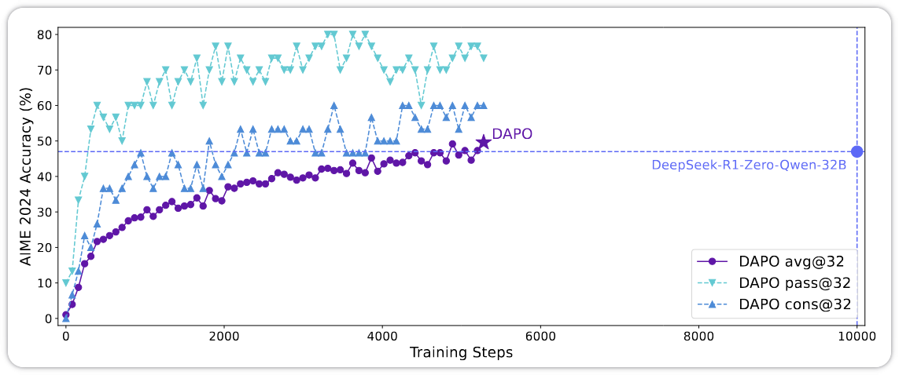
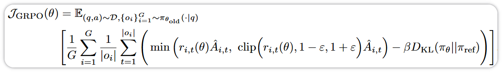
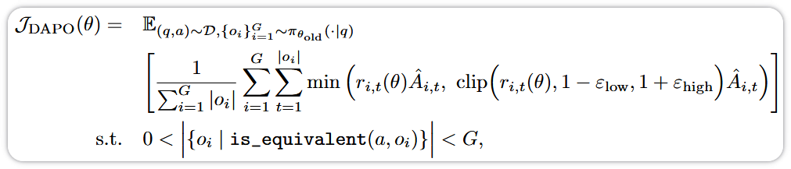
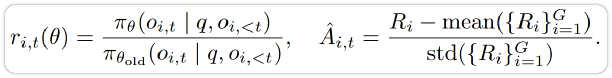
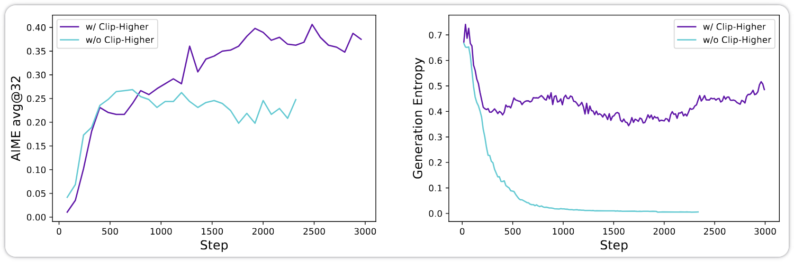
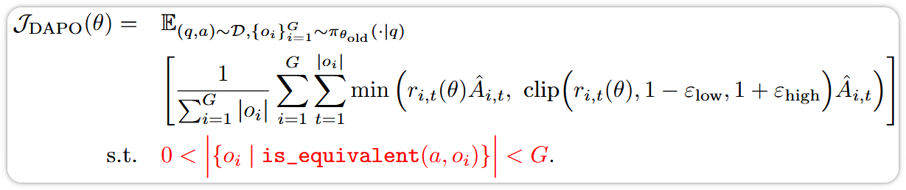
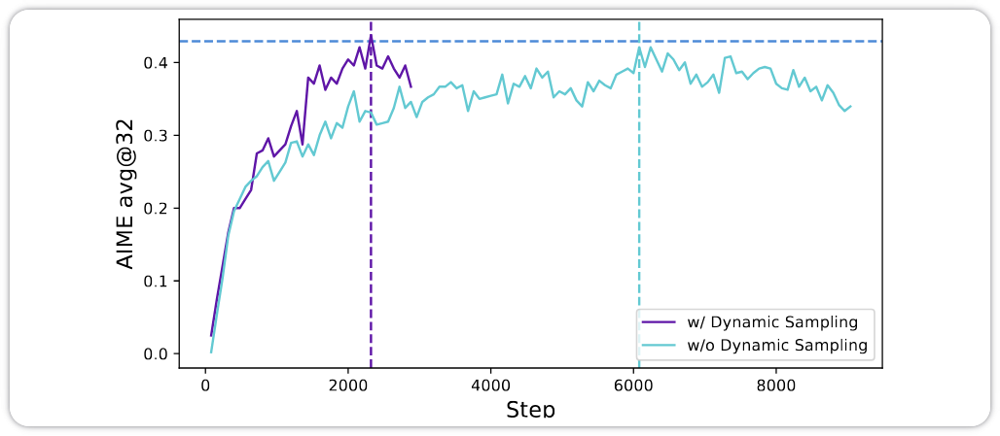
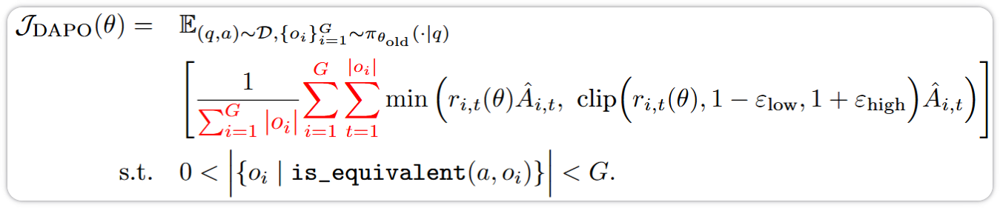
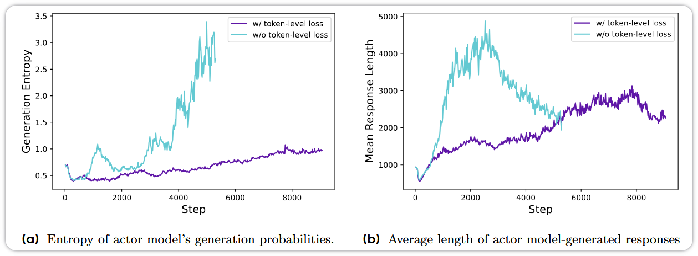
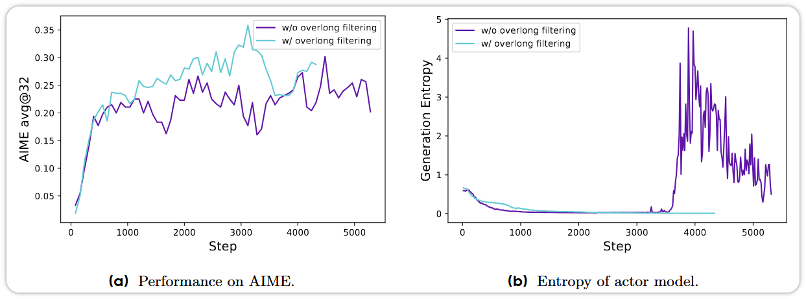

## Overview

### Abstract

推理扩展（Inference Scaling）赋予了大语言模型（LLM）前所未有的推理能力，而强化学习（RL） 则是激发其复杂推理能力的核心技术. 然而，目前最先进推理 LLM 的关键技术细节被隐藏（例如 OpenAI o1 的博客和 DeepSeek R1 的技术报告），因此研究社区仍在努力复现其 RL 训练结果.

我们提出了解耦裁剪与动态采样策略优化（DAPO，Decoupled Clip and Dynamic sAmpling Policy Optimization）算法，并完全开源了一个大规模 RL 系统，该系统的性能达到了业界领先水平：使用 Qwen2.5-32B 基座模型，在 AIME 2024 基准测试上取得了 50 分的成绩. 与以往隐瞒训练细节的工作不同，我们介绍了算法中的四项关键技术，正是这些技术使得大规模 LLM 的 RL 训练得以成功. 此外，我们还开源了训练代码（基于 verl 框架构建）以及一个经过精心整理和处理的数据集. 我们开源系统的这些组成部分增强了可复现性，并为未来大规模 LLM RL 的研究提供了有力支持.

### Introduction

当研究人员首次尝试复现基于 RL 的 DeepSeek-R1 32B 结果时，他们遇到了显著的性能差距. 他们的初始运行在 AIME 2024 基准上仅获得了 30 分，而 DeepSeek-R1 达到了 47 分.

为此，研究人员着手通过开发 DAPO（解耦裁剪与动态采样策略优化）来缩小这一差距. DAPO 是一种全新的 RL 算法，专门设计用于应对长思维链（long CoT，Chain of Thought）推理任务中的挑战. DAPO 以 GRPO 为基础，并融入了多项新颖技术.

由于 DAPO 与 GRPO 类似，先看一下 GRPO 和 DAPO 的优化目标. 

GRPO 优化目标：

DAPO 优化目标：

其中：

### The Policy Ratio ($r$) – Confidence Change

$r$ 代表策略比值（Policy Ratio）. 在这个场景中，策略就是要训练的 LLM.

- 分子：给定问题 $q$，LLM 在经过某个训练步更新后，生成某个特定响应（记作 $o$）的概率. 这代表每个训练步中被更新的参数.
- 分母：同一个 LLM 在更新之前（因此标注为 "old"）生成同一响应的概率. 这只是一个由模型当前状态决定的固定数值.

两者之间的比值反映了 LLM 对某个特定响应的置信度变化：

- 如果比值接近 1（$r ≈ 1$），意味着新策略（LLM）对该响应的置信度与旧策略相同；
- 如果比值大于 1（$r > 1$），新策略对该响应更有信心；
- 如果比值小于 1（$r < 1$），新策略对该响应信心下降.

直观理解：如果响应很好，希望 $r > 1$；如果响应很差，希望 $r < 1$.

### The Advantage ($A$) – Response Quality

"A" 代表 LLM 响应的优势（advantage）. 这是衡量该响应与其他响应相比质量的一个指标. 更详细地说：

- 针对给定问题会采样多个响应；
- 每个响应都会计算一个奖励，可以通过奖励模型或基于规则的奖励来计算；
- 一个响应的优势是通过其奖励与同一问题下其他响应相比的高低来衡量的；

Good Actions：如果 $A > 0$，表示该响应优于特定问题的平均响应水平. 将策略比值乘以一个正数，会鼓励模型朝着更优的响应方向更新.
Poor Actions：如果 $A < 0$，表示该响应劣于平均水平. 将策略比值乘以一个负数，会抑制模型生成不优的响应.

## Method

### DAPO Technique #1 – Clip-Higher

要理解 Clip-Higher，首先需要了解裁剪（clipping）的概念. 裁剪是一种常见的强化学习技术，通过防止模型发生大幅更新来稳定训练过程. 简单来说，我们希望每个训练步都进行小幅渐进式的改进，而不是可能导致训练不稳定的剧烈变化.

可以这样理解：每个训练步只接触到一小批训练样本，而非全部训练数据. 不希望任何单一小批量数据产生剧烈影响. 随着时间的推移逐步改进，才能实现更稳定的训练.

裁剪系数由目标函数中的 $ε$ 决定，它将策略比值限制在 $1-ε$ 到 $1+ε$ 之间的信任域（trust region）内.

研究人员发现，常用的默认裁剪值 $ε = 0.2$ 会导致熵崩塌（entropy collapse）. 熵崩塌是指模型对某些确定性选项变得过于自信的现象. 缺乏随机性会阻碍模型探索不同的解决方案.

其根本原因在于，裁剪更偏向于那些概率已经很高的响应，从而限制了对低概率响应的探索. 一个数学上的直觉解释是：现有响应概率在分母位置，新概率在分子位置. 如果一个响应的概率较低（除以一个较小的数），那么将新概率更新到超过裁剪边界，要比高概率响应（除以一个较大的数）更容易.

在 GRPO 中，单个超参数 $ε$ 同时控制下裁剪范围和上裁剪范围. DAPO 将两者解耦，并将上裁剪范围从 0.2 提高到 0.28. 研究人员没有提高下裁剪范围，以避免将不常见 token 的概率降至 0.

在下图中，可以看到 Clip-Higher 的效果. 左侧图表中，紫色线条显示，与使用默认值的基线相比，使用 Clip-Higher 时模型的准确率有所提升. 右侧图表则显示，不使用 Clip-Higher 时会出现熵崩塌，而 Clip-Higher 能避免熵值的下降.

### DAPO Technique #2 – Dynamic Sampling for Stronger Training Signals

在 GRPO 和 DAPO 中，每个问题会采样多个响应，每个响应的优势是相对于其他采样响应来计算的. 在基于规则的 RL 中，奖励通常是固定的（如果答案正确则为 1，否则为 -1）. 那么，如果所有采样响应都是正确的，会导致每个响应的优势都变为零，因为所有样本的平均奖励相同. 这会消除该样本的训练信号.

随着训练推进、模型变强，这种情况会越来越常见，因为模型在所有采样方案中都能正确解决更多问题. 这意味着每个训练步实际生效的批次小于预期规模，只来自那些未被完全正确解答的问题. 这会减少更新信号，并可能导致更新幅度的方差变大.

为解决此问题，DAPO 采用动态采样（dynamic sampling）. 如果某个问题的所有采样响应都正确，则过滤掉该问题并重新采样一个新问题，直到批次中充满非冗余问题.

在 DAPO 的目标函数中，代表动态采样的部分在下图中以红色高亮显示：

这种过采样（over-sampling）并不会拖慢训练速度. 下图显示，动态采样在仅用三分之一训练步数的情况下，就能达到与不使用动态采样相同的性能.

### DAPO Technique #3 – Token-Level Loss for Better Training Stability

在强化学习中，虽然奖励是在响应级别计算的，但损失（loss）是在 token 级别计算的. 换句话说，每个 token 没有真实标签（ground truth），只有针对整个响应的奖励. 由于模型是逐 token 生成的，损失需要在 token 级别进行传播，以逐步指导模型的学习.

GRPO 通过先按响应长度对每个响应内的 token 级损失取平均，再对所有采样响应取平均的方式来计算样本级损失. 这实际上赋予每个响应相同的权重，无论其长度如何.

然而，采样响应的长度各不相同. 对于高质量的长响应，这会减慢从这些响应中学习推理模式的速度；而对于低质量的长响应，则惩罚不够充分.

DAPO 通过基于所有采样响应的总体长度来统一平均损失，从而解决此问题. 只需对 GRPO 的目标函数做一个小改动即可实现，即将除以响应长度的操作移到损失计算的最后一步. 在 DAPO 的目标函数中，代表 token 级平均的部分在下图中以红色高亮显示：

下图显示了这一改动如何稳定训练，防止熵值（左图）和响应长度（右图）出现不健康的增长.

### DAPO Technique #4 – Overlong Responses Punishment

在强化学习中，通常会设定一个最大响应长度，超长响应会被截断. 当这种情况发生时，由于模型未能给出最终答案，该响应的奖励为负值. 然而，截断点之前的推理过程可能仍然是有效的. 这会让模型感到困惑，因为它可能因高质量的推理而受到惩罚.

为解决此问题，研究人员探索了两种方法. 第一种方法称为超长过滤（Overlong Filtering），即避免基于被截断的响应来更新模型. 下图展示了该方法对准确率提升（左图）和训练稳定性（右图）的贡献.

第二种方法称为软性超长惩罚（Soft Overlong Punishment），即在基于规则的奖励基础上，额外增加一个奖励分量. 新的奖励分量由以下公式定义，逐步向模型传递“响应过长”的信号. 模型仅在响应超过某个长度阈值时才受到惩罚，惩罚从小开始，并随响应变长而逐渐增大.
$$
R_{\text{length}}(y) =
\begin{cases} 
0, & |y| \leq L_{\text{max}} - L_{\text{cache}} \\
\frac{(L_{\text{max}} - L_{\text{cache}}) - |y|}{L_{\text{cache}}}, & L_{\text{max}} - L_{\text{cache}} < |y| \leq L_{\text{max}} \\
-1, & L_{\text{max}} < |y|
\end{cases}
$$

### KL Divergence Removal

我们还未介绍的另一个改动是，从目标函数中移除了 KL 散度（KL divergence）. 在目标函数中可以看到，GRPO 包含 KL 散度项，而 DAPO 的目标函数中没有这一项. KL 散度项有助于确保模型不会偏离预训练模型太远. 然而，论文指出，在针对长思维链（long CoT）推理的强化学习过程中，模型分布可能会与初始模型产生显著差异，因此不再需要这一限制.

