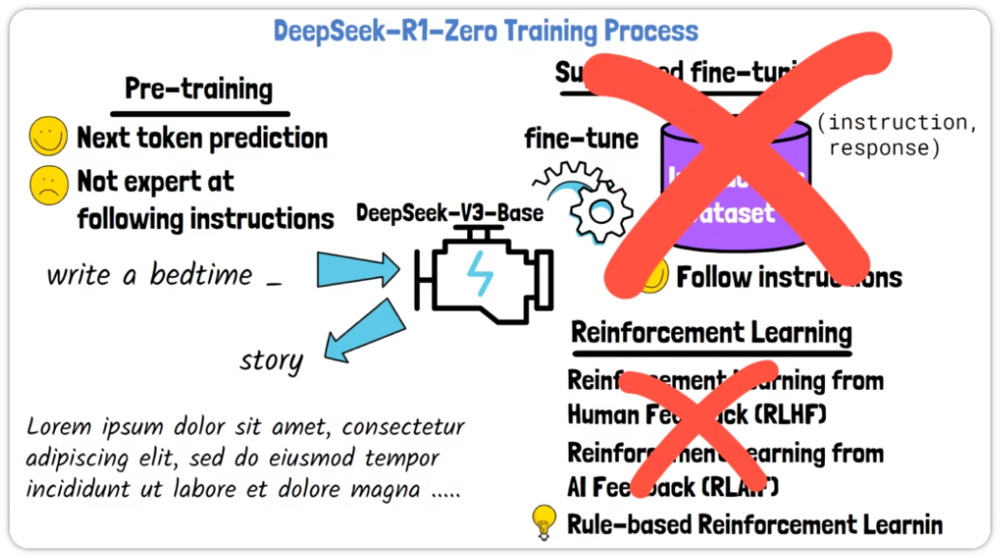
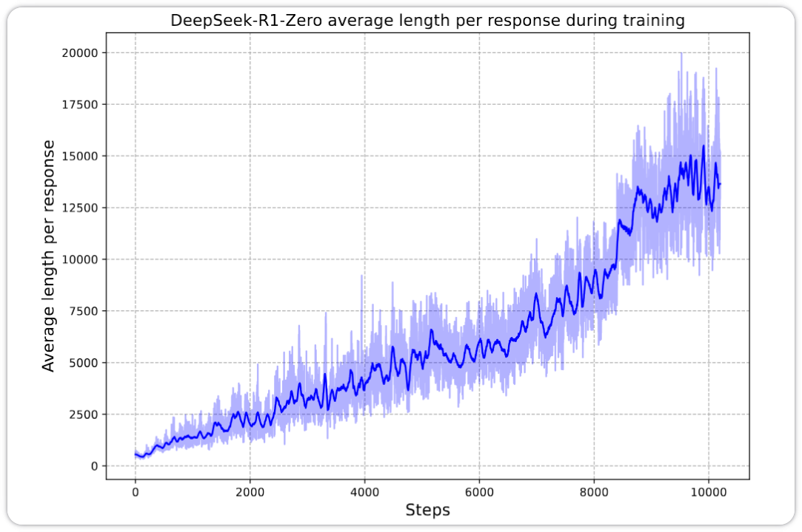
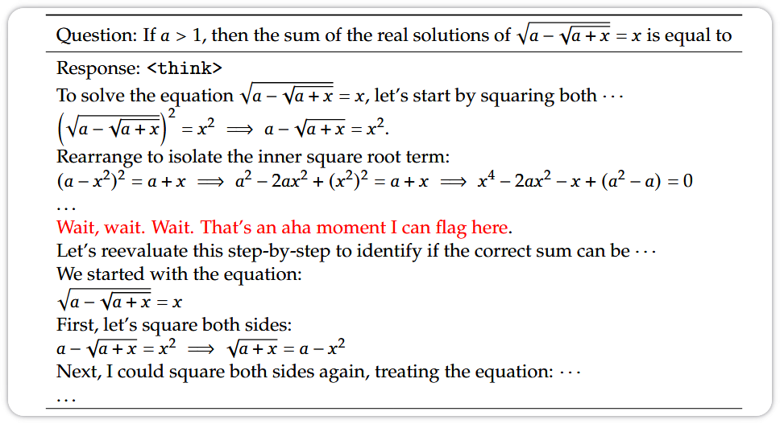
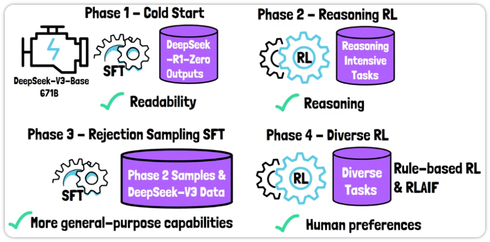
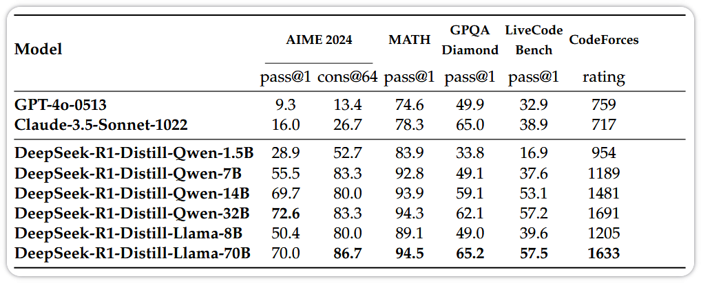

## Overview

### Abstract

通用推理是人工智能领域中一个长期存在且极具挑战性的难题. 近期以大型语言模型（LLMs）和思维链提示为代表的突破性进展，已在基础推理任务上取得了相当大的成功. 然而，这种成功在很大程度上依赖于大量的人工标注示例，且模型在处理更复杂问题时能力仍然不足. 在此，我们证明 LLM 的推理能力可以通过纯粹的强化学习（RL）来激发，从而无需依赖人工标注的推理轨迹. 所提出的 RL 框架促进了高级推理模式的自发涌现，例如自我反思（self-reflection）、验证（verification）和动态策略调整（dynamic strategy adaptation）. 因此，训练后的模型在数学、编程竞赛和 STEM 领域等可验证任务上表现优异，超越了通过传统监督学习在人工示例上训练的同类模型. 此外，这些大规模模型所展现出的涌现推理模式，可以被系统地利用来指导和增强较小模型的推理能力.

## Introducing the DeepSeek-R1-Zero Model

这篇论文取消（或部分取消）了监督微调阶段. 具体来说，为了训练模型 DeepSeek-R1-Zero，作者从一个名为 DeepSeek-V3-Base 的预训练模型开始，该模型拥有 671B 个参数. 监督微调阶段被完全省略. 为了大规模运行强化学习，论文没有采用基于人类或 AI 反馈的标准强化学习，而是使用了一种基于规则的强化学习方法.

### Rule-based Reinforcement Learning

DeepSeek-R1 所使用的强化学习方法称为群体相对策略优化（GRPO），在 DeepSeekMath 这篇文章中介绍.

给定一个待训练的模型和一个输入问题，将输入送入模型，并采样一组输出. 每个输出包含一个推理过程和一个答案. GRPO 方法观察这些采样输出，并通过使用预定义规则为每个输出计算奖励来训练模型生成更优选项：

- 准确性（Accuracy）：一组规则用于计算准确性奖励. 例如，在结果确定的数学问题中，可以可靠地检查模型提供的最终答案是否正确. 对于带有预定义测试用例的代码问题，编译器会根据测试用例生成反馈；
- 格式（Format）：另一类规则用于生成格式奖励. 在论文的下图中，我们可以看到模型被指示如何响应，其推理过程放在 <think> 标签内，答案放在 <answer> 标签内. 格式奖励确保模型遵循这种格式.

这种基于规则的机制不使用模型来生成奖励，从而简化了训练流程并降低了成本，使其在大规模上可行. 此外，研究人员发现奖励模型可能遭受奖励黑客（reward hacking）问题，即模型发现了一种漏洞或非预期的方式来最大化奖励，而这与预期目标不符.

## Self-Evolution Process of DeepSeek-R1-Zero

论文的一个关键洞见是模型的自我进化过程，如上图所示. 横轴表示训练步数，纵轴表明随着训练推进，模型的响应长度在增加. 通过强化学习，模型自然地学会在解决推理任务时分配更多的思考时间.

### The 'Aha Moment' Phenomenon

论文中还提到了另一个有趣的现象，称为 DeepSeek-R1-Zero 的"顿悟时刻"（Aha moment）. 论文中的下方示例展示了这一现象. 给定一个数学问题，模型开始其推理过程. 然而，在某个时刻，模型开始重新评估自己的解答. 模型学会了重新评估其初始方法，并在需要时进行自我修正. 这种卓越的能力是在强化学习训练过程中自然涌现的.

## Training Process of the DeepSeek-R1 Model

为什么需要 DeepSeek-R1？主要有两个原因：

- 可读性问题：DeepSeek-R1-Zero 的输出常常可读性较差；
- 语言一致性：它经常在单个响应中混合使用多种语言.

以上问题使得 DeepSeek-R1-Zero 对用户不太友好. 一项消融研究表明，引导模型保持单一语言会轻微损害其性能. 模型通过使用多种语言来更好地表达自己，这与通常坚持使用单一语言的人类不同.

### Training Pipeline of DeepSeek-R1

为了解决这些问题，DeepSeek-R1 采用四个阶段的流程进行训练：

- SFT 冷启动（Cold Start，阶段 1）：从预训练模型 DeepSeek-V3-Base 开始，模型在一个由 DeepSeek-R1-Zero 收集的结果组成的包含长思维链示例的小型数据集上进行监督微调. 这些结果被验证为高质量且可读. 该数据集包含数千个样本，规模相对较小. 在这个小而高质量的数据集上加入监督微调阶段，有助于 DeepSeek-R1 缓解初始模型中存在的可读性问题；
- 推理强化学习（Reasoning Reinforcement Learning，阶段 2）：此阶段应用之前介绍过的相同的大规模强化学习（GRPO），以增强 R1 模型的推理能力. 针对 R1 所做的唯一改动是在 RLVR 中增加了语言一致性奖励（language consistency reward）——该奖励根据模型输出中使用目标语言的比例来计算. 语言一致性有助于避免 R1-Zero 中出现的语言混合问题，使模型的输出更加流畅和可读；
- 拒绝采样与监督微调（Rejection Sampling and Supervised Fine-Tuning，阶段 3）：在此阶段，使用阶段 2 的模型检查点（checkpoint）生成大量样本. 通过拒绝采样（rejection sampling），只保留正确且可读的样本. 此外，还使用一个生成式奖励模型 DeepSeek-V3 来决定哪些样本应被保留. DeepSeek-V3 的部分训练数据也被纳入此阶段. 然后，模型在此数据集上进行监督微调. 该数据集不仅包含推理类问题，还增强了模型在更多领域的能力；
- 多样化强化学习阶段（Diverse Reinforcement Learning，阶段 4）：这最后一个阶段包含多样化的任务. 对于允许使用规则奖励的任务（如数学），采用基于规则的奖励. 对于其他任务，则由 LLM 提供反馈，以使模型与人类偏好对齐.

此外，还使用阶段 3 构建的数据集蒸馏（distill）出多种较小的开源模型，为需要高推理能力但规模更小的场景提供了选择.

