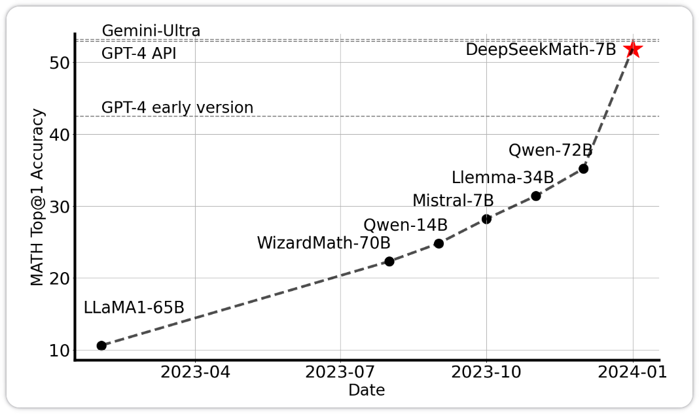
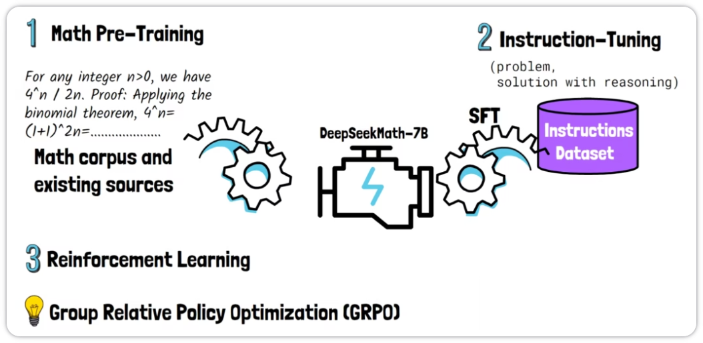
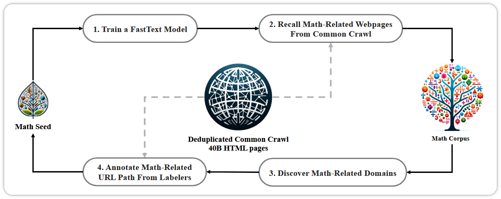
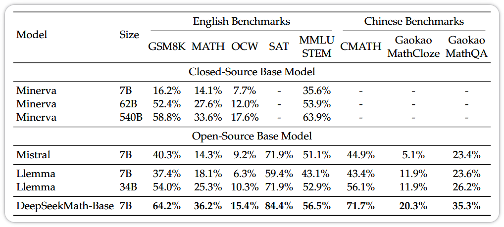
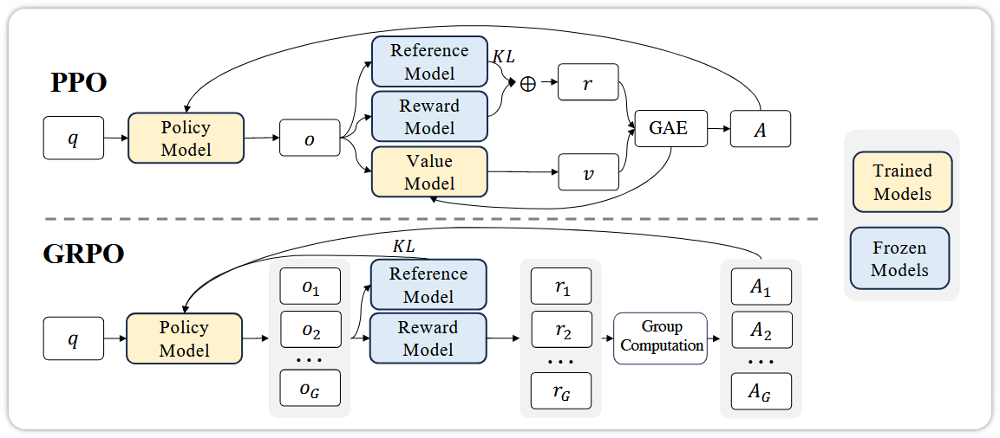

## Overview

### Abstract

数学推理由于其复杂和结构化的性质，对语言模型提出了重大挑战. 本文介绍了 DeepSeekMath 7B，它继续使用来自 Common Crawl 的 120B 数学相关 token 预训练 DeepSeek-Coder-Base-v1.5 7B，与自然语言和代码数据一起. DeepSeekMath 7B 取得了令人印象深刻的 51.7% 的分数. DeepSeekMath 7B 在 64 个样本上的自洽性达到 60.9%. DeepSeekMath 的数学推理能力主要归功于两个关键因素：首先，我们通过精心设计的数据选择管道来利用公开可用的Web数据的巨大潜力. 其次，我们引入了组相对策略优化（GRPO），这是最近策略优化（PPO）的一个变体，增强数学推理能力，同时优化PPO的内存使用.

### Motivation

大型语言模型（LLM）已经彻底改变了人工智能中的数学推理方法，促进了定量推理基准和几何推理基准. 然而，诸如 GPT-4（OpenAI，2023）和 Gemini-Ultra（Anil 等人，2023）等尖端模型尚未公开，并且目前可访问的开源模型在性能上远远落后. 

- 数学推理因其复杂性和结构化特性对语言模型构成了重大挑战. 
- 公开可用的网络数据可能包含尚未被挖掘和利用的丰富数学信息. 

### Contributions

文章构建了一个完整的开放式数学推理方案：

- 通过一个 data selection pipeline 从 Common Crawl 收集高质量数学相关网络数据，构建了包含 120B token 的 DeepSeekMath 语料库；
- 在数学训练之前进行代码训练可以提高模型在使用和不使用工具的情况下解决数学问题的能力；
- 引入了组相对策略优化（GRPO），这是一种改进的强化学习算法，去除了 PPO 中的 Critic 模型，通过组评分来估计基线，从而减少训练资源. 

核心设计理念是：数学推理的质量源于数据领域与优化目标的契合. 针对通用数据设计的通用强化学习目标，其效果不如针对数学特性集中的数据设计的、包含数学信息的强化学习目标.

## Method

- 从 Common Crawl 构建 DeepSeekMath 语料库. 通过一个迭代管道，从 Common Crawl 系统地收集大规模数学语料库.
- DeepSeek 构建了一个将数学问题与详细推理轨迹配对的监督数据集. 在以此数据集对预训练的DeepSeekMath-Base 7B 模型进行指令微调后，创建了 DeepSeekMath-Instruct 7B.
- 强化学习（RL）已被证明可以有效地在监督微调（SFT）阶段之后进一步提高 LLM 的数学推理能力. 文章引入了组相对策略优化（GRPO）.

### Math Pre-Training

- 构建 DeepSeekMath 语料库：使用基于 fastText 的分类器，从 Common Crawl 中提取 120B 数学相关 token，构建大规模、高质量的预训练语料库 DeepSeekMath Corpus；
- 迭代式数据过滤：采用迭代策略，以 OpenWebMath 作为种子数据训练初始分类器，然后使用该分类器从 Common Crawl 中挖掘更多正例，并进行人工标注以持续优化分类器性能；
- 多语言特征：DeepSeekMath 语料库包含多语言数据，提高了模型在中文数学基准上的性能；
- 去污染处理：对训练数据进行去污染处理，避免与测试基准重叠.

文章预训练的 DeepSeekMath-Base 7B 模型使用 DeepSeek-Coder-Base-v1.5 7B 进行初始化，发现比从通用 LLM 初始化更有效. 数据分布如下：56% 来自 DeepSeekMath 语料库，4% 来自 AlgebraicStack，10% 来自 arXiv，20% 是Github代码，剩下的 10% 是来自 Common Crawl 的自然语言数据，中英文都有. 使用 AdamW 优化器，学习率最大值 4.2e-4，批次大小 10M tokens，训练 500B tokens.

### Supervised Fine-Tuning

构建包含 776K 样本的数学指令微调数据集，涵盖多种数学领域和难度级别，包括 CoT（思维链）、PoT（思维程序）和工具集成推理格式.

基于 DeepSeekMath-Base 进行数学指令微调得到 DeepSeekMath-Instruct 7B. 训练示例随机连接，直到达到 4K token 的最大上下文长度. 训练模型 500 步，批次大小为256，恒定学习率为5e-5. 

| Model                     | Size | GSM8K     | MATH      | MGSM-zh   | CMATH     |
| :------------------------ | :--- | :-------- | :-------- | :-------- | :-------- |
| InternLM2-Math            | 20B  | 82.6%     | 37.7%     | -         | -         |
| Qwen                      | 72B  | 78.9%     | 35.2%     | -         | -         |
| Math-Shepherd-Mistral     | 7B   | 84.1%     | 33.0%     | -         | -         |
| WizardMath-v1.1           | 7B   | 83.2%     | 33.0%     | -         | -         |
| DeepSeek-LLM-Chat         | 67B  | 84.1%     | 32.6%     | 74.0%     | 80.3%     |
| MetaMath                  | 70B  | 82.3%     | 26.6%     | 66.4%     | 70.9%     |
| SeaLLM-v2                 | 7B   | 78.2%     | 27.5%     | 64.8%     | -         |
| ChatGLM3                  | 6B   | 72.3%     | 25.7%     | -         | -         |
| WizardMath-v1.0           | 70B  | 81.6%     | 22.7%     | 64.8%     | 65.4%     |
| **DeepSeekMath-Instruct** | 7B   | 82.9%     | 46.8%     | 73.2%     | 86.4%     |
| **DeepSeekMath-RL**       | 7B   | **88.2**% | **51.7**% | **79.6**% | **88.8**% |

### Reinforcement Learning —— GRPO

#### PPO

假设有一个预训练的 LLM，要使用 PPO 进行强化学习训练. 在 RL 中，将 LLM 称为策略模型（Policy Model）. 给定一个输入提示，将其馈送到 LLM 以获得响应. 然后根据响应的质量更新模型.

首先，将提示词（prompt）和响应（response）输入一个奖励模型（Reward Model），以获得对该响应的奖励分数. 奖励模型是另一个专门为此目的训练的专用模型. 奖励分数提供了一个衡响应质量的指标. 然而，这本身并不足以有效地训练模型. 最终实际所需要的信号，称为优势（Advantage）.

优势告诉我们，对于给定的提示词，某个响应是优于还是劣于平均水平. 为了计算优势，需要估计平均响应的质量. 这个值被标记为 v（value），因为它代表当前状态的值. 从另一个称为价值模型（Value Model）的专用模型中获得这个值.

有了价值和奖励，就可以计算出响应相对于平均水平的优势（Advantage）. 然后，优势计算还包含另一个组成部分. 在强化学习阶段，不希望模型偏离其预训练模型太远，这个原始的预训练模型被称为参考模型（Reference Model）.

借助参考模型，引入一个 KL 散度惩罚项（KL Penalty）. 这个惩罚项的作用是：当新模型与参考模型在响应概率上存在显著差异时，惩罚值会变大，从而抑制模型过度偏离. 综合这三个模型，计算出最终用于模型更新的优势值（A）.

#### GRPO

在 PPO 中，有四个模型，一个是我们想要通过强化学习训练的 LLM，称为策略模型. 还有三个额外的模型：奖励模型、价值模型和参考模型. GRPO 则完全移除了价值模型. 

GRPO 不是只采样单个响应，而是从策略模型中采样多个输出. 随后，奖励模型为每个采样得到的响应生成一个奖励分数. 对奖励进行归一化处理后，不再依赖价值模型来确定平均价值，而是利用采样得到的响应来评估. 这正是 GRPO 中 "Group Relative" 的含义，因为优势是根据采样得到的响应群体来相对计算的.
$$
\hat{A}_{i,t} = \frac{R_i - \text{mean}(\{R_i\}_{i=1}^G)}{\text{std}(\{R_i\}_{i=1}^G)}
$$
与 PPO 不同，GRPO 的优势公式中不包含 KL 散度惩罚项. 而是和优势一起，都作为训练的一部分，共同参与模型更新.

这里给出两个算法的优化目标：
$$
\mathcal{J}_{PPO}(\theta) = \mathbb{E}[q \sim P(Q), o \sim \pi_{\theta_{old}}(O|q)] \frac{1}{|o|} \sum_{t=1}^{|o|} \min \left[ \frac{\pi_{\theta}(o_t|q, o_{<t})}{\pi_{\theta_{old}}(o_t|q, o_{<t})} A_t, \text{clip} \left( \frac{\pi_{\theta}(o_t|q, o_{<t})}{\pi_{\theta_{old}}(o_t|q, o_{<t})}, 1 - \varepsilon, 1 + \varepsilon \right) A_t \right]
$$

$$
\mathcal{J}_{GRPO}(\theta) = \mathbb{E}[q \sim P(Q), \{o_i\}_{i=1}^G \sim \pi_{\theta_{old}}(Q|q)] \frac{1}{G} \sum_{i=1}^G \frac{1}{|o_i|} \sum_{t=1}^{|o_i|} \left\{ \min \left[ \frac{\pi_{\theta}(o_{i,t}|q, o_{i,<t})}{\pi_{\theta_{old}}(o_{i,t}|q, o_{i,<t})} \hat{A}_{i,t}, \text{clip} \left( \frac{\pi_{\theta}(o_{i,t}|q, o_{i,<t})}{\pi_{\theta_{old}}(o_{i,t}|q, o_{i,<t})}, 1 - \epsilon, 1 + \epsilon \right) \hat{A}_{i,t} \right] - \beta \mathbb{D}_{KL} \left[ \pi_{\theta} \| \pi_{ref} \right] \right\}
$$

$$
\mathbb{D}_{KL} \left[ \pi_{\theta} \| \pi_{ref} \right] = \frac{\pi_{ref}(o_{i,t} | q, o_{i,<t})}{\pi_{\theta}(o_{i,t} | q, o_{i,<t})} - \log \frac{\pi_{ref}(o_{i,t} | q, o_{i,<t})}{\pi_{\theta}(o_{i,t} | q, o_{i,<t})} - 1
$$

两个目标函数中都有一个相同的比值，这个比值称为策略比值（Policy Ratio）. 策略就是我们所训练的大模型（LLM）. 给定一个问题 $q$，分子和分母都表示该 LLM 生成某个特定响应（小写 $o$）的概率. 区别在于，分子代表 LLM 在经过某个训练步更新后的新概率，而分母代表 LLM 在更新之前的旧概率.

分母只是由模型当前状态决定的一个固定数值，而分子则是在每个训练步中要优化的参数. 两者之间的比值反映了 LLM 对某个特定响应的置信度变化，换句话说，就是同一个响应在训练步之前和之后被生成的概率变化. 如果比值大于1，说明新策略对该响应更有信心；如果比值小于1，说明新策略对该响应信心下降. 这些目标函数的核心，是将策略比值乘以优势（Advantage). 这引导模型更新时，增加具有正优势的响应的生成概率.

可以看到，目标函数取的是（策略比值×优势）与另一个通过裁剪函数（Clip Function）生成的项之间的最小值. 裁剪函数通过一个名为 epsilon 的超参数来限制更新的幅度. 裁剪(Clipping）是一种强化学习技术，通过防止模型发生大幅更新来稳定训练过程. 训练时希望每个训练步都只进行小幅、渐进式的改进，而不是可能导致训练不稳定的剧烈变化，裁剪正是为此服务的.

GRPO 的主要区别在于：对每个问题采样多个输出. 可以看到，目标函数对每个采样得到的响应分别计算，然后除以采样响应数量 $G$ 来取平均. 还看到，多个响应被用于计算优势，其中它们的平均奖励被用来计算每个响应的相对价值.

可以看到，目标函数中还有另一个求和符号，它对响应中的每个 Token 进行遍历. 虽然每个 token 没有真实标签（ground truth)，只有针对整个响应的奖励，但训练信号仍然需要在 token 级别进行传播，以逐步指导模型的学习——因为模型是逐 token 生成的.

强化学习是整个训练流程的最后阶段，最终产出的 DeepSeekMath 模型被命名为 DeepSeekMath-7B.

## Towards to a Unified Paradigm

论文提出了一个统一范式来理解 SFT、RFT、DPO、PPO、GRPO 等不同训练方法. 统一框架的关键元素包括：

| 方法           | 训练数据                    | 奖励函数                   | 梯度系数                   | 训练方式     | 主要特点                       |
| -------------- | --------------------------- | -------------------------- | -------------------------- | ------------ | ------------------------------ |
| **SFT**        | 人工标注 SFT 数据           | 人工选择（隐式奖励）       | 固定为 1                   | 监督学习     | 简单稳定，依赖高质量标注数据   |
| **RFT**        | SFT 问题 + SFT 模型采样输出 | 基于答案正确性（规则判断） | 0（错误）或 1（正确）      | 离线策略优化 | 计算高效，直接使用规则反馈     |
| **DPO**        | SFT 问题 + 模型输出对       | 人类偏好标注或规则比较     | 基于偏好概率计算           | 对比学习     | 避免显式奖励建模，直接优化偏好 |
| **Online RFT** | 实时策略模型采样问题-输出对 | 基于答案正确性（规则判断） | 0（错误）或 1（正确）      | 在线策略优化 | 动态更新策略，实时反馈优化     |
| **PPO**        | SFT 问题 + 策略模型采样输出 | 训练的奖励模型（RM）       | 优势函数（基于奖励估计）   | 策略梯度方法 | 高效稳定，支持多步优化         |
| **GRPO**       | SFT 问题 + 策略模型采样输出 | 训练的奖励模型（RM）       | 组内相对奖励（归一化比较） | 组策略优化   | 降低奖励方差，增强组内比较     |