## Self-Distilled Reasoner: On-Policy Self-Distillation for Large Language Models

### Abstract

知识蒸馏通过压缩教师大语言模型（LLM）的知识来训练更小的 LLM，从而提升其推理能力. 同策略蒸馏（on-policy distillation）对此方法进行了改进：让学生模型采样自身的轨迹，同时由教师 LLM 提供密集的 token 级监督，从而缓解了异策略蒸馏（off-policy distillation）方法中训练与推理之间的分布不匹配问题. 然而，同策略蒸馏通常需要一个独立的、往往规模更大的教师 LLM，且未能显式利用推理数据集中可用的真值解答. 受以下直觉的启发——一个能力足够强的 LLM 能够对外部特权推理轨迹进行合理化，并教导其较弱的自身——我们提出了同策略自蒸馏（On-Policy Self-Distillation, OPSD），一种让单个 LLM 以**不同上下文同时充当教师和学生的学习算法**. 教师策略以**特权信息**（如经过验证的推理轨迹）为条件，而学生策略仅看到问题；训练在学生的自身 rollout 上最小化这两个分布之间的**逐 token 散度**. 我们在多个数学推理基准上验证了该方法的有效性，相较于强化学习方法实现了更优的 token 效率，并相较异策略蒸馏方法取得了更好的性能.

### Motivation

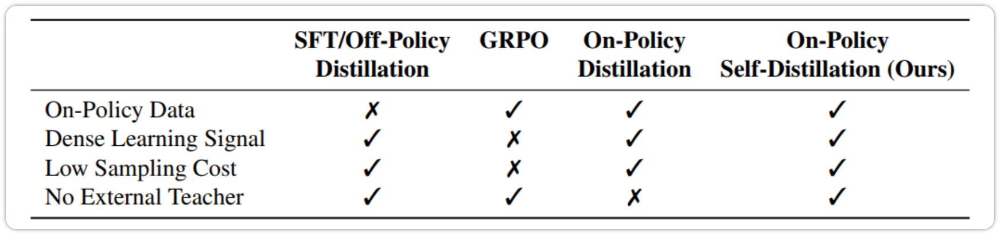

现有的三种训练范式都有一定的痛点，作者提出的 OPSD 没有这四个痛点. 相对于 OPD 而言，该方法不需要额外的外部教师模型——让模型自己当自己的老师.

### Method

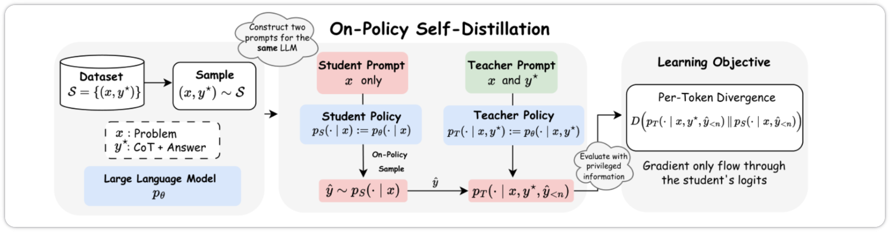

给定数据集 $$\mathcal{S}=\{(x_i,y_i^\star)\}_{i=1}^N$$，从同一个 LLM 实例化出学生策略 $$p_S(\cdot|x)$$ 与教师策略 $$p_T(\cdot|x,y^\star)$$；学生采样出 on-policy 轨迹 $$\hat y$$；两个策略在同一串 $$\hat y$$ 上分别给出 next-token 分布；损失沿学生轨迹最小化逐 token 散度 $$D(p_T\|p_S)$$. 关键是：梯度只穿过学生的 logits.

流程可以拆成 4 步：

1. 构造两份 prompt（同一个模型，两种上下文）：
    - 学生 prompt：只有题目 $$x$$

    - 教师 prompt：题目 $$x$$ + 参考解 $$y^\star$$ + 一句 "请重新生成解答" 的指令
2. 学生采样：$$\hat{y} \sim p_S(\cdot \mid x)$$，得到一条 on-policy 轨迹
3. 双方对同一串 $$\hat y$$ 打分：在每一个位置 n，各自算出对整个词表 $$\mathcal{V}$$ 的 next-token 分布 $$p_S(y_n \mid x, \hat y_{<n})$$，$$\qquad p_T(y_n \mid x, y^\star, \hat y_{<n})$$
4. 逐 token 分布对齐：最小化二者散度，梯度只回传给学生模型

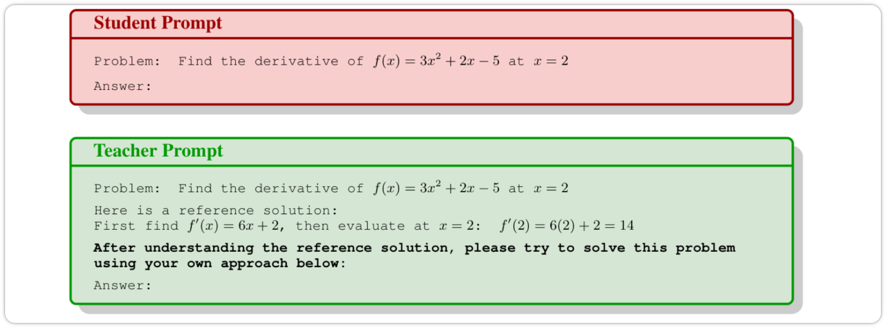

损失函数如下：
$$
\mathcal{L}_{\text{OPSD}}(\theta)=\mathbb{E}_{(x,y^\star)\sim\mathcal{S}}\left[\mathbb{E}_{\hat{y}\sim p_S(\cdot\mid x)}\left[\sum_{n=1}^{|\hat{y}|}D\Big(p_T(\cdot\mid x,y^\star,\hat{y}_{<n})\;\Big\|\;p_S(\cdot\mid x,\hat{y}_{<n})\Big)\right]\right]
$$

- $$\theta$$：模型参数. 教师与学生共享同一组 $$\theta$$，只是条件上下文不同；实现上学生带 LoRA、教师用冻结的初始权重
- $$\mathcal{S}=\{(x_i,y_i^\star)\}$$：训练集：题目 $x$ 与已验证的参考解 $$y^\star$$（可以是完整 CoT）
- $$\hat{y}\sim p_S(\cdot\mid x)$$：学生采样出来的轨迹. 这是 "on-policy" 的全部含义：期望是对学生当前分布取的
- $$\hat{y}_{<n}=(\hat y_1,\dots,\hat y_{n-1})$$：第 $n$ 步之前的轨迹. 教师和学生用的是同一串轨迹（学生的轨迹）
- $$p_T(\cdot\mid x, y^\star, \hat y_{<n})$$：教师分布：条件里多了一个 $$y^\star$$，这是它 "更聪明" 的原因
- $$p_S(\cdot\mid x, \hat y_{<n})$$：学生分布：条件里只有题目，复刻推理时的处境
- $$D(\cdot\|\cdot)$$：任意散度：forward KL、reverse KL 或 JSD 都可以代入
- $$|\hat y|$$：轨迹长度

#### per-token pointwise clipping

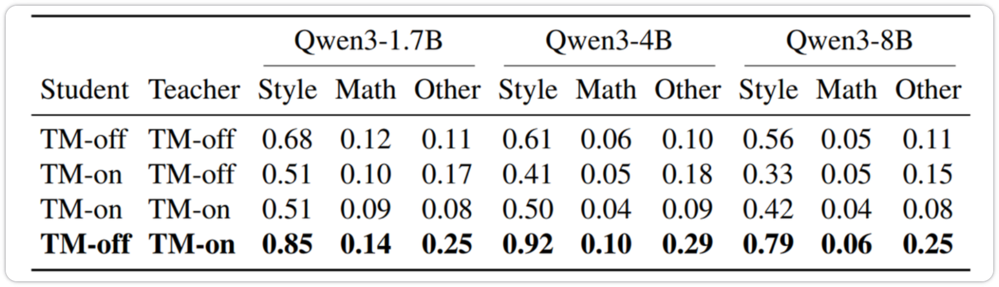

作者把 token 分成三类（style = 推理连接词如 `wait`/`think`/`hmm`/`because`；math = 数字、算符、数学关键词；other），统计各类的平均逐 token KL.

Style token 的散度是 Math token 的约 6 倍（0.85 : 0.14）. 教师一旦知道答案，连回答的口吻都变了——`hmm`、`wait`、`Let me think` 这类词在 "看过答案" 和 "没看过答案" 的条件下差异极大. 这样导致训练时训练信号会被 Style token 主导，模型学到的是一些语气，而不是推理方式.

所以要在词表维度上做点对点裁剪. 对每个位置 $n$、每个词表项 $v$，先算该词表项的散度贡献
$$
\ell^{(f)}_{n,v}=p_T(v\mid\cdot)\,f\!\left(\frac{p_S(v\mid\cdot)}{p_T(v\mid\cdot)}\right)
$$
再求和时逐项截断：
$$

D^{(f)}_{\text{clip}}(p_T\|p_S)=\frac{1}{|\hat y|}\sum_{n=1}^{|\hat y|}\sum_{v\in\mathcal{V}}\min\!\left(\ell^{(f)}_{n,v},\ \tau\right)
$$
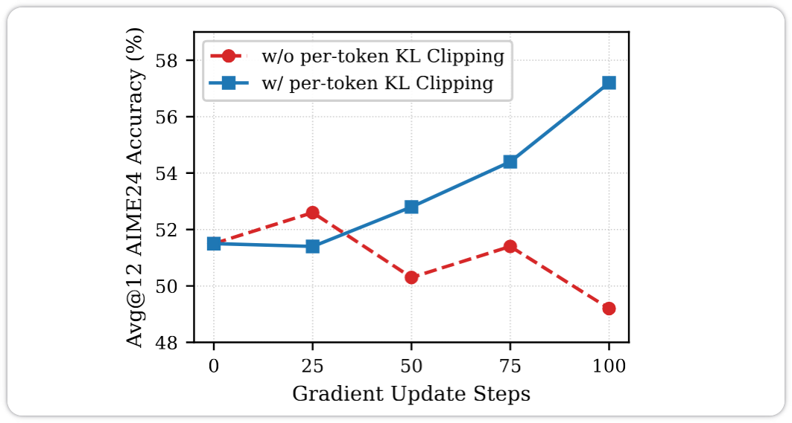

## Vision-OPD: Learning to See Fine Details for Multimodal LLMs via On-Policy Self-Distillation

### Abstract

多模态大语言模型（Multimodal Large Language Models, MLLMs）在细粒度视觉理解方面仍存在困难，其答案往往取决于完整图像中微小但具有决定性作用的证据. 我们观察到一种从**区域到全局的感知差距**（regional-to-global perception gap）：同一个 MLLM 在以证据为中心的裁剪图像（crop）为条件时，对细粒度问题的回答准确率高于以对应的完整图像为条件时，这表明许多失败源于**模型难以聚焦于相关证据**，而非局部识别能力不足. 受此观察启发，我们提出了 Vision-OPD（Vision On-Policy Distillation），一种从区域到全局的自蒸馏框架，将模型自身所享有的特权区域感知能力迁移至其全图策略中. Vision-OPD 从同一个 MLLM 实例化出两个条件策略：一个以**裁剪图像为条件的教师模型**和一个以**完整图像为条件的学生模型**. 学生模型生成同策略 rollout，Vision-OPD 在这些 rollout 上最小化教师模型与学生模型下一 token 分布之间的 **token 级散度**. 这使得模型能够在无需外部教师模型、真值标签、奖励验证器或推理时工具使用的情况下，内化视觉缩放（visual zooming）所带来的收益. 在多个细粒度视觉理解基准上的实验表明，Vision-OPD 模型相较于规模大得多的开源模型、闭源模型以及 "Thinking-with-Images" 智能体模型，取得了具有竞争力甚至更优的性能.

### Motivation

一个现象：多模态大语言模型（MLLM）在 "看图回答问题" 时：

- 给它**整张高分辨率照片**，问一个关于角落里小物体的问题 → 它答错
- 把同一块区域**裁下来、放大**再问同样的问题 → 它答对了

也就是说，模型并不是不认识这个东西，而是在整张图里很难找到它. 主要问题是模型的细粒度感知. 所以就要解决这样的问题：能不能不引入任何推理时的外部工具，就把 "局部放大" 这个能力内化进模型权重.

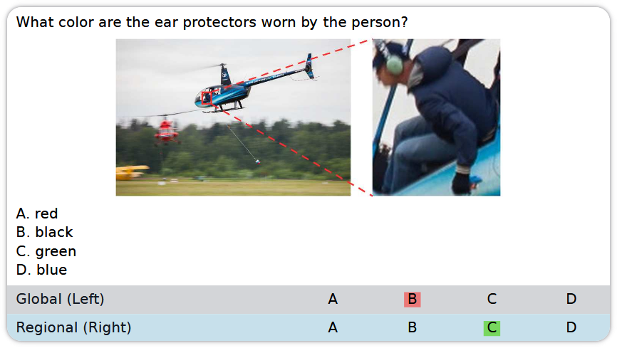

已有的解决方法主要是：

- 推理时裁剪/工具调用：让模型自己生成 bbox，调用裁剪工具，裁剪后的图像再输入进去.
- 传统 SFT/RL：用标注数据直接训练，或用可验证奖励做 RL. 传统监督微调通常使用教师生成的前缀，而测试时模型会使用自己生成的前缀. 随着生成过程变长，前缀差异可能不断积累.

Vision-OPD 的思路是在**训练时给特权信息，推理时扔掉**. 让同一个模型在局部裁剪图像下的“特权感知能力”，去监督它在完整图像下的行为.

### Method

1. 数据构造. Vision-OPD 使用三元组：

$$
D=\{(x_i,x'_i,q_i)\}_{i=1}^{N}
$$

- 其中：

    - $$x$$：带有目标区域框的完整图像

    - $$x'$$：目标区域的裁剪并放大图像

    - $$q$$：针对局部细节设计的问题

- 数据构造流程如下：

    - 对原始图像进行目标识别和分割
    - 找到面积较小、可能包含细粒度证据的区域
    - 使用 Qwen3.5-397B 根据局部区域生成问题
    - 将目标区域的 bounding box 画回完整图像
    - 在问题中加入空间限制，例如 "只关注红色框内的物体"
    - 裁剪目标区域并放大 2 倍
    - 保留局部回答具有较高一致性的样本

    最终得到约 6.2K 个训练样本.

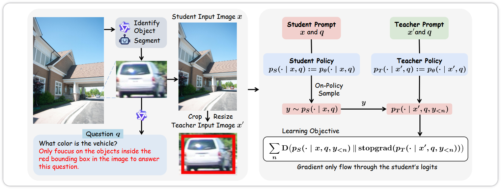

2. Vision-OPD 使用同一个 MLLM 构造两个策略.

学生看到完整图像：
$$
p_S(\cdot|x,q)=p_\theta(\cdot|x,q)
$$
教师看到局部裁剪：
$$
p_T(\cdot|x',q)=p_\theta(\cdot|x',q)
$$
裁剪图像集中呈现了关键证据，所以教师更容易做出正确判断.

3. On-policy rollout. 学生先根据完整图像生成自己的回答：

$$
y\sim p_S(\cdot|x,q)
$$

然后在学生已经生成的同一前缀上，分别计算教师和学生的下一 token 分布. 第$$n$$步使用相同的前缀：
$$
y_{<n}=(y_1,\ldots,y_{n-1})
$$

4. Vision-OPD 的损失是沿着学生 rollout 计算的平均逐 token 散度：

$$
\mathcal{L}_{\text{Vision-OPD}} = \mathbb{E}_{(x,x',q)\sim D} \mathbb{E}_{y\sim p_S} \left[ \frac{1}{|y|} \sum_{n=1}^{|y|} D\left( p_T(\cdot|x',q,y_{<n}) \parallel p_S(\cdot|x,q,y_{<n}) \right) \right]
$$

梯度只传给学生策略，教师策略作为固定目标使用. 让完整图像下的学生，在自己的生成轨迹上，逐步接近局部裁剪图像下教师的分布.

## From Seeing to Thinking: Decoupling Perception and Reasoning Improves Post-Training of Vision-Language Models

### Abstract

近期视觉语言模型（VLM）的进展强调长思维链推理；然而我们发现，其在视觉任务上的表现主要受限于视觉感知能力的不足，而非推理本身. 在这项工作中，我们通过将 VLM 的能力分解为三个独立的训练阶段——视觉感知、视觉推理和文本推理——并配以专门的训练数据，系统地研究了后训练中**感知与推理**之间的相互作用. 我们证明：视觉感知（a）需要借助**专门数据进行针对性优化**；（b）充当基础性支架（scaffold），应在精炼视觉推理之前通过分阶段训练加以夯实；（c）通过强化学习（RL）得到的效果优于基于描述（caption）的监督微调（SFT）. 我们在多个 VLM 上的实验表明，**分阶段训练相较于混合训练**，能够持续提升视觉感知和推理性能. 值得注意的是，采用我们方法训练的模型在推理准确率上提升了 1.5%，同时推理轨迹长度缩短了 20.8%，这表明**更优的感知能够减少对过度推理的需求**. 此外，我们还表明这种基于能力的阶段划分代表了一个新的课程维度，与传统的基于难度的课程正交，二者结合可带来进一步的增益. 我们的分阶段训练模型在开源权重 VLM 中取得了领先性能，在多个视觉数学和感知任务上相较基座模型取得了先进结果（例如在 WeMath 上 +5.2%，在 RealWorldQA 上 +3.7%）.

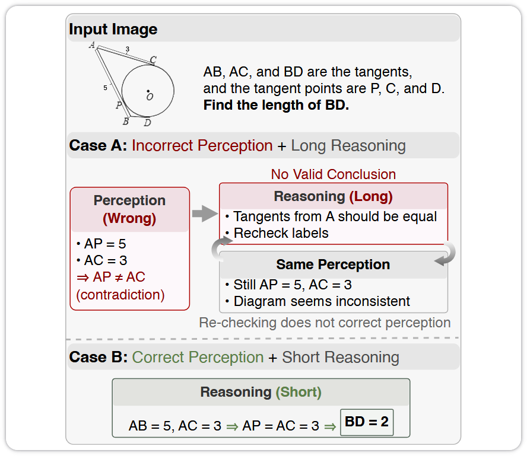

### Motivation

作者对 3 个视觉数学数据集进行了分析，使用了 Claude-Haiku-4.5 模型来检测视觉语言推理过程中的感知错误：在 Qwen3-VL-8B 模型中，所有采样错误的答案都被识别出来了. 有 86.9% 的情况是由于视觉感知错误导致的. 这些研究揭示了当前训练后实践中的一个关键问题：长时间的推理过程并不能弥补错误的感知判断.

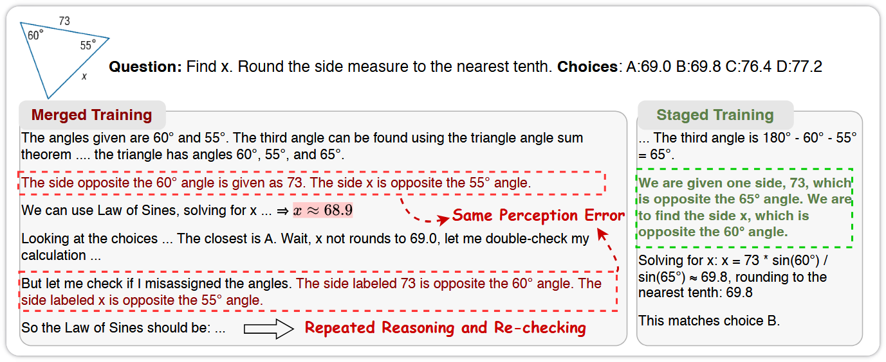

当感知出错时，增加推理长度（thinking tokens）并不能把答案救回来，反而可能放大错误.

### Method

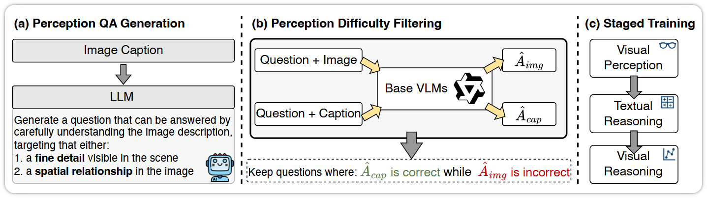

通过视觉感知数据合成和分阶段训练来提升预训练语言模型的效果：(a) 通过向语言模型输入图像内容，生成基于图像内容的问答对；然后由强大的预训练语言模型来标记答案；(b) 感知难度过滤，即去除那些可以通过基础预训练语言模型根据标题进行回答的样本；(c) 通过分阶段训练，逐步提升从感知到思考的能力.

三个阶段的总步数是 930 步，配置如下：

1. 视觉感知（Visual Perception）数据：`D_perc`（由 DOCCI 的 caption 合成 QA），90 步. GRPO 算法
2. 文本推理（Textual Reasoning）数据：`D_text`（ORZ-Math-13k），375 步. RLVR 算法
3. 视觉推理（Visual Reasoning）数据：`D_vis`（CLEVR-Math, GeoQA170K, Math PUMA, DocVQA, ArxivQA），465 步. RLVR 算法

感知数据 `D_perc` 的构造流程是全自动的，分四步：

1. 原材料. 从 DOCCI 拿到成对的 `(I, C)`，即一张图 `I` 和它对应的详细 caption `C`.
2. 用文本 LLM 造题. 把 caption `C` 送进一个纯文本 LLM（Qwen2.5-72B），用一个 prompt 模板 `f_gen` 让它产出四选一选择题：

$$
(Q, A) = f_{\mathrm{gen}}(C)
$$

即从 caption 中 "提炼" 出一个问题 `Q`、四个选项 `Q_options`、以及正确答案 `A`.

3. 用两个 VLM 做筛选. 拿两个视觉语言模型（Qwen2.5-VL-7B 和 Qwen2.5-VL-32B）分别做两次预测：

$$
\hat{A}_{\mathrm{img}} = f_\theta(I, Q), \quad \hat{A}_{\mathrm{cap}} = f_\theta(C, Q).
$$

- $$\hat{A}_{\mathrm{img}}$$：看着图像回答这道题得到的答案
- $$\hat{A}_{\mathrm{cap}}$$：只读 caption（不看图）回答同一道题得到的答案

4. 筛选. 只保留同时满足两个条件的样本：

$$
\mathbb{I}[\hat{A}_{\mathrm{img}} \neq A] \land \mathbb{I}[\hat{A}_{\mathrm{cap}} = A]
$$

也就是 "看图答不对、但读文字能答对" 的样本才留下.

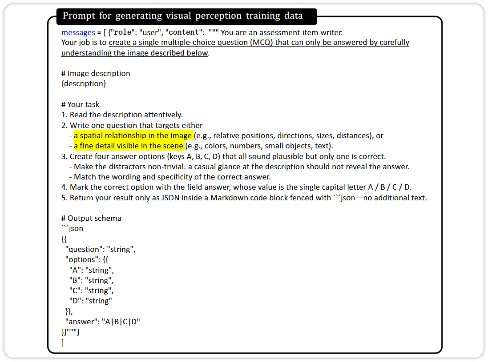

论文用一个裁判模型（judge）——Claude-4.5-Haiku——来判定 "模型是不是犯了感知错误"，并把感知错误分成 5 类. 这个 5 类分类法定义在裁判提示词（judge prompt）里：

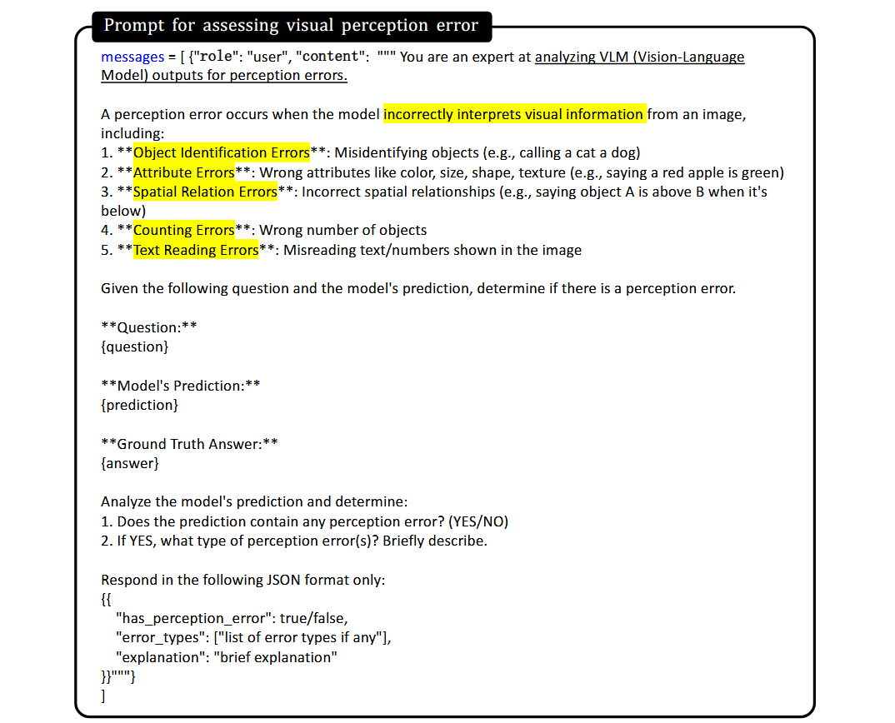

## Seeing Before Reasoning: Decoupling Perception and Reasoning for Shortcut-Resilient Multimodal On-Policy Self-Distillation

### Abstract

同策略自蒸馏（On-Policy Self-Distillation, OPSD）在模型自身的 rollout 上进行训练，并使用一个冻结的副本，以参考目标（reference target）为条件提供密集的 token 级目标. 这一方法在 LLM 推理中效果良好，但直接扩展到多模态大语言模型（MLLM）时可能出现捷径：特权目标（privileged target）可能**主要依据文本**参考目标**而非图像**来引导 token. 我们提出了 ViGOS，一个面向 MLLM 后训练的、视觉接地的（visually grounded）OPSD 框架. 学生模型首先**写出视觉描述**，然后**逐步推理**以得出最终答案. 对于有效的 rollout，一个**仅基于图像的感知教师模型**监督描述部分，而一个**特权推理教师模型**在相同的学生前缀上监督推理和最终答案. 参考教师模型仅用于无效 rollout，以恢复输出格式. 在通用视觉语言、专家推理、视觉数学、空间接地以及视觉语言先验等基准上，ViGOS 保留了 OPSD 的主要优势，并在易产生捷径的设定下改善了图像接地的行为.

### Motivation

1. OPSD 的基本逻辑

训练数据可以表示为：
$$
D=\{(I_i,x_i,a_i^*)\}
$$

- 其中：
    - $$I_i$$：图像
    - $$x_i$$：问题或指令
    - $$a_i^*$$：参考答案或参考解法

学生模型只接收图像和问题：
$$
y\sim p_\theta(\cdot|I,x)
$$
教师模型是学生模型的冻结副本，但可以额外看到参考答案：
$$
q_{\text{priv},t} = p_{\theta^-}(\cdot|I,x,a^*,h_t)
$$
这里$$h_t$$是学生在第$$t$$步已经生成的前缀.

2. 多模态场景中的 shortcut

Vanilla OPSD 对整段输出都使用参考答案条件下的教师可能导致：

- 模型更依赖问题中的文字、选项和参考答案
- 图像证据还没有被明确提取，就开始围绕目标答案组织推理
- 模型能够 "看见" 图像内容，却在最终决策时回到**常识或语言先验**

在原始 OPSD 中，特权教师在监督整个学生 rollout 的同时可以看到参考目标. 对于纯文本推理，这是引导推理路径的自然方式. 对于 MLLM，相同的文本信号可能比图像更容易遵循. 教师可以在图像内容被检查之前就将学生推向已知答案，因此学生可能学到与答案兼容**但视觉基础薄弱**的推理过程.

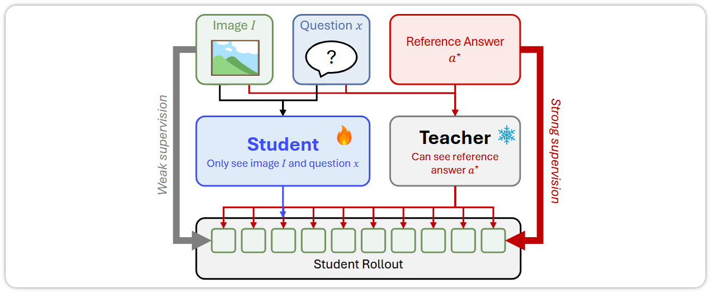

教师看过答案 → 教师的分布被答案污染 → 学生对齐教师的分布 → 答案绕过图像，从分布里流进学生的描述段.

3. PALR 诊断

作者提出 **PALR（Privileged Answer Leakage Rate）**，用来衡量教师监督中有多少部分来自参考答案，而不是来自图像.
$$
\mathrm{PALR}(G) = \frac{\sum_{t \in G} S_{\text{act},t} \cdot A_t}{\sum_{t \in G} S_{\text{act},t}\cdot\left(A_t + I_t\right) + \varepsilon}
$$

-  其核心思想是：
    - 固定同一条学生轨迹
    - 替换教师看到的参考答案，观察监督信号变化
    - 再替换图像，观察监督信号变化
    - 比较 "答案驱动" 与 "图像驱动" 的比例

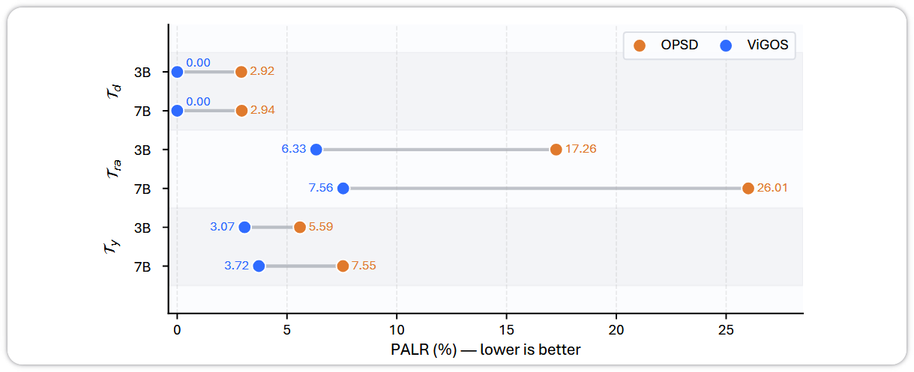

PALR 诊断结果（1000 条样本的子集，越低越好）. 纵轴分三组区域：描述段 $\tau_d$、推理段 $\tau_r$、以及整段回答所在的第三组；每组上下两行分别是 3B 和 7B. 橙点 = OPSD，蓝点 = ViGOS. 描述段上 ViGOS 恒为 0.00（按构造），OPSD 是 2.92 / 2.94；推理段上 ViGOS 把 17.26 → 6.33（3B）、26.01 → 7.56（7B）；整段为 5.59 → 3.07（3B）、7.55 → 3.72（7B）.

### Method

1. 学生模型生成：

$$
y=(d,r,a)
$$

- 其中：

    - $$d$$：视觉描述

    - $$r$$：推理过程

    - $$a$$：最终答案

输出格式为：

视觉描述不是额外人工标注，而是学生自己生成的内容，因此测试时也可以生成.

2. 三类教师模型：

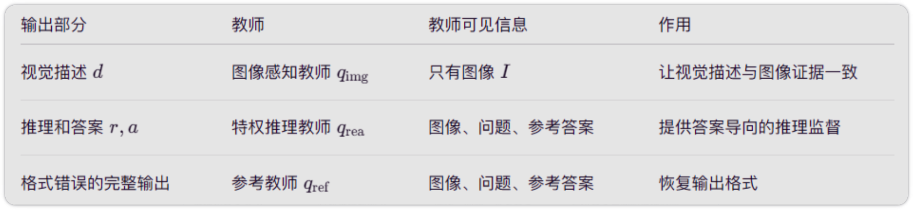

学生始终只接收：
$$
c_{\text{stu}}=(I,x,\pi_{\text{out}})
$$
学生不会看到参考答案.

3. 有效与无效 rollout

一个 rollout 被认为有效，需要满足：包含规定的标签；视觉描述和推理部分非空；最终答案可以解析. 即使答案本身错误，只要格式正确，也属于有效 rollout.

- 有效 rollout
    - 描述段使用图像感知教师
    - 推理和答案段使用特权推理教师
    - 参考教师不参与
- 无效 rollout
    - 片段边界不可靠
    - 不再使用分段教师
    - 使用参考教师对整段输出进行格式恢复

4. 训练目标

感知损失：只在视觉描述 token 上使用，让模型先学习 "图像中有什么".
$$
\mathcal{L}_{\text{perc}} = \mathbb{E} \left[ \sum_{t\in T_d} D_{\mathrm{KL}} (q_{\text{img},t}\|p_{\theta,t}) \right]
$$
推理损失：在推理和答案 token 上使用，保留参考答案对后续推理和答案生成的帮助.
$$
\mathcal{L}_{\text{rea}} = \mathbb{E} \left[ \sum_{t\in T_r\cup T_a} D_{\mathrm{KL}} (q_{\text{rea},t}\|p_{\theta,t}) \right]
$$
参考格式恢复损失：只对无效 rollout 使用，使用反向 KL，主要目的是把格式错误的输出拉回可解析的结构.
$$
\mathcal{L}_{\text{ref}} = \mathbb{E} \left[ \sum_{t\in T_y} D_{\mathrm{KL}} (p_{\theta,t}\|q_{\text{ref},t}) \right]
$$
总损失为：
$$
\mathcal{L}_{\text{ViGOS}} = \lambda_{\text{perc}}\mathcal{L}_{\text{perc}} + \lambda_{\text{rea}}\mathcal{L}_{\text{rea}} + \lambda_{\text{ref}}\mathcal{L}_{\text{ref}}
$$
