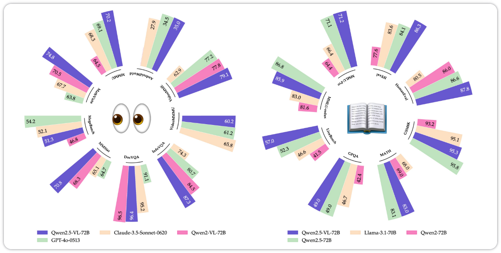
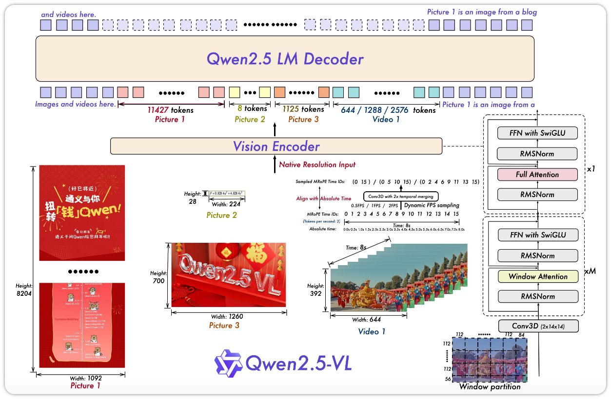

## Overview

### Abstract

我们介绍了 Qwen2.5-VL，这是 Qwen 视觉语言系列的最新旗舰模型，在基础能力和创新功能方面均展现了显著进步. Qwen2.5-VL 通过增强的视觉识别、精确的目标定位、文件的文档解析以及长视频理解，在理解和与世界的交互方面实现了重大飞跃. Qwen2.5-VL 的一个突出特点是能够使用边界框或精确定位目标. 它提供从发票、表单和表格中进行的稳健结构化数据提取，以及对图表、示意图和布局的详细分析. 为了处理复杂输入，Qwen2.5-VL 引入了动态分辨率处理和绝对时间编码，使其能够处理不同尺寸的图像和长时长的视频，并具备秒级事件定位能力. 这使得模型能够原生感知空间尺度和时间动态，而无需依赖传统的归一化技术. 通过从头开始训练原生动态分辨率 Vision Transformer（ViT）并引入 Window Attention，我们在保持原生分辨率的同时显著降低了计算开销. 因此，Qwen2.5-VL 不仅在静态图像和文档理解方面表现出色，还能作为一个交互式视觉智能体，在现实场景（如操作计算机和移动设备）中具备推理、工具使用和任务执行能力. 该模型在跨领域上实现了强大的泛化能力，而无需针对特定任务进行微调. Qwen2.5-VL 提供三种尺寸，适用于从边缘 AI 到高性能计算的各种用例. 旗舰模型 Qwen2.5-VL-72B 模型可与 GPT-4o 和 Claude 3.5 Sonnet 等最先进模型相媲美，尤其在文档和图表理解方面表现优异. 较小的 Qwen2.5-VL-7B 和 Qwen2.5-VL-3B 模型优于同类竞品，即使在资源受限的环境中也能提供强大的能力. 此外，Qwen2.5-VL 保持了稳健的语言性能，延续了 Qwen2.5 LLM 的核心语言能力.

### Introduction

在 Qwen2.5-VL 之前，视觉语言模型（VLM）普遍面临几个问题:

- 分辨率被固定：图像无论多大都被缩放到固定尺寸，细小的文字和物体直接丢失细节；
- 高分辨率付不起：ViT 的全局注意力复杂度是 $O(n²)$，分辨率越高 token 越多，训练和推理成本急剧上升；
- 视频不理解绝对时间：模型只知道 "第几帧"，不知道 "第几秒"，长视频中的事件定位困难；
- 定位坐标依赖归一化：目标检测使用相对坐标，不同分辨率下同一物体的数值含义不同；
- 文档解析依赖多个专用模型：版面分析、OCR、表格识别、图表理解各用一个模型，再拼装起来，笨重且易错.

从技术上讲，研究人员的主要的贡献有以下几点：

- 在视觉编码器中实现了 Window Attention 机制，以优化推理效率；
- 引入了动态 FPS 采样，将动态分辨率扩展到时间维度，从而实现了跨不同采样率的全面视频理解；
- 通过与绝对时间对齐，升级了时间域中的 MRoPE，从而促进了更复杂的时间序列学习；
- 在预训练和监督微调的高质量数据集整理方面投入了巨大努力，进一步将预训练语料库从 1.2 万亿 token 扩展到 4.1 万亿 token.

Qwen2.5-VL 的核心思路是：与其堆砌更多模块，不如把 "感知的精度" 和 "计算的效率" 同时做对，让一个模型原生处理任意尺寸图像与任意时长视频，再统一承载定位、文档解析与 Agent 能力.

## Method

### Model Architecture

Qwen2.5-VL 延续了经典的 "ViT + 连接器 + LLM" 三段式架构:

- 大语言模型：Qwen2.5-VL 系列采用大型语言模型作为其基础组件. 该模型使用来自 Qwen2.5 LLM 的预训练权重进行初始化. 为了更好地满足多模态理解的需求，将一维 RoPE 修改为对齐绝对时间的多模态旋转位置编码 MRoPE；
- 视觉编码器：采用了重新设计的 Vision Transformer（ViT）架构. 在结构上，引入了 2D-RoPE 和 Window Attention，以支持原生输入分辨率，同时加速整个视觉编码器的计算；
- 基于 MLP 视觉语言合并器（Merger）：为了解决长图像特征序列带来的效率挑战，研究人员会在特征序列输入 LLM 之前对其进行压缩. 首先将空间上相邻的四组 patch 特征进行分组，分组后的特征随后被拼接，并输入到一个两层的 MLP 中，将其投影到与 LLM 中使用的文本 embedding 相匹配的维度.

### Technique #1 – Native Dynamic Resolution and Frame Rate

一张 1280×1280 的大图和一张 320×240 的小图，信息量完全不同. 固定缩放要么丢细节，要么浪费算力. Qwen2.5-VL 的做法是让图像像文本一样，内容多就多分 token，内容少就少分 token.

图像先被缩放到宽高都是 28 的倍数，再切成 14×14 的 patch. 这里 28 这个数字并不是随意设定的，而是从整个视觉编码器的结构推导出来的：模型会先把每个 14×14 像素的 patch 作为 ViT 的最小输入单元，随后在连接器中将空间上相邻的 2×2 个 patch 合并为一个视觉 token，这样一来，每个视觉 token 实际覆盖的就是 28×28 像素的区域. 因此，输入图像的宽高必须被调整为 28 的倍数，才能保证 patch 的切分和后续的 2×2 合并恰好对齐，不会出现边界上的残留或错位. 分辨率越高，token 越多，长宽比完全保留. 官方默认支持最多约 100 万像素（即 1280×28×28），token 数大致在 256~1280 之间，可以通过 min_pixels 和 max_pixels 参数按任务调节——文档类任务给足 token，简单图片可以省着用.

模型在训练中见过各种分辨率和长宽比，天然学会了 "尺度" 信息，同时图像与文本在序列层面完全统一，从而提高模型处理不同分辨率图像的能力.

### Technique #2 – Window Attention

动态分辨率让 token 变多了，但全局注意力的 $O(n²)$ 复杂度会立刻成为瓶颈. Qwen2.5-VL 的解法很朴素：大部分层只看局部，最后几层再看全局.

具体来说，ViT 的大多数层使用窗口注意力，每个窗口最多覆盖 8×8 个 patch（即 112×112 像素），只有最后 4 层使用全注意力；同时把归一化和激活函数换成 RMSNorm + SwiGLU，与 Qwen2.5 LLM 对齐.

具体来说，ViT 的大多数层使用窗口注意力，每个窗口最多覆盖 8×8 个 patch（即 112×112 像素），只有最后 4 层使用全注意力. 窗口注意力虽然限制了单层内每个 token 的感受野，但模型是多层堆叠的，上一层窗口内聚合的信息会作为下一层窗口的输入继续参与计算. 通过这种逐层的传递，信息可以像波纹一样逐步扩散到更远的区域. 因此，浅层用窗口注意力提取局部细节，深层用全注意力做全局语义整合，本质上是用 "深度" 换 "广度"，在精度损失很小的前提下大幅降低了计算复杂度. 同时，模型把归一化和激活函数换成 RMSNorm + SwiGLU，与 Qwen2.5 LLM 对齐.

除此之外，训练时会对每张图动态采样不同的分辨率和长宽比，让模型对任意尺寸都保持稳定，而不是只在训练时见过的几种分辨率上表现好.

### Technique #3 – MRoPE 与绝对时间编码（让位置编码理解空间与时间）

位置编码是序列模型的 "坐标系". Qwen2-VL 提出的 MRoPE 把一维位置编码拆成三个维度: 时间、高度、宽度. Qwen2.5-VL 的三个模态这样使用它:

- 纯文本: 三个维度的 ID 相同，自动退化成普通一维 RoPE，语言能力不受影响；
- 静态图像: 时间 ID 固定不变，高度和宽度 ID 按 token 在图像中的空间位置分配，相当于二维位置编码；
- 视频: 每一帧的时间 ID 递增，帧内空间 ID 不变，相当于三维位置编码.

Qwen2.5-VL 的关键改进在于绝对时间对齐：视频中时间 ID 的间隔不再等于 "帧序号"，而是与真实时间戳对应（按 FPS 换算）. 于是模型知道的是 "第几秒发生了什么"，而不是 "第几帧发生了什么"，这正是它支持小时级视频和秒级事件定位的底层原因. 为了控制成本，视频输入会把相邻两帧合成一个 3D patch，减少 token 数量；官方限制单视频最多 768 帧，总视觉 token 不超过 24576.

## Training Pipeline

### Pre-Training Data

预训练数据从 Qwen2-VL 的 1.2T token 扩展到 4.1T，覆盖图像描述、interleaved 图文、OCR、视觉知识、多模态数学、定位、文档、视频、Agent 交互等各类数据. 为了过滤噪声，团队设计了四阶段评分体系（图文相关性、信息互补性、信息密度等）；interleaved 图文数据被专门保留，是为了维持模型的纯文本语言能力不退化.

数据构建的工程细节非常 "硬核"：用视觉文本生成引擎合成多语言 OCR 数据；用 matplotlib、seaborn、plotly 合成图表；处理 600 万真实表格样本；用复制粘贴增强 + Grounding DINO/SAM 生成检测数据；为长视频合成带秒级时间戳的字幕；为 Agent 采集跨平台操作轨迹.

### 三阶段训练

1. **视觉预训练**：冻结语言模型，从零训练 ViT 和连接器（基于 DataComp 与内部数据），让视觉特征与文本空间对齐；
2. **全量微调**：解冻所有参数，加入 interleaved 图文、VQA、多模态数学、Agent、视频与纯文本数据，序列长度 8192；
3. **长序列训练**：序列长度提升到 32768，注入更长视频与更完整的 Agent 轨迹.

### 后训练: SFT + 拒绝采样 + DPO

后训练阶段是 SFT（约 200 万条精选指令，50% 文本 / 50% 多模态）+ 拒绝采样提升复杂推理 + DPO 对齐人类偏好. 团队用 Qwen2-VL-Instag 把问答数据分成 8 个领域、30 个子类做分层过滤，再用奖励模型从正确性、清晰度、视觉信息利用等多个维度打分.

## Conclusion

Qwen2.5-VL 的核心贡献可以归结为四个层面的协同：在感知层面，原生动态分辨率让图像不再被强制缩放，细节保留与计算开销之间有了弹性调节的空间；在效率层面，Window Attention 用 "浅层局部、深层全局" 的设计，在几乎不损失精度的情况下大幅降低了高分辨率输入的注意力成本；在时间建模层面，MRoPE 与绝对时间对齐让模型第一次真正理解了 "秒" 而不仅仅是“帧序号”，从而支撑起长视频理解和秒级事件定位；在数据层面，预训练语料从 1.2T 扩展到 4.1T，配合分层过滤和后训练流程，把上述架构能力充分释放出来. 

Qwen2.5-VL 的意义不在于单点技术的突破，而在于它把 "精细感知" 和 "计算可行性" 这两件此前难以兼得的事情，通过架构设计和数据工程的配合真正统一了起来. 这为后续视觉语言模型走向更复杂的 Agent 场景和真实世界交互提供了一个足够稳固的基础. 
