> **Note:** 理解并从零手写 Vision Transformer（ViT）进行图像分类.


## Vision Transformer 简介及与 CNN 的比较

Vision Transformer 将 Transformer 架构从语言建模领域适配到图像领域. ViT 将图像的 patch 视为 token，并通过自注意力（self-attention）学习这些 patch 之间的相互关系. 目前，可以将 Vision Transformer 理解为一种能够同时看到图像所有部分，并决定哪些区域应该相互影响的模型.

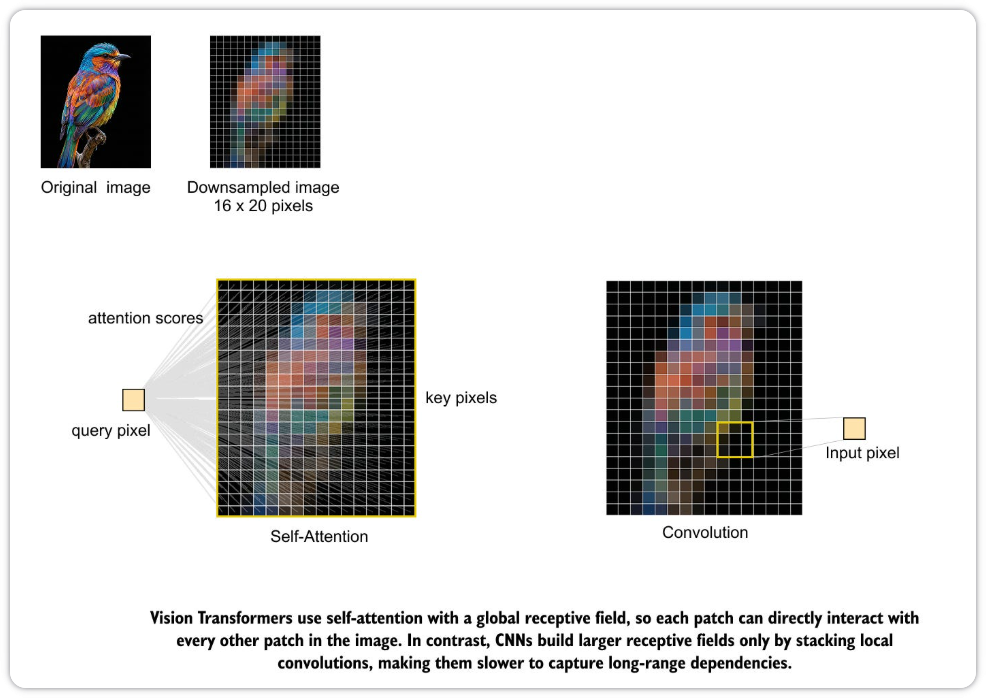

Vision Transformer 与卷积网络之间的关键架构差异在于它们 "看" 图像的方式. 卷积层在计算输出时仅关注像素的一个小邻域. 其感受野只有通过堆叠更多层和池化操作才能逐渐增大. 这种局部性偏置（locality bias）在经典视觉任务中非常成功，但这也意味着图像中的长距离关系只能间接地、在网络较深层次才能被捕捉. 上图展示了全局自注意力与局部卷积在一张简单鸟类图像上的对比. 

Vision Transformer 中的自注意力从第一层开始就具有全局感受野. 对于任意查询位置，模型可以直接将其与图像中的每一个其他 patch 进行比较，并决定哪些是相关的. 在鸟的示例中，单个像素或 patch 可以立即连接到图像中的任何其他区域，而卷积只能看到其附近的邻域，必须依靠大量堆叠的层才能将信息从图像的一侧传递到另一侧.

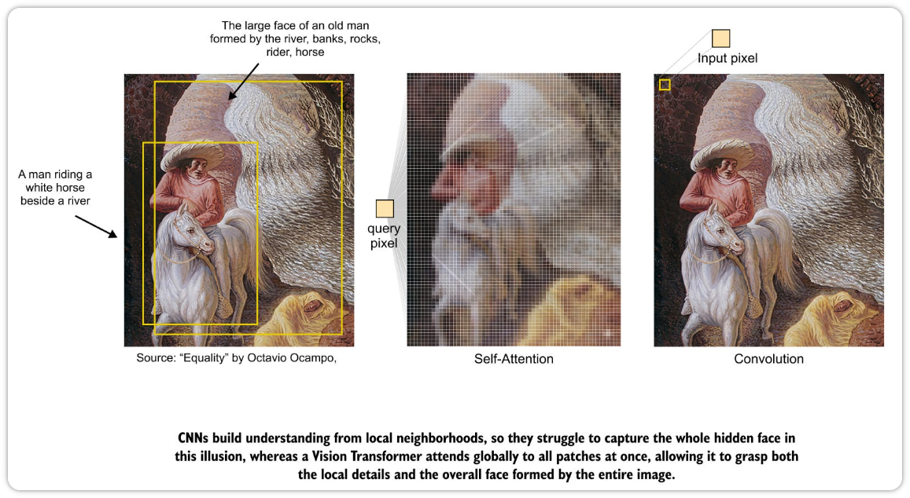

上图展示了一副视错觉画，使这种差异更加具体. 人类观察者既能感知骑手在河边的细致场景，也能感知整幅画构成的更大面孔. 卷积模型倾向于关注岩石、水流和毛发的局部纹理，而 Vision Transformer 能够将构成面孔的区域连接起来. 

"盲人摸象"的经典故事为这种差异提供了另一种直观的画面. 每个人触摸到象的一部分，就根据摸到的是尾巴、身体还是鼻子，得出结论说大象是绳子、墙壁或蛇. 卷积网络的行为与此类似，因为每个单元只能访问一个小 patch，其理解建立在许多独立的局部视图之上. 而 Vision Transformer 则更像一个可以自由共享信息的群体. 即使每个观察者从有限的视角出发，自注意力也能让他们综合各自的观察，并最终就大象的完整形状达成一致.

### 从 Text Transformer 到 Vision Transformer

文本 Transformer 和图像 Transformer 具有相同的核心思想. 在 GPT 等语言模型中，我们从一串 token 开始，对它们进行嵌入，并应用掩码自注意力（masked self-attention），使得每个 token 只能关注当前及之前位置的 token. 这与 "下一 token 预测" 的目标相匹配——序列的最终上下文向量被用来预测下一个 token. 而在 Vision Transformer 中，图像首先被 token 化为一串 patch，然后应用无掩码的自注意力（unmasked self-attention），使得每个 patch 可以关注所有其他 patch，最后通过一个特殊的类别 token（class token）提供单一的表示，传递给一个小型 MLP 头进行分类.

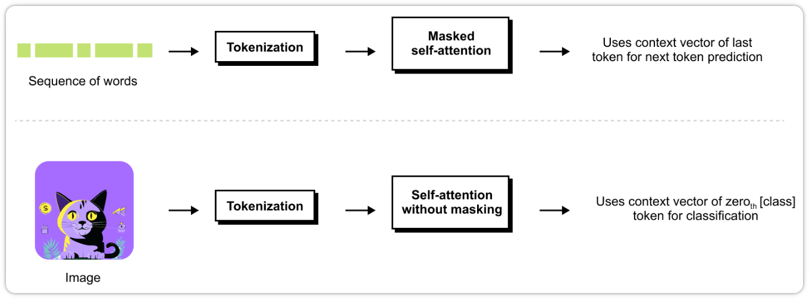

BERT 为 Vision Transformer 提供了第二个参考点. BERT 不是预测下一个词，而是训练来恢复句子中被掩码的 token，因此它对整个序列使用无掩码的自注意力来捕捉双向上下文. Vision Transformer 采用了 BERT 的这种编码器风格设计，但将其应用于图像 patch 与类别 token 的结合，在图像领域提供了 BERT 风格序列理解的类似物.

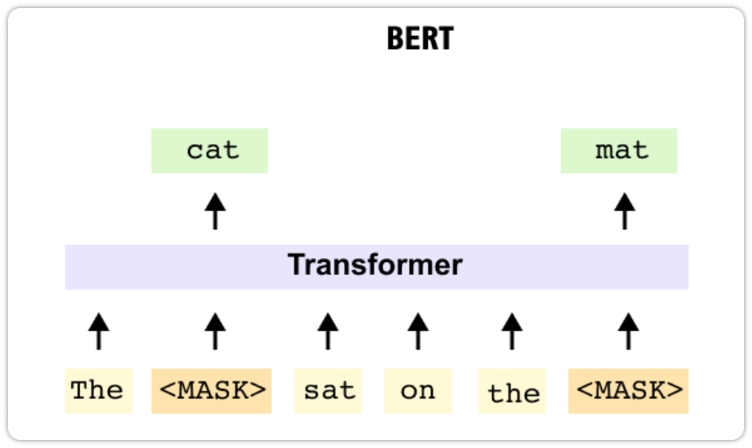

## 将 Transformer 适配到图像：Patch 嵌入与展平

将 Transformer 适配到图像始于一个简单的问题：如何将一张 2D 图像转换为 Text Transformer 所期望的那种 1D token 序列？Vision Transformer 的回答是：将图像切割成固定大小的 patch 网格，并将每个 patch 视为一个 token. 这里以一张 640×640 的猫图像为例，逐步完成 patch 嵌入步骤，然后展示两种常见的实现方式：展平加线性投影，以及一个等价的卷积层.

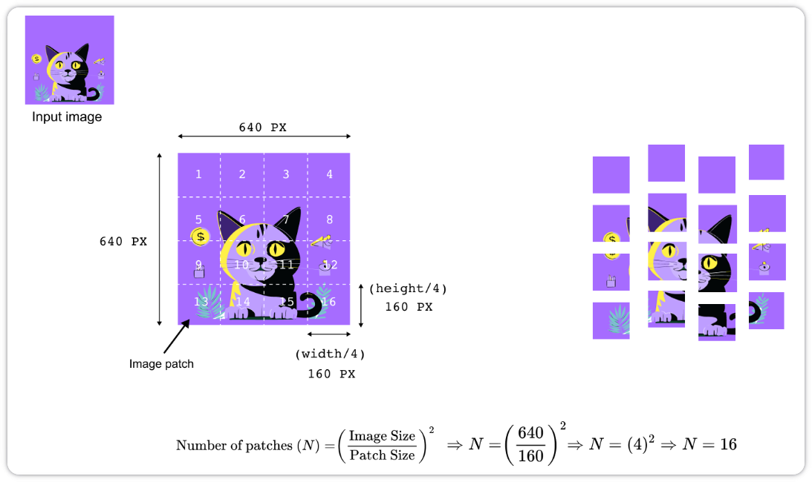

假设图像的高度和宽度为 640 像素，有三个颜色通道（RGB）. 我们选择 160 像素大小的方形 patch. 图像被划分为 4×4 的不重叠 patch 网格，每个 patch 的尺寸为 160×160×3. 一般来说，对于高度为 $H$、宽度为 $W$、patch 大小为 $P$ 的图像，patch 数量 $N$ 为：
$$
N = \frac{H}{P} \times \frac{W}{P} = \frac{H W}{P^2}
$$
假设 $H$ 和 $W$ 是 $P$ 的倍数. 对于边长为 $S$ 的方形图像，简化为：
$$
N = \left(\frac{S}{P}\right)^2
$$
将图像分割成 patch 后，每个 patch 必须转换为一个属于公共嵌入空间（维度为 $D$）的向量，就像文本模型中对词 token 进行嵌入一样. 原始 Vision Transformer 论文中使用的一种直接方法是展平每个 patch 并应用线性投影. 单个 patch 的形状为 $P \times P \times C$，其中 $C$ 是通道数. 展平后得到一个长度为 $P^2 C$ 的向量.

在 Transformer 中，方便的做法是将这些 patch 按固定顺序排列，并将其视为一维序列而非二维网格. 例如，可以从左上角的 patch 开始，逐行从左到右移动，直到到达右下角的 patch.

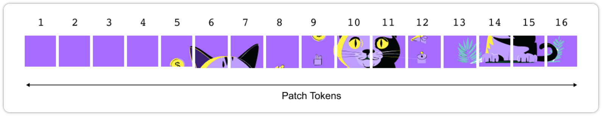

### 不使用卷积的 Patch 嵌入

我们将每个 $160 \times 160 \times 3$ 的 patch 视为一个微小的图像，将其所有像素展平成一个长向量，然后将该向量通过一个可学习的线性层，得到一个 $D$ 维的 patch 嵌入. 这与语言模型中的词嵌入相对应：每个 patch 就是另一个 token，其嵌入直接从数据中学习.

回到上一节中 $640 \times 640$ 的猫图像. 我们将其划分为 $4 \times 4$ 的不重叠 patch 网格，每个大小为 $160 \times 160$ 像素. 这 $16$ 个 patch 中的每一个都将成为 Transformer 的一个 token.

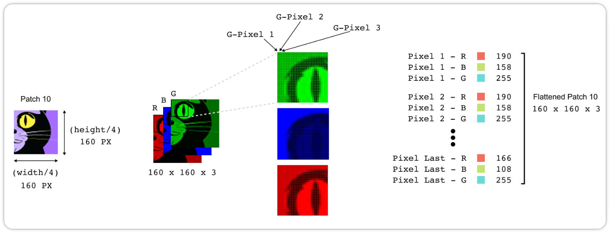

考虑 patch 10，即猫眼周围的方块. 作为一个 RGB patch，它是一个小的 3D 张量，形状为：
$$
P \times P \times C = 160 \times 160 \times 3
$$
其中 $C=3$ 是颜色通道数. 上图展示了该 patch 被分解为红、绿、蓝三个平面，然后显示了一些单独的像素作为 $(R,G,B)$ 三元组. 非卷积的 patch 嵌入的第一步是将这个张量展平为一个单一向量，方法是按固定顺序连接所有通道的所有像素值. 如果我们用 $flat\_patch_i$ 表示第 $i$ 个 patch 的展平版本，那么它的长度为：
$$
flat\_patch_i \in \mathbb{R}^{P^2 C}
$$
对于一个 $160 \times 160$ 的 RGB patch，这意味着
$$
P^2 C = 160 \times 160 \times 3 = 76{,}800
$$
每个 patch 有 76,800 个数值. 展平并不学习任何东西，它只是一个将 $160 \times 160 \times 3$ 的像素块重新塑形为长度为 76,800 的向量的操作.

然而，Transformer 并不想要长度为 76,800 的原始像素向量. 它期望一个更短的嵌入向量，维度为某个 $D$，比如在示意图中 $D=32$，或在 ViT-Base 模型中 $D=768$. 获得这一向量的最简单方法是对每个展平的 patch 应用一个共享的线性层. 这里引入权重矩阵 $W_{\text{patch}}$ 和偏置向量 $b_{\text{patch}}$，将第 $i$ 个 patch 的嵌入定义为：
$$
\mathbf{x}_i = W_{\text{patch}} \,\, flat\_patch_i + \mathbf{b}_{\text{patch}}
$$
其中：
$$
W_{\text{patch}} \in \mathbb{R}^{D \times P^2 C}, \quad \mathbf{b}_{\text{patch}} \in \mathbb{R}^{D}
$$
维度的对齐很自然：$W_{\text{patch}}$ 接受一个长度为 $P^2 C$ 的向量并将其映射为长度为 $D$ 的向量，而 $b_{\text{patch}}$ 对结果进行偏移. 在猫的例子中，如果选择 $D=32$，那么 $W_{\text{patch}}$ 的形状为 $32 \times 76{,}800$，$b_{\text{patch}}$ 的长度为 32. 输出：
$$
\mathbf{x}_i \in \mathbb{R}^D
$$
是一个 $D$ 维的 patch 嵌入. 相同的参数 $W_{\text{patch}}$ 和 $b_{\text{patch}}$ 对每张图像中的每个 patch 重复使用，因此它们是高度共享的，并与模型的其余部分进行端到端训练. 可以将 $W_{\text{patch}}$ 的每一行看作一个学习到的模板，它查看整个 patch 并响应对应一个单一数值；将 $D$ 个这样的响应堆叠起来就得到了嵌入向量.

至此，已经将一个 patch 转换为一个 token. 对全部 $N$ 个 patch 重复相同的"展平-投影"操作，得到一组 patch 嵌入：
$$
\mathbf{x}_1, \mathbf{x}_2, \ldots, \mathbf{x}_N \in \mathbb{R}^D
$$
按固定的、确定性的顺序排列它们（例如，按行遍历图像），并将它们堆叠成一个矩阵：
$$
\mathbf{X}_{\text{patch}} = \begin{bmatrix} \mathbf{x}_1 \\ \mathbf{x}_2 \\ \vdots \\ \mathbf{x}_N \end{bmatrix} \in \mathbb{R}^{N \times D}
$$
这个矩阵直接对应于 Text Transformer 中的 token 嵌入矩阵. 唯一的不同在于，每一行现在编码的是图像中一个 $160 \times 160$ 的彩色区域，而不是一个词.

将整个流程描述如下：在嵌入之前，模型看到的是 $N$ 个原始 patch，每个形状为 $3 \times P \times P$. 展平后，我们在概念上有 $N$ 个长度为 $3P^2$ 的向量. 经过线性投影后，有 $N$ 个长度为 $D$ 的 patch 嵌入. 在后续章节中将添加特殊的类别 token 和位置嵌入，这就变成了一个 $(N+1) \times D$ 的矩阵，最终被送入 Transformer 编码器.

### 使用卷积的 Patch 嵌入

通过将卷积核大小和步长设置为与 patch 大小匹配，卷积将 $640 \times 640$ 的图像转换为 $4 \times 4$ 的特征图网格，其通道维度恰好是嵌入维度（例如32个通道）. 然后，特征图中的每个空间位置被解释为一个 patch token. 

其思想是：使用卷积核大小为 $P$、步长为 $P$ 的卷积可以恰好访问每个 patch 一次，对其进行压缩，并将输出写入一个大小为 $(H/P, W/P)$ 的网格.

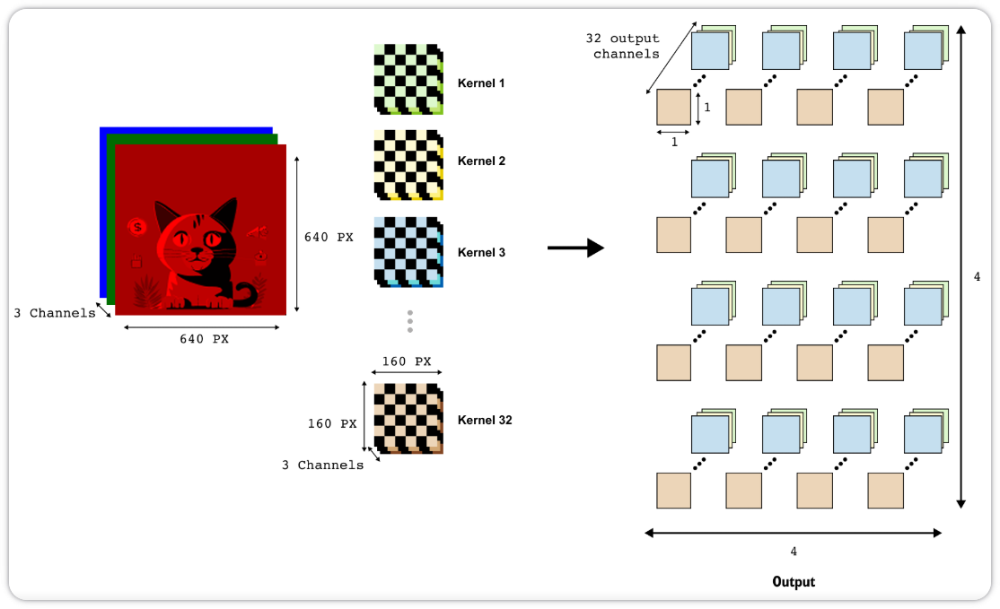

在示例中，使用空间大小为 $160 \times 160$、步长为 160 的卷积核. 输入是一个形状为 $(3, 640, 640)$ 的张量. 应用一个卷积层，其输入通道数 $C=3$. 输出通道数被选为我们想要的嵌入维度，例如 $D=32$. 卷积核大小和步长都设为 160，这意味着卷积核以不重叠的 $160 \times 160$ 步长在 $640 \times 640$ 图像上滑动，并且使用零填充以使图像被整齐地分割成 patch，而不会添加额外的边界像素.

该卷积层包含 $D$ 个独立的卷积核. 每个卷积核是一个形状为 $(C, P, P) = (3, 160, 160)$ 的可学习权重张量. 当该层处理图像时，每个卷积核以 160 像素为步长在图像上滑动，每个 patch 产生一个响应. 由于步长等于卷积核大小，相邻感受野之间没有重叠. 卷积后，输出张量的形状为：
$$
(D, \tfrac{H}{P}, \tfrac{W}{P}) = (32, 4, 4)
$$
这个 $4 \times 4$ 网格中的每个空间位置 $(u,v)$ 对应原始图像中的一个 patch. 该位置处的 32 个数值来自 32 个卷积核，它们共同扮演了上一小节中线性矩阵 $W_{\text{patch}}$ 的行的角色. 如果将 $4 \times 4$ 的空间位置网格展平成长度为 16 的序列，并读取每个位置处的 32 维向量，就得到了与之前相同的一组 patch 嵌入.

综合来看，这两种构造表明 Vision Transformer 并不依赖任何特定的 patch 提取技巧：关键是要得到 $N$ 个维度为 $D$ 的 patch 嵌入序列. 这些嵌入来自 "展平加线性层" 还是 "精心配置的卷积" 在很大程度上是实现选择问题；一旦得到了 $N \times D$ 的 patch token 矩阵，Vision Transformer 的其余部分将以完全相同的方式运行.

### 添加 Class Token 并形成序列

到目前为止，我们得到了 $N$ 个 patch 嵌入 $\mathbf{x}_1,\ldots,\mathbf{x}_N$，每个维度为 $D$. 对于分类任务，Vision Transformer 引入了一个额外的 token，称为类别 token（class token）. 这个 token 不来自任何特定的 patch；它是一个学习到的向量，被添加到序列的开头，旨在通过自注意力从所有其他 token 收集信息. 用 $\mathbf{x}_0 \in \mathbb{R}^D$ 表示类别 token 的嵌入.

该向量是一个可训练参数，在创建模型时随机初始化，并与所有其他权重一起优化. 有了 $\mathbf{x}_0$ 和 patch 嵌入 $\mathbf{x}_1,\ldots,\mathbf{x}_N$，我们可以形成完整的序列矩阵：
$$
X = \begin{bmatrix} \mathbf{x}_0 \\ \mathbf{x}_1 \\ \vdots \\ \mathbf{x}_N \end{bmatrix} \in \mathbb{R}^{(N+1) \times D}
$$
因此，进入 Transformer 编码器的 token 数量为：
$$
\text{NumTokens} = N + 1 = 1 + \frac{HW}{P^2}
$$
在 $640 \times 640$、patch 大小为 160 的例子中，$N=16$ 加上一个类别 token，总共 17 个 token，每个维度 $D=32$.
$$
X \in \mathbb{R}^{17 \times 32}
$$
在添加位置信息后，该矩阵将成为 Vision Transformer 的输入.

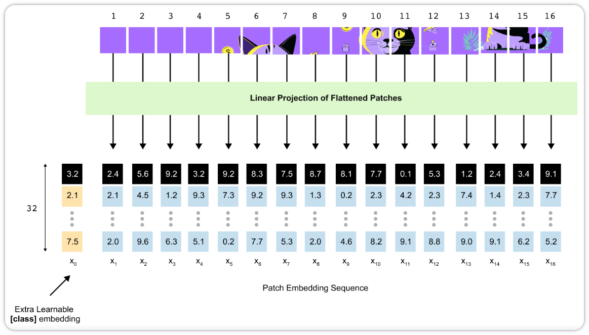

## Vision Transformer 中的位置编码

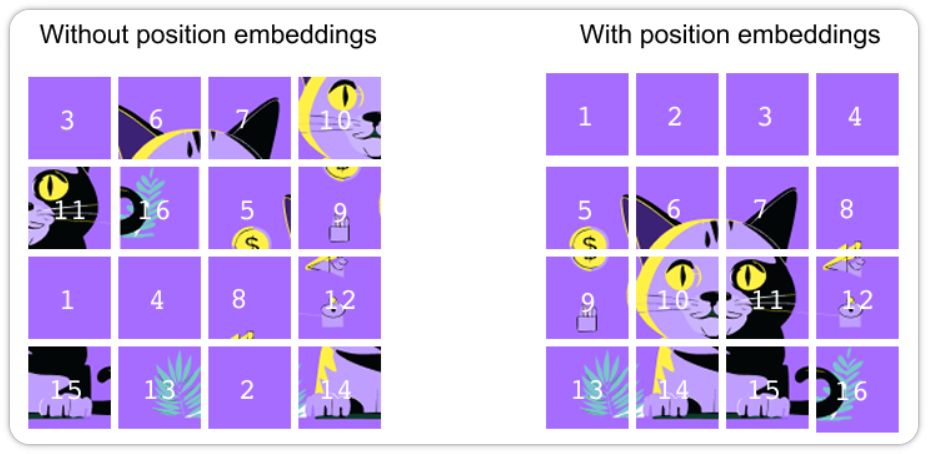

Vision Transformer 中的自注意力没有内置的顺序概念. 在上图中，我们可以打乱猫的 patch，让来自耳朵区域的图块与来自纯色背景的图块互换位置，编码器会直接处理这个混乱的序列，仿佛什么都没有发生. 对于图像来说，这是有问题的：显示猫眼的 patch 与仅显示空白紫色背景的 patch 含义截然不同. 为了让模型了解每个 token 在原始猫图像网格中的位置，要在每个 token 进入 Transformer 编码器之前为其添加一个位置嵌入.

在 patch 嵌入和添加类别 token 之后，得到 $N+1$ 个 token 的序列，每个维度为 $D$. 用矩阵 $X$ 表示，其中 $x_0$ 是类别 token，$x_1,\ldots,x_N$ 是 patch 嵌入. Vision Transformer 引入了一个可学习的位置嵌入矩阵：
$$
P = \begin{bmatrix} p_0 \\ p_1 \\ \vdots \\ p_N \end{bmatrix} \in \mathbb{R}^{(N+1) \times D}
$$
其中每一行 $p_i$ 是一个可训练向量，代表 token $i$ 的位置. 在训练期间，这些向量和模型中的任何其他参数一样被更新. 对于大小为 $B$ 的小批量（mini-batch），我们将相同的位置矩阵广播到整个批次，并通过简单的逐元素加法形成编码器的最终输入：
$$
E = X + P, \qquad E_i = x_i + p_i \in \mathbb{R}^D, \quad i = 0, \ldots, N
$$
因此，送入 Transformer 编码器的张量形状为 $B \times (N+1) \times D$. 序列长度和嵌入大小不变，但每个 token 现在同时携带两类信息：其 patch 的视觉内容以及该 patch 在原始网格中的位置.

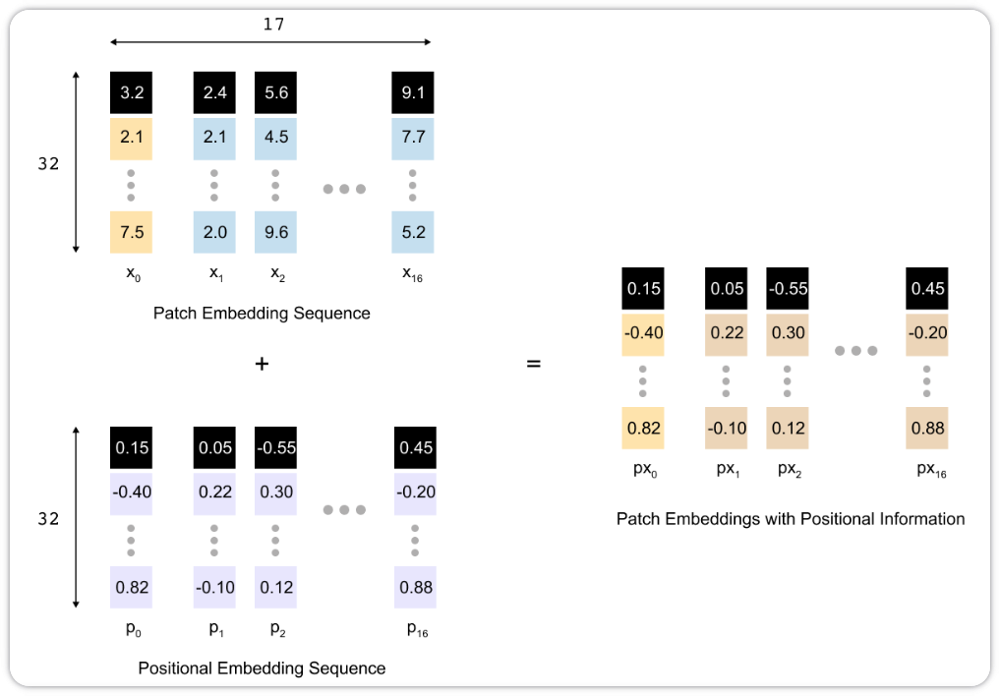

## 用于分类的仅编码器（Encoder-only）结构

在 Vision Transformer 中，只保留了原始 Transformer 架构中的编码器一侧. 图像被转换为一串 token，这些 token 通过 $L$ 个相同编码器块的堆叠. 每个块包含多头自注意力（multi-head self-attention）、前馈 MLP、残差连接（residual connection）和层归一化（layer normalization），但没有解码器来预测未来的 token. 相反，在序列前面添加一个可学习的类别 token，并将编码器视为特征提取器. 经过最后一个编码器块后，只读取该类别 token 的最终隐藏状态，并将其送入一个小的 MLP 头，为图像生成类别 logits. 从这个意义上说，ViT 是一个仅编码器的分类模型.

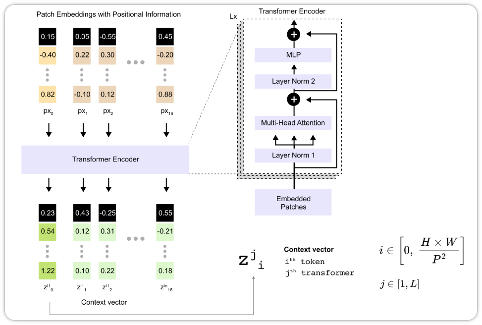

### 从 Patch 嵌入到上下文向量的完整路径

我们已经有了一个结合了 patch 信息和位置信息的嵌入 token 矩阵. 然后添加了一个额外的 token 用于分类，因此总序列长度为 $N+1$. 每个 token 的嵌入维度为 $D$. 如果将所有 token 向量按行堆叠，会得到一个矩阵：
$$
E \in \mathbb{R}^{(N+1) \times D}
$$
有了类别 token，就有 $N+1=17$ 个 token. 如果选择嵌入维度 $D=32$，矩阵 $E$ 的形状为 $17 \times 32$. 这个矩阵是 Transformer Encoder Stack 的输入，从编码器的角度来看，它看起来与语言模型的 token 嵌入完全一样：一个批次的序列，每个长度为 17，每个 token 由一个 32 维的向量表示.

编码器不会改变序列长度. 经过每个编码器块后，仍然得到一个形状为 $(N+1) \times D$ 的矩阵，但每一行向量已经通过自注意力和 MLP 更新，融入了来自所有其他 token 的信息. 这些更新后的向量就是上下文向量（context vectors），因为它们同时编码了一个 token 的内容以及序列中其他 token 提供的上下文.

### Transformer 编码器与注意力机制

要理解一个编码器块内部发生了什么，主要来看自注意力子层（self-attention sublayer）. 在一个块的输入处，有一个矩阵：
$$
\mathbf{Z}^{(j)} \in \mathbb{R}^{(N+1) \times D}
$$
其中 $j$ 表示块在 stack 中的深度. 该矩阵的行是 token 的当前表示. 自注意力通过让每个 token 查看所有其他 token 并决定关注程度，将这个矩阵转换为一个相同形状的新矩阵.

第一步是将 token 表示投影到三个新的空间，分别称为查询（queries）、键（keys）和**值**（values）. 具体来说，将 $\mathbf{Z}^{(j)}$ 乘以三个可学习的权重矩阵：
$$
W_Q, W_K, W_V \in \mathbb{R}^{D \times d_h}
$$
其中 $d_h$ 是单个注意力头的头维度. 这些权重矩阵在序列中的所有位置共享，并在训练过程中学习. 应用它们得到三个新矩阵：
$$
Q = \mathbf{Z}^{(j)} W_Q, \qquad K = \mathbf{Z}^{(j)} W_K, \qquad V = \mathbf{Z}^{(j)} W_V
$$
每个的形状为 $(N+1) \times d_h$. 直观地说，token $i$ 的查询向量 $q_i$ 编码了该 token 在其上下文中寻找什么，键向量 $k_i$ 编码了该 token 向其他 token 提供什么，而值向量 $v_i$ 编码了当其他 token 关注它时将被混入的实际信息.

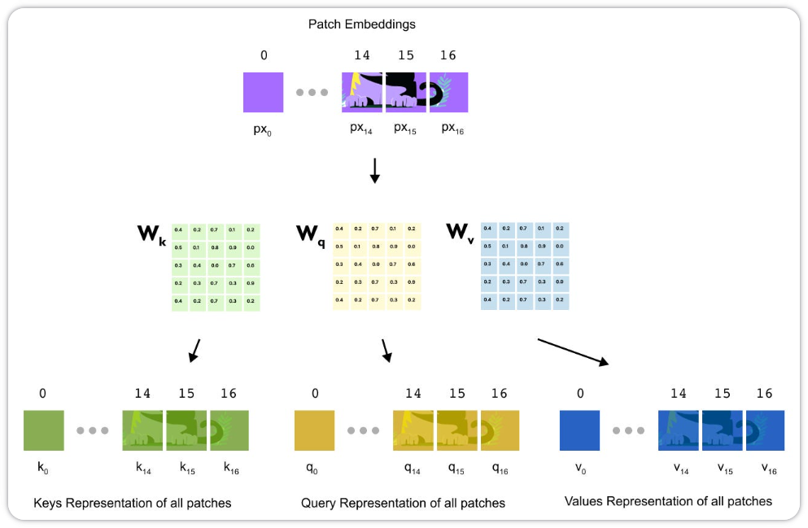

第二步是将查询和键转化为注意力权重. 对于给定的查询向量 $q_i$，使用缩放点积计算它与每个键 $k_j$ 的相似度，为每对位置产生一个标量分数：
$$
s_{ij} = \frac{q_i k_j^{\top}}{\sqrt{d_h}}
$$
沿索引 $j$ 的 softmax 函数将这些分数转换为概率分布：
$$
\alpha_{ij} = \mathrm{softmax}_j (s_{ij})
$$
使得：
$$
\alpha_{ij} \ge 0 \quad \text{且} \quad \sum_j \alpha_{ij} = 1
$$
系数 $\alpha_{ij}$ 可以理解为 "token $i$ 对 token $j$ 的关注程度".

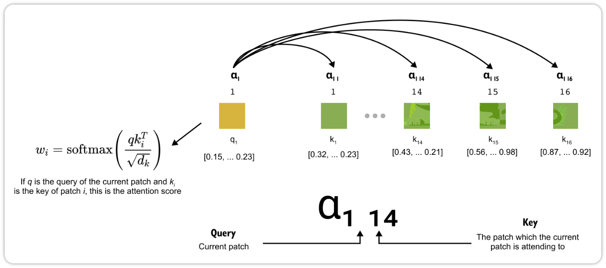

第三步是使用这些注意力权重来混合值向量. 对于 token $i$，对所有值取加权和：
$$
\tilde{z}_i = \sum_{j=0}^{N} \alpha_{ij} v_j
$$
向量 $\tilde{z}_i \in \mathbb{R}^{d_h}$ 是该注意力头为 token $i$ 产生的新表示. 它包含所有 token 的值向量的混合，其中来自缩放点积判断为更相关的位置的权重更大. 例如，如果一个头学会了关注猫的眼睛，那么在计算类别 token 的上下文向量时，来自眼睛周围 patch 的值向量将获得更大的系数.

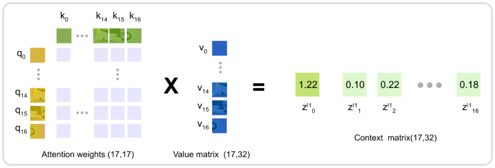

在实践中，Vision Transformer 使用多头注意力（multi-head attention）而非单头. 这意味着使用多组不同的投影矩阵 $W_Q, W_K, W_V$ 并行重复上述过程多次. 每个头有自己的头维度 $d_h$，因此在对每个头计算出 $\tilde{z}_i$ 后，将结果拼接起来，并使用另一个学习到的投影返回到原始嵌入维度 $D$. 由此得到注意力子层的输出矩阵，形状为 $(N+1) \times D$，然后通过 MLP 子层和残差连接，形成更新后的矩阵 $\mathbf{Z}^{(j+1)}$.

### 上下文向量与输出维度

为了跟踪表示在编码器 stack 中的演变，引入一个简单的记法. 令：
$$
\mathbf{Z}^{(0)} = E \in \mathbb{R}^{(N+1) \times D}
$$
为经过 patch 嵌入和位置嵌入后的初始 token 嵌入矩阵. 经过第 $j$ 个编码器块后，记：
$$
\mathbf{Z}^{(j)} = \begin{bmatrix} z^{(j)}_0 \\ z^{(j)}_1 \\ \vdots \\ z^{(j)}_N \end{bmatrix} \in \mathbb{R}^{(N+1) \times D}, \qquad j = 0, 1, \ldots, L
$$
其中 $z_i^{(j)} \in \mathbb{R}^D$ 是 token $i$ 在深度 $j$ 处的上下文向量. 索引 $i$ 从 0 到 $N$. 当 $i=0$ 时，该向量对应类别 token；当 $i \ge 1$ 时，对应一个图像 patch. 由于编码器堆栈从不改变序列长度，每个 $\mathbf{Z}^{(j)}$ 都具有完全相同的形状：$(N+1) \times D$. 对于 $640 \times 640$ 的猫图像，$P=160$、$D=32$，这意味着每个编码器块接受一个 $17 \times 32$ 的矩阵作为输入，并产生另一个 $17 \times 32$ 的矩阵作为输出.

经过最后一个编码器块后，得到 $\mathbf{Z}^{(L)}$. 这个矩阵中最重要的向量是 $z_0^{(L)}$，即类别 token 的最终上下文向量. 在训练过程中，该向量通过重复的自注意力和 MLP 层学会了从所有 patch token 中聚合信息. 将 $z_0^{(L)}$ 送入一个小型 MLP 头，它将 $D$ 维向量映射为一个类别 logits 向量（例如，对于 ImageNet-1k 为 1000 维）. 对这些 logits 取 softmax 即可得到各类别上的概率分布.

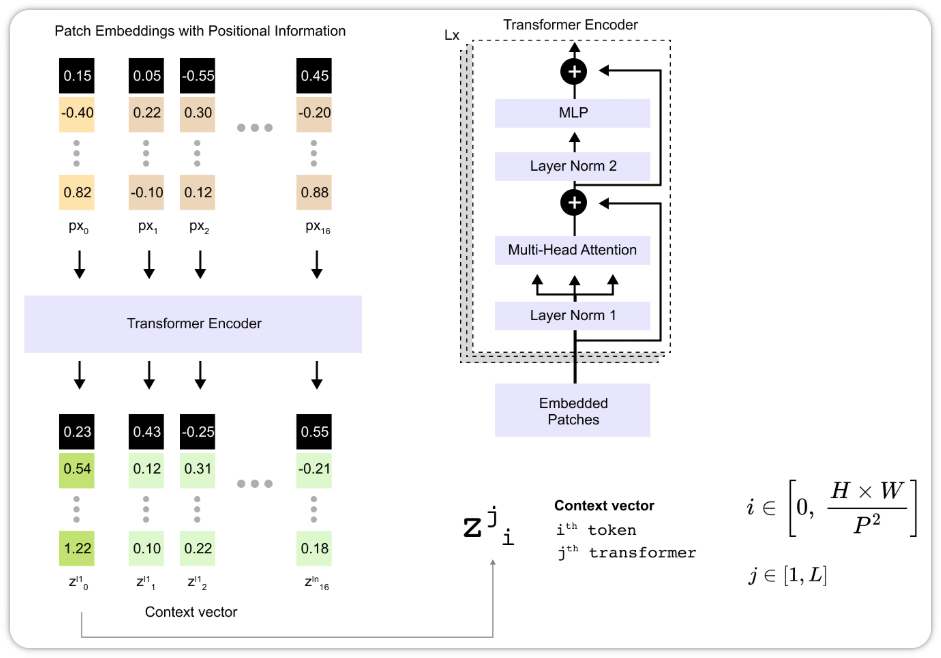

### MLP 头与分类

到序列通过 Transformer 编码器时，所有繁重的工作已经完成. 从猫图像开始，我们创建了 $N=16$ 个 patch token，在开头添加了一个可学习的类别 token，并将所有内容映射到一个 $D$ 维的嵌入空间. 经过 $L$ 个编码器块后，得到最终的序列矩阵：
$$
\mathbf{Z}^{(L)} \in \mathbb{R}^{(N+1) \times D}
$$
每行 $z_i^{(L)}$ 是 token $i$ 的上下文向量，其中 $i=0$ 对应类别 token，$i=1,\ldots,N$ 对应图像 patch. 在我们的示例中，$N+1=17$，$D=32$，所以 $\mathbf{Z}^{(L)}$ 的形状为 $17 \times 32$. 

对于图像分类，不会将全部十七个上下文向量送入一个单独的网络. 相反，遵循原始的 ViT 设计，仅使用类别 token 的最终上下文向量 $z_0^{(L)} \in \mathbb{R}^D$.

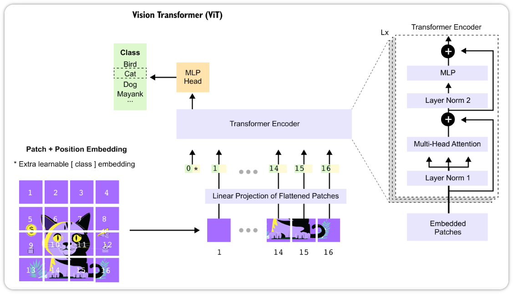

该向量在每一编码器层都关注了所有 patch token. 使用单一的汇总向量保持了架构的简单性，并使最终分类器的参数数量保持在较小水平. 原则上，可以池化或拼接所有 patch 的上下文向量，但这会增加分类器输入的维度，并且在 ViT 实验中并未带来明显的收益. 

MLP 头是一个普通的前馈分类器，它以 $z_0^{(L)}$ 为输入，并为每个类别输出一个 logit. 在最简单的情况下，它由一个带有权重矩阵 $W \in \mathbb{R}^{C \times D}$ 和偏置向量 $b \in \mathbb{R}^C$ 的单一线性层组成，其中 $C$ 是标签数量（例如猫、狗、鸟等）. 那么 logits 向量为：
$$
y = W z_0^{(L)} + b \in \mathbb{R}^C
$$
许多实际 ViT 实现在这里使用一个小型的两层 MLP 而非单一的线性层. 在这种情况下，首先将 $z_0^{(L)}$ 投影到一个隐藏维度 $D_{\text{mlp}}$，应用 GELU 等非线性激活函数，可选地应用 dropout 进行正则化，然后投影到 $C$ 维. 总体效果是给分类器多一点能力来重塑来自 Transformer 编码器的表示，再将其转换为类别分数. 

输出 $y$ 是一个未归一化的分数（即 logits）向量，每类一个. 在推理时，通常取最大 logit 的索引作为预测标签. 在训练时，将 $y$ 通过 softmax 获得各类别的概率分布，并计算与真实标签之间的交叉熵损失. 该损失的梯度通过 MLP 头反向传播到 Transformer 编码器，再进一步传播到 patch 和位置嵌入，从而使整个 Vision Transformer 能够进行端到端训练.

## 从零手写一个 ViT 进行图像分类

这里采用 CIFAR-10 数据集（下载后解压到 ./data/ 目录下）来预训练一个 ViT，CIFAR-10 数据集包含 60000 张 32 x 32 像素的彩色图像，分为 10 个类别，每个类别 6000 张图像. 其中，50000 张为训练图像，10000 张为测试图像.

下面一步一步来进行.

### 加载和处理数据集

```python
import torch 
import torch.nn as nn
from torchvision import datasets, transforms
from torchvision.transforms import RandomErasing
from torch.utils.data import DataLoader

# Mean and standard deviation for CIFAR-10 dataset normalization
cifar10_mean = [0.4914, 0.4822, 0.4465]
cifar10_std  = [0.2023, 0.1994, 0.2010]

# Defining Transformations with data augmentation for Training images
transform_train = transforms.Compose([
    transforms.RandomCrop(32, padding=4),             # Randomly crop image to 32x32 with padding
    transforms.RandomHorizontalFlip(),                # Randomly flip image horizontally
    transforms.ToTensor(),                            # Convert PIL images to Tensor
    transforms.Normalize(cifar10_mean, cifar10_std),  # Normalize with CIFAR-10 mean and std
    RandomErasing(p=0.5, scale=(0.02, 0.33), ratio=(0.3, 3.3), value=0), #Randomly erase rectangle regions of the image
])

# Defining Transformations without data augmentation for Testing images
transform_test = transforms.Compose([
    transforms.ToTensor(),
    transforms.Normalize(cifar10_mean, cifar10_std),
])

# Loading CIFAR-10 dataset
train_dataset = datasets.CIFAR10(root='./data', train=True, download=True, transform=transform_train)
test_dataset = datasets.CIFAR10(root='./data', train=False, download=True, transform=transform_test)

# Creating efficient DataLoaders used for batching
train_loader = DataLoader(train_dataset, batch_size=128, shuffle=True, num_workers=2)
test_loader = DataLoader(test_dataset, batch_size=128, shuffle=False, num_workers=2)
```

### 定义 PatchEmbedding 类

```python
class PatchEmbedding(nn.Module):
    
    """
    Splits the image into patches and embeds them.

    Args:
        img_size (int): Size of the image.
        patch_size (int): Size of the patches.
        in_channels (int): Number of input channels (3 for RGB).
        emb_dim (int): Embedding dimension.

    Shape:
        - Input: (batch_size, in_channels, img_size, img_size)
        - Output: (batch_size, num_patches, emb_dim)
    """

    def __init__(self, img_size, patch_size, in_channels=3, emb_dim=256):
        super().__init__()

        self.patch_size = patch_size
        self.num_patches = (img_size // patch_size) ** 2 

        # Linear projection layer
        self.linear_proj = nn.Linear(patch_size * patch_size * in_channels, emb_dim)

    
    def forward(self, x):

        """
        Forward pass for Patch embedding.

        Args:
            x: Input tensor of shape (batch_size, in_channels, img_size, img_size)

        Returns:
            Tensor of shape (batch_size, num_patches, emb_dim)
        """

        batch_size, channels, height, width = x.shape
        
        # Checks
        assert height == width, "Input images must be square."
        assert height % self.patch_size == 0, "Image dimensions must be divisible by the patch size."

        # Converting image into patches
        x = x.unfold(2, self.patch_size, self.patch_size)  
        x = x.unfold(3, self.patch_size, self.patch_size) 

        # x's shape: (batch_size, channels, num_patches_h, num_patches_w, patch_size, patch_size)

        num_patches_h = x.size(2)
        num_patches_w = x.size(3)

        # Flattening the patches
        x = x.permute(0, 2, 3, 1, 4, 5)  # x's shape: (batch_size, num_patches_h, num_patches_w, channels, patch_size, patch_size)
        x = x.reshape(batch_size, num_patches_h * num_patches_w, -1)  # x's shape: (batch_size, num_patches, patch_size * patch_size * channels)

        # Applying Linear projection to each patch
        x = self.linear_proj(x)  # x's shape: (batch_size, num_patches, emb_dim)
        
        return x
```

### 定义 MultiHeadSelfAttention 类

```python
class MultiHeadSelfAttention(nn.Module):
    """
    Multi-Head Self-Attention layer.

    Args:
        emb_dim (int): Embedding dimension.
        num_heads (int): Number of attention heads.

    Shape:
        - Input: (batch_size, num_patches + 1 (or seq_len), emb_dim)
        - Output: (batch_size, num_patches + 1 (or seq_len), emb_dim)
    """
    
    def __init__(self, emb_dim, num_heads):
        super().__init__()
        
        assert emb_dim % num_heads == 0,  "Embedding dimension must be divisible by num_heads."
        
        self.num_heads = num_heads
        self.head_dim = emb_dim // num_heads
        
        # Scaling factor for attention scores
        self.scale = self.head_dim ** -0.5  
    
        # Linear layer to compute queries, keys, and values in one operation
        self.qkv = nn.Linear(emb_dim, emb_dim * 3)

        # Final linear layer to project concatenated outputs
        self.proj = nn.Linear(emb_dim, emb_dim)

    def forward(self, x):
        """
        Forward pass for multi-head self-attention.

        Args:
            x: Input tensor of shape (batch_size, seq_len, emb_dim)
        
        Returns:
            Output tensor of shape (batch_size, seq_len, emb_dim)
        """

        batch_size, seq_len, emb_dim = x.shape 

        # Computing Queries, Keys, and Values
        qkv = self.qkv(x)

        # Splitting qkv into separate q, k, v tensors
        qkv = qkv.reshape(batch_size, seq_len, 3, self.num_heads, self.head_dim)
        qkv = qkv.permute(2, 0, 3, 1, 4)
        q, k, v = qkv[0], qkv[1], qkv[2]

        # Computing Attention scores
        attn_scores = torch.matmul(q, k.transpose(-2, -1))  
        attn_scores = attn_scores * self.scale
        
        # Calculating Attention weights by applying Softmax
        attn_weights = attn_scores.softmax(dim=-1)

        # Scaling 'Value' by Attention weights
        attn_output = torch.matmul(attn_weights, v)

        # Concatenating attention outputs from all heads
        attn_output = attn_output.transpose(1, 2)  
        attn_output = attn_output.reshape(batch_size, seq_len, emb_dim)  

        # Applying final linear projection
        output = self.proj(attn_output)  

        return output
```

### 定义 TransformerEncoderLayer 类

```python
class TransformerEncoderLayer(nn.Module):
    """
    Transformer Encoder Layer with Multi-Head Self-Attention and MLP.

    Args:
        emb_dim (int): Embedding dimension.
        num_heads (int): Number of attention heads.
        mlp_dim (int): Dimension of the MLP hidden layer.
        dropout_rate (float): Dropout rate.

    Shape:
        - Input: (batch_size, num_patches + 1, emb_dim)
        - Output: (batch_size, num_patches + 1, emb_dim)
    """
    
    def __init__(self, emb_dim, num_heads, mlp_dim, dropout_rate=0.2):
        super().__init__()
        
        # Multi-Head Self-Attention
        self.msa = MultiHeadSelfAttention(emb_dim, num_heads)

        # MLP block 
        self.mlp = nn.Sequential(
            nn.Linear(emb_dim, mlp_dim),
            nn.GELU(),
            nn.Dropout(dropout_rate),
            nn.Linear(mlp_dim, emb_dim),
            nn.Dropout(dropout_rate),
        )

        # Layer Normalization
        self.norm1 = nn.LayerNorm(emb_dim)
        self.norm2 = nn.LayerNorm(emb_dim)

    def forward(self, x):
        """
        Forward pass for the Transformer Encoder Layer.

        Args:
            x: Input tensor of shape (batch_size, num_patches + 1, emb_dim)
        
        Returns:
            Tensor of shape (batch_size, num_patches + 1, emb_dim)
        """

        # Applying Layer Normalization and Multi-Head Self-Attention with Residual connection
        x = x + self.msa(self.norm1(x))
        
        # Applying Layer Normalization and MLP block with Residual connection
        x = x + self.mlp(self.norm2(x))
        
        return x
```

### 定义 VisionTransformer 类

```python
class VisionTransformer(nn.Module):
    """
    Vision Transformer (ViT) Model.

    Args:
        img_size (int): Size of the input image.
        patch_size (int): Size of each patch.
        in_channels (int): Number of input channels.
        emb_dim (int): Embedding dimension.
        num_layers (int): Number of Transformer encoder layers.
        num_heads (int): Number of attention heads.
        mlp_dim (int): Dimension of the MLP hidden layer.
        num_classes (int): Number of output classes.
        dropout_rate (float): Dropout rate.

    Shape:
        - Input: (batch_size, in_channels, img_size, img_size)
        - Output: (batch_size, num_classes)
    """
    def __init__(
        self, img_size, patch_size, in_channels, emb_dim, num_layers, 
        num_heads, mlp_dim, num_classes, dropout_rate):
        super().__init__()
      
        # Patch Embedding
        self.patch_embed = PatchEmbedding(img_size, patch_size, in_channels, emb_dim)

        # Learnable class token (x_class)
        self.class_token = nn.Parameter(torch.zeros(1, 1, emb_dim)) 

        # Learnable Positional Embedding
        num_patches = self.patch_embed.num_patches
        self.pos_embed = nn.Parameter(torch.zeros(1, num_patches + 1, emb_dim))
      
        # Dropout layer
        self.dropout = nn.Dropout(dropout_rate)

        # Transformer Encoder Layers
        self.encoder_layers = nn.ModuleList([
            TransformerEncoderLayer(emb_dim, num_heads, mlp_dim, dropout_rate)
            for _ in range(num_layers)
        ])

        # Final Layer Normalization
        self.norm = nn.LayerNorm(emb_dim)

        # Classification Head (MLP with one hidden layer)
        self.hidden_dim = emb_dim 
 
        self.classifier = nn.Sequential(
            nn.Linear(emb_dim, self.hidden_dim),
            nn.GELU(),
            nn.Dropout(dropout_rate),
            nn.Linear(self.hidden_dim, num_classes)
        )

    def forward(self, x):
        """
        Forward pass for the Vision Transformer.

        Args:
            x: Input tensor of shape (batch_size, in_channels, img_size, img_size)

        Returns:
            Tensor of shape (batch_size, num_classes)
        """
        
        batch_size = x.shape[0]

        # Applying Patch Embedding 
        x = self.patch_embed(x)

        # Adding class token
        class_token = self.class_token.expand(batch_size, -1, -1)
        x = torch.cat((class_token, x), dim=1)

        # Adding Positional embeddings
        x = x + self.pos_embed 

        # Applying Dropout
        x = self.dropout(x)
        
        # Pass through Transformer Encoder
        for layer in self.encoder_layers:
            x = layer(x)

        # Step 5: Apply final LayerNorm
        x = self.norm(x)  

        # Extracting the class token 
        cls_token_final = x[:, 0]  

        # Pass through the Classification head
        logits = self.classifier(cls_token_final) 
        
        return logits
```

### 编写 train 和 evaluate 方法

```python
# Training function

def train(model, dataloader, optimizer, criterion, device):
    """
    Training loop for one epoch.

    Args:
        model: The neural network model.
        dataloader: DataLoader for the training data.
        optimizer: Optimizer for updating model parameters.
        criterion: Loss function.
        device: Device to perform computations on (CPU or GPU).

    Returns:
        Tuple of average loss and accuracy over the epoch.
    """
    model.train()  

    total_loss = 0
    total_correct = 0
    total_samples = 0

    loop = tqdm(dataloader, leave=True)

    for images, labels in loop:
        images, labels = images.to(device), labels.to(device)
        batch_size = images.size(0)

        optimizer.zero_grad()  

        # Forward pass
        outputs = model(images) 

        # Computing loss
        loss = criterion(outputs, labels)

        # Backward pass and optimization
        loss.backward()
        optimizer.step()

        # Updating metrics
        total_loss += loss.item() * batch_size
        _, predicted = torch.max(outputs.data, 1)
        total_correct += (predicted == labels).sum().item()
        total_samples += batch_size

        # Updating the progress bar
        loop.set_description(f"Training - Loss: {total_loss / total_samples:.4f}, Accuracy: {total_correct / total_samples:.4f}")

    avg_loss = total_loss / total_samples
    avg_acc = total_correct / total_samples

    return avg_loss, avg_acc
```

```python
# Evaluation function

def evaluate(model, dataloader, criterion, device):
    """
    Evaluation loop for one epoch.

    Args:
        model: The neural network model.
        dataloader: DataLoader for the validation/test data.
        criterion: Loss function.
        device: Device to perform computations on (CPU or GPU).

    Returns:
        Tuple of average loss and accuracy over the epoch.
    """

    model.eval()  

    total_loss = 0
    total_correct = 0
    total_samples = 0

    loop = tqdm(dataloader, leave=True)

    with torch.no_grad():
        for images, labels in loop:
            images, labels = images.to(device), labels.to(device)
            batch_size = images.size(0)

            # Forward pass
            outputs = model(images) 

            # Computing loss
            loss = criterion(outputs, labels)

            # Updating metrics
            total_loss += loss.item() * batch_size
            _, predicted = torch.max(outputs.data, 1)
            total_correct += (predicted == labels).sum().item()
            total_samples += batch_size

            # Updating the progress bar
            loop.set_description(f"Evaluating - Loss: {total_loss / total_samples:.4f}, Accuracy: {total_correct / total_samples:.4f}")

    avg_loss = total_loss / total_samples
    avg_acc = total_correct / total_samples

    return avg_loss, avg_acc
```

最后，让我们用数据集训练模型.

### Train Model

```python
from torch import optim
from tqdm import tqdm

# Instantiating the Vision Transformer model
model = VisionTransformer(
    img_size=32,       # CIFAR-10 image size
    patch_size=4,      # Each patch will be 4x4 pixels
    in_channels=3,     # RGB images have 3 channels
    emb_dim=256,       # Embedding dimension
    num_layers=4,      # Number of Transformer encoder layers
    num_heads=4,       # Number of attention heads
    mlp_dim=128,       # Dimension of the MLP in encoder layers
    num_classes=10,    # CIFAR-10 has 10 classes
    dropout_rate=0.2   # Dropout rate
)

# Setting device to GPU if available
device = torch.device("cuda" if torch.cuda.is_available() else "cpu")
model.to(device)  

print("Training on: ", device)

# Defining optimizer, loss function, and learning rate scheduler
optimizer = optim.AdamW(model.parameters(), lr=3e-4, weight_decay=0.01)
scheduler = optim.lr_scheduler.CosineAnnealingWarmRestarts(optimizer, T_0=10, T_mult=2)
criterion = nn.CrossEntropyLoss(label_smoothing=0.1)

# Lists to store metrics for plotting
train_losses = []
train_accuracies = []
val_losses = []
val_accuracies = []

# Number of training epochs
num_epochs = 100 

# Early Stopping
best_val_loss = float("inf")
patience = 5
trigger_times = 0

for epoch in range(num_epochs):
    print(f"Epoch {epoch + 1}/{num_epochs}")

    # Training loop
    train_loss, train_acc = train(model, train_loader, optimizer, criterion, device)

    # Evaluation loop
    val_loss, val_acc = evaluate(model, test_loader, criterion, device)

    # Updating the learning rate scheduler
    scheduler.step()

    # Storing the metrics
    train_losses.append(train_loss)
    train_accuracies.append(train_acc)
    val_losses.append(val_loss)
    val_accuracies.append(val_acc)

    # Printing epoch results
    print(f"Train Loss: {train_loss:.4f}, Train Accuracy: {train_acc * 100:.2f}%")
    print(f"Validation Loss: {val_loss:.4f}, Validation Accuracy: {val_acc * 100:.2f}%\n")

    # Check for early stopping
    if val_loss < best_val_loss:
        best_val_loss = val_loss
        trigger_times = 0
        # Optionally save the model checkpoint
        torch.save(model.state_dict(), 'best_model.pt')
    else:
        trigger_times += 1
        print(f'EarlyStopping counter: {trigger_times} out of {patience}')
        if trigger_times >= patience:
            print('Early stopping!')
            break
```

### 结果展示

绘制 train 曲线和 evaluate 曲线.

```python
import matplotlib.pyplot as plt
import numpy as np

# Finding the actual number of epochs completed
num_epochs_completed = len(train_losses)
epochs = range(1, num_epochs_completed + 1)

# Plotting Training and Validation Loss
plt.figure(figsize=(10, 4))
plt.plot(epochs, train_losses, label='Training Loss')
plt.plot(epochs, val_losses, label='Validation Loss')
plt.title('Training and Validation Loss')
plt.xlabel('Epochs')
plt.ylabel('Loss')
plt.legend()
plt.grid(True)
plt.show()

# Plotting Training and Validation Accuracy
plt.figure(figsize=(10, 4))
plt.plot(epochs, train_accuracies, label='Training Accuracy')
plt.plot(epochs, val_accuracies, label='Validation Accuracy')
plt.title('Training and Validation Accuracy')
plt.xlabel('Epochs')
plt.ylabel('Accuracy')
plt.legend()
plt.grid(True)
plt.show()
```

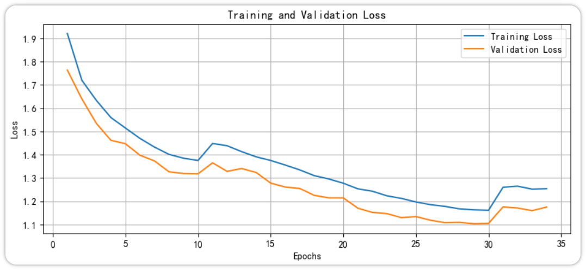

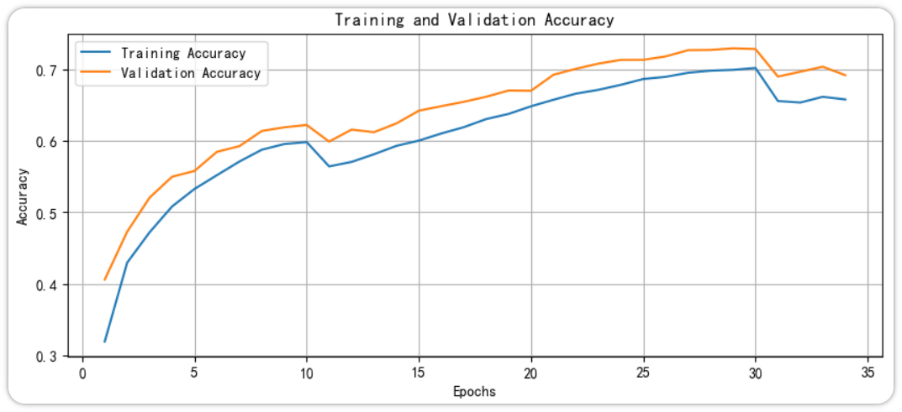

### 结果可视化

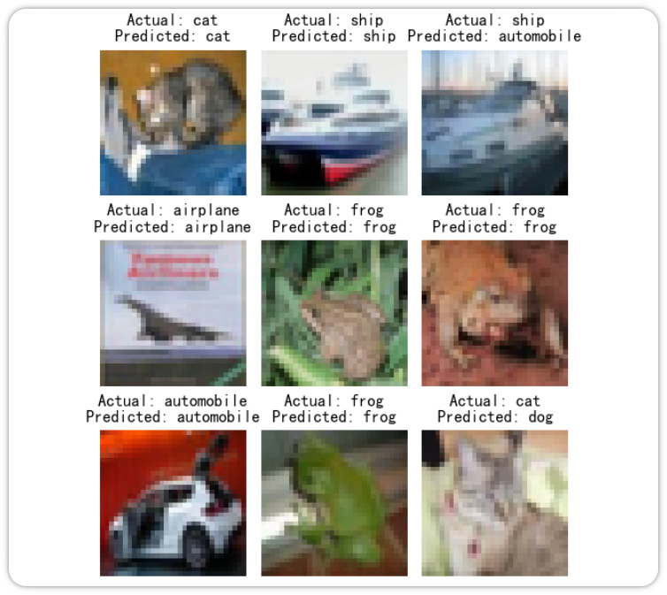

## 总结

1. **Vision Transformer** 通过将固定大小的图像 patch 视为 token，使全局自注意力从第一层开始就能发挥作用，从而将 Transformer 架构适配到图像领域. 与通过堆叠层逐渐构建感受野的卷积网络不同，ViT 可以直接关联图像中的任意两个区域.

2. **Patch 嵌入**将 2D 图像转换为 1D 的 token 向量序列. 这可以通过展平每个 patch 并应用线性投影来实现，或者等价地使用一个卷积核大小和步长等于 patch 大小的单层卷积来实现.

3. **可学习的类别 token** 被附加到序列的开头，并通过自注意力从所有 patch 中积累信息. 在最后一个编码器块之后，类别 token 的上下文向量作为整个图像的紧凑摘要，被传递给一个 MLP 头进行分类.

4. **可学习的位置嵌入**被添加到每个 token 上，使模型能够保留每个 patch 在原始图像网格中的空间位置信息.

5. **仅编码器架构**通过 $L$ 个相同的多头自注意力和前馈层块处理完整的 patch 序列. 每个块保持序列长度和嵌入维度不变，逐步精炼 token 的表示.

6. Vision Transformer 在**大规模数据集和模型规模**上扩展良好，但在小数据集上比 CNN 的数据效率低. 实际的变体通过层次化设计和窗口注意力来解决平方复杂度的注意力成本问题.